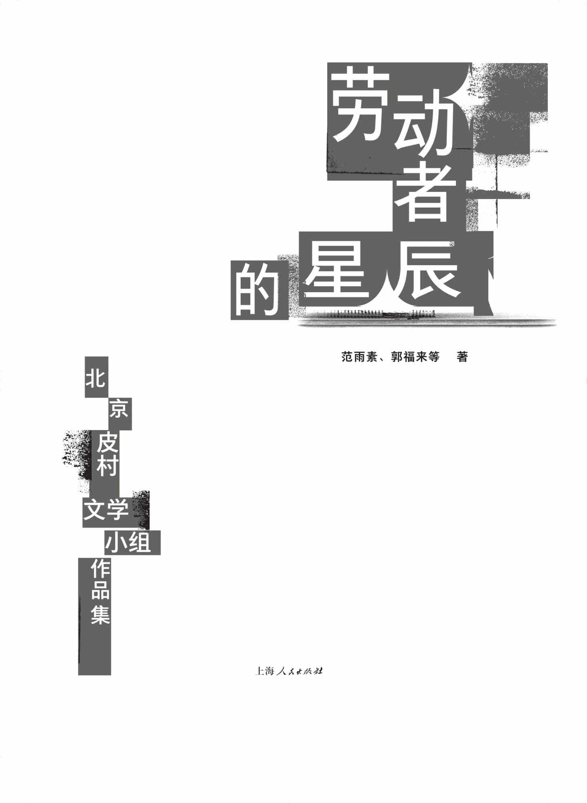
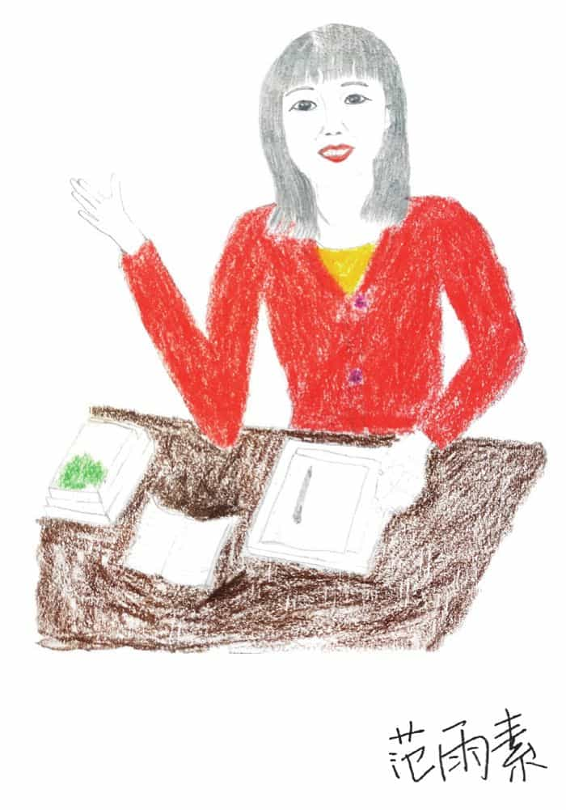
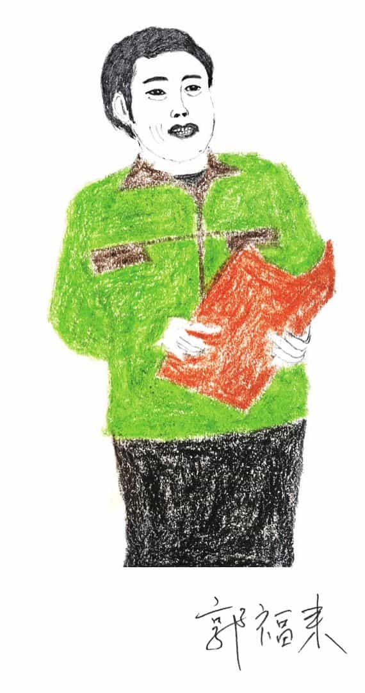
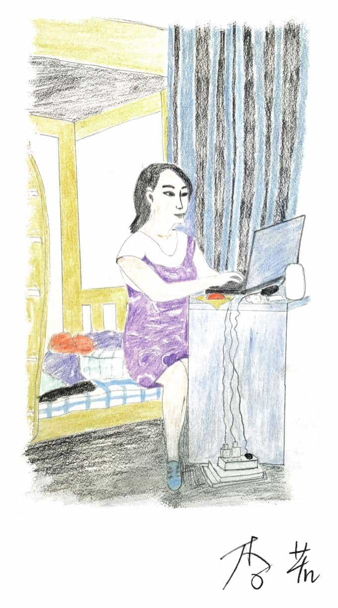
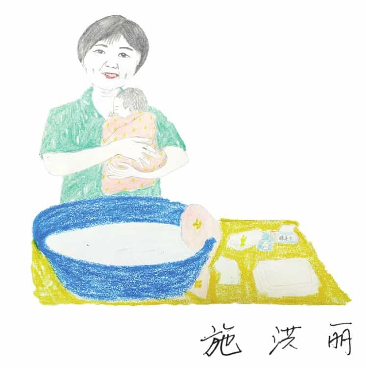
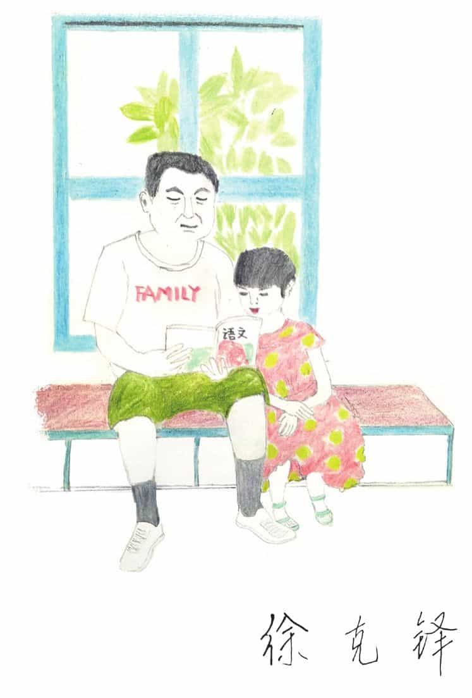
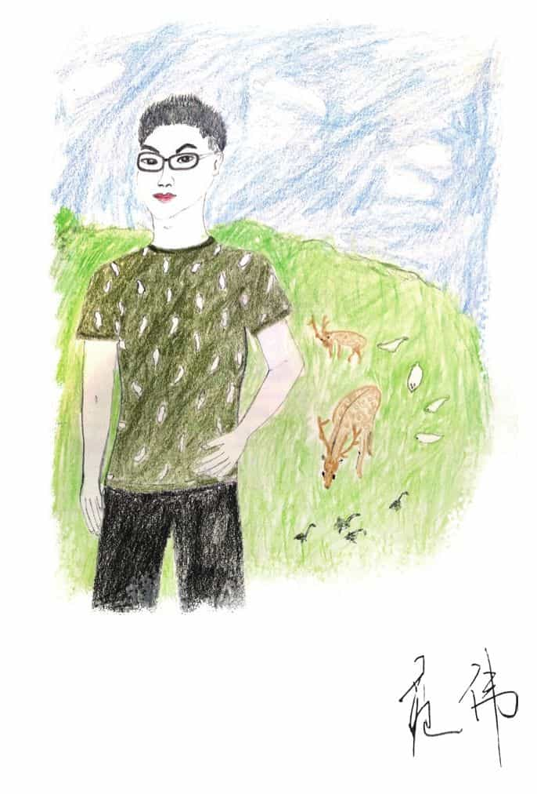
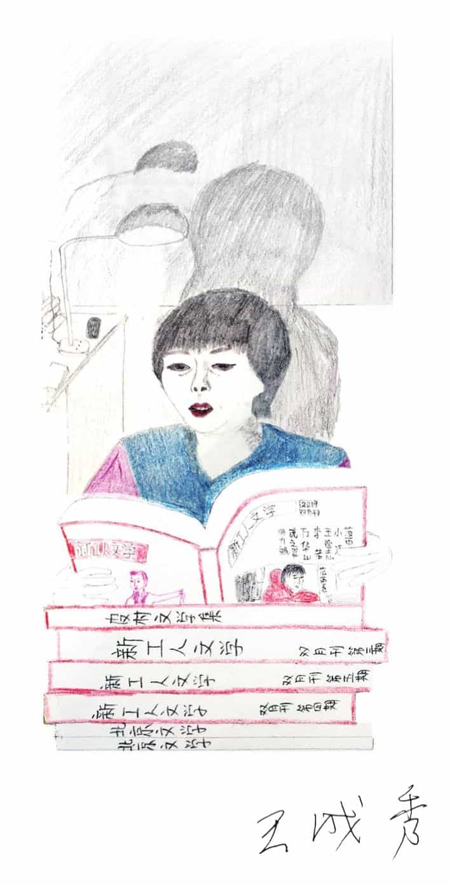
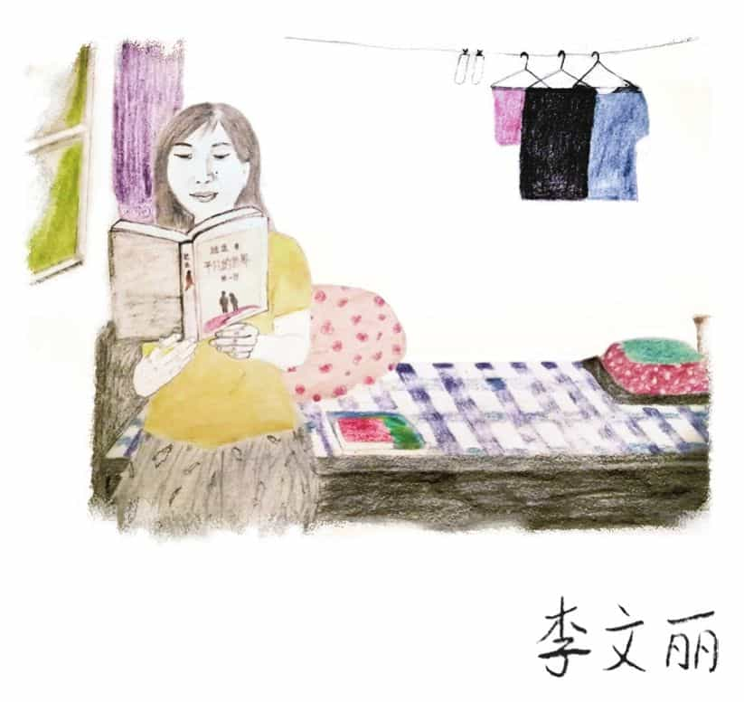
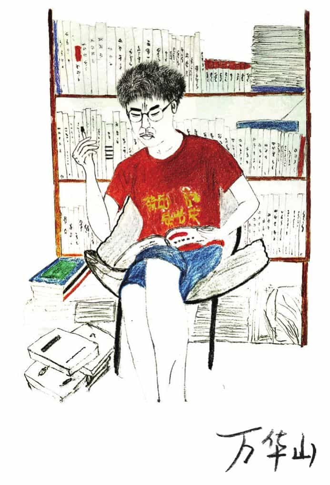

图书在版编目（CIP）数据

劳动者的星辰／范雨素等著．--上海：上海人民出版社，2022

ISBN 978–7–208–17763–5

Ⅰ．①劳…　Ⅱ．①范…　Ⅲ．①散文集–中国–当代　Ⅳ．①I267

中国版本图书馆CIP数据核字（2022）第117960号

书　　名：劳动者的星辰

作　　者：范雨素　郭福来 等

出品人：姚映然

责任编辑：杨沁

转　　码：欣博友

ISBN：978–7–208–17763–5/I·2025

本书版权，为北京世纪文景文化传播有限责任公司所有，非经书面授权，不得在任何地区以任何方式进行编辑、翻印、仿制或节录。

豆瓣小站：世纪文景

新浪微博：@世纪文景

微信号：shijiwenjing2002

发邮件至wenjingduzhe@126.com订阅文景每月书情

# 目 录

[序：用文学书写我们的世界](#part0003.html_uskJHtidYAT2Y84TFlHaDzA)

[范雨素](#part0004.html_uhhnhfVk6zIU6XlScsh6Kp2)

[大哥哥的梦想](#part0005.html_uWBNdmNYadwUmFRp75GDZz8)

[“北漂”们的日子](#part0006.html_ukiWkvQzhVmYjIHGTme9IZ2)

[郭福来](#part0007.html_uihpvTSFAuiKFWVZHfYT8jG)

[三个人，一棵树，四十年](#part0008.html_uwnSoZW4d9MwWXqm8zbZzk2)

[工棚记狗](#part0009.html_uSgaoPFZEjfKpS2ublhSfB8)

[工棚记鼠](#part0010.html_uTMwPqqm6ATX2dFgb7CTTp5)

[李若](#part0011.html_AFM60-10e58d6da94947c78d76ae54bf390baf)

[穷孩子的学费](#part0012.html_BE6O0-10e58d6da94947c78d76ae54bf390baf)

[红薯粉条](#part0013.html_CCNA0-10e58d6da94947c78d76ae54bf390baf)

[施洪丽](#part0014.html_DB7S0-10e58d6da94947c78d76ae54bf390baf)

[一个四川月嫂的江湖往事](#part0015.html_E9OE0-10e58d6da94947c78d76ae54bf390baf)

[徐克铎](#part0016.html_F8900-10e58d6da94947c78d76ae54bf390baf)

[媒人段钢嘴](#part0017.html_G6PI0-10e58d6da94947c78d76ae54bf390baf)

[大部分老实人的结果是什么](#part0018.html_H5A40-10e58d6da94947c78d76ae54bf390baf)

[苑伟](#part0019.html_I3QM0-10e58d6da94947c78d76ae54bf390baf)

[暗夜前行](#part0020.html_J2B80-10e58d6da94947c78d76ae54bf390baf)

[王成秀](#part0021.html_K0RQ0-10e58d6da94947c78d76ae54bf390baf)

[高楼之下](#part0022.html_KVCC0-10e58d6da94947c78d76ae54bf390baf)

[李文丽](#part0023.html_LTSU0-10e58d6da94947c78d76ae54bf390baf)

[我的母亲](#part0024.html_MSDG0-10e58d6da94947c78d76ae54bf390baf)

[万华山](#part0025.html_NQU20-10e58d6da94947c78d76ae54bf390baf)

[我在东莞演坏人](#part0026.html_OPEK0-10e58d6da94947c78d76ae54bf390baf)

# 序：用文学书写我们的世界

张慧瑜

北京大学新闻与传播学院

这本文集的作者来自皮村文学小组。2014年，因偶然的契机，我成为文学小组的志愿者，与一群喜欢文学、爱好写作的工友们相识，有一段时间，每周末我们都相聚在北京东五环外皮村的工友之家，一起讨论文学、写作相关的话题。这些喜欢文学的工友大多住在皮村和皮村附近，在城里工作，业余从事写作。文学小组的出现，使大家在陌生城市找到了文学之家。后来，陆陆续续又有新朋友加入，也有老朋友离开北京，即便很久不见面，也会时常通过微信联系。我想以好朋友的身份谈谈他们的文学故事和新工人文学的意义。

范雨素来自湖北襄阳，因为小时候哥哥有文学梦，家里有很多文学期刊，这让范雨素养成了文学阅读的好习惯。哥哥没有当成文学家，又想当造飞机的发明家，也没有实现，这是《大哥哥的梦想》里的故事。范姐做过保姆、小学老师，打过零工，从《“北漂”们的日子》中能看到她90年代在北京漂泊的生活。范姐一直住在皮村，参加文学小组之后开始写作。2017年《我是范雨素》在“正午”发表，让更多人关注到范雨素和皮村文学小组。范姐是一个通透的人，尝遍了人生的磨难，孤身养育两个女儿，不怕苦、不怕累，乐观而积极。成名后，她偶尔参加一些“高大上”的活动，始终保持本色。有记者来采访她，看到记者的艰辛，她也采访记者，写记者的故事作为回报。范姐的文字中既有生活的磨砺，也有灵动的美感，她阅遍古今春秋，又保有纯真的赤诚。她经常说，文学为她营造了一个颠沛生活之外的异度空间，让她的生命拥有了多维时空，帮助她度过漫长的、难挨的岁月。范姐敏感又勇敢，是个有大智慧的人。疫情期间，她完成了自己的小说《久别重逢》，范姐常说“相遇就是缘分”，前世与今生、古人与今人、父母与子女都是命中注定的有缘人。

为了提高家里的收入，四十岁后，郭福来从河北吴桥到北京打工，也住在皮村。他从小喜欢文学，在来北京之前就在家乡的报纸发过不少文章。《三个人，一棵树，四十年》是一篇自传体散文，围绕着家乡河堤上的一棵树，讲述了少年友谊、成家后的艰辛和友谊的破碎，家人、土地和树是远在他乡打工的郭福来的精神寄托。福来大哥从事的是布展工作，长年东奔西走，经常晚上加班布展。有一次，我们到深圳参加一个活动，会后去参观某个大型展览，福来大哥给我讲了很多布展的材质、方法和技巧，使我了解了很多展览背后“搭建”的秘密。《工棚记狗》和《工棚记鼠》两篇文章看起来像童话故事，讲述的却是打工过程中遇到的苦与乐。住在简陋工棚里的工友们，模仿城里人养一条流浪狗，小狗的叫声使“本来沉闷的空气，轻快地流动起来”。一只老鼠闯进工棚，被工友捉住，放在笼子里当宠物，这成为室友们每天下班后的牵挂，因为老鼠的到来，大家经常你一言我一语地开起关于老鼠的“神仙会”，“我”讲起吴桥杂技里的老鼠表演，有的讲起老鼠成精的“聊斋”故事等。后来，小老鼠、流浪狗最后都因为工友们去外地出差而夭亡。我想郭福来之所以会写它们，是因为这些闯入他们生活的小动物反映出背井离乡、过着集体生活的工友们“苦中作乐”的生存境遇。

李若在工友之家从事公益工作，参加过几次文学小组的活动，尝试写作，很快就在“网易人间”发表作品。李若的文章很受欢迎，阅读量非常大，有的达到几十万，她成了名副其实的“流量女王”。2017年文学小组编过一本小册子《布谷鸟的啼叫声——李若作品选》，里面的文章是李若两三年完成的几十篇作品，有诗歌，更多的是非虚构文学，把她打工十几年遇到的人和事，还有家乡发生的各种变故，都用文学表现出来。李若性格干练、倔强，她的文字风格也不藏着掖着，寥寥数笔就把人物写得活灵活现。城乡经验是新工人文学中最常见的主题，李若也不例外，她经常写的两类故事，一类是故乡以及生活在故乡的父母、亲戚和老家人，在她笔下，家乡、故乡是逐渐衰败、凋零的“变了样的故乡”，这是一个留守老人、妇女和儿童的“恶”故乡。李若擅长写农村女性的悲苦命运，一个无法掌握自己命运，随时有可能失去生命的女性，这其中也有她个人生命的印记。《穷孩子的学费》是写小时候李若交不起学费变成失学儿童的故事，《红薯粉条》是十二岁的“我”帮爸妈做红薯粉条卖钱的往事。第二类是城市以及在他乡遇到的打工者的故事。李若写了很多打工中遇到的小人物，如向父母以死抗争才获得爱情的打工妹燕子、美食城里保安队与小姐的故事。她还写了一篇《我的老板们》，写的是打工过程中遇到几位小老板，这些老板都是做小生意的，比较抠门，想尽办法节约开支，让工人多干活，这种看老板的视角也只有在被雇佣者的位置上才能体会。2017年底，李若遇到爱人，离开打工十几年的北京，回到河南老家生活。

徐克铎也是一位“神人”，因为同在皮村居住，徐大哥早就认识范雨素，2017年范姐也带着徐大哥来参加文学小组。徐大哥是50后，当过兵，复员后种过地、干过保安，也做过顶棚装修工作，年龄大了就在北京帮子女看孩子。徐大哥之前从来没有写过东西，范姐出名之后，他也尝试写作，结果一发不可收。徐大哥写了很多往事，有当兵的生活，也有复员回家后农村的故事。篇幅不长，语言简短直接，不拖泥带水，有速写的特征，草草几笔就把一个人物、一个小故事叙述得有声有色。比如《枣红烈马》，写的是生产队里一头脾气暴躁、难以驯服的枣红马，一天夜里，枣红马挣脱缰绳逃脱，却意外跌进六米深的壕沟，天亮后，枣红马却没有摔死，“呆呆弓着背站在沟壕里”。还有《先代会上的尴尬》，一位魏师长竟向当班长的徐克铎敬礼，弄得徐大哥措手不及，原来很久以前在教导队，徐大哥当过魏师长的班长。还有战友王兴凯的系列故事，如入伍前与妹妹相依分别的场景等。这些故事像老照片一样，带出一个又一个鲜活的历史剪影。徐大哥有丰富的人生阅历，擅长写乡村里的各种奇闻逸事。《媒人段钢嘴》就是一篇乡村媒人“歪打正着”乱点鸳鸯谱的故事，使用了大量民间俗语，人物形象鲜活，有地域特色。疫情之后，徐大哥没有来北京，他在今日头条有一个叫“顶棚匠”的头条号，在那里可以经常读到他的文章。

李文丽、施洪丽、王成秀和范雨素一样，都是从事家政工作，她们是文学小组的“半边天”，也是文学创作的骨干。李文丽是个才女，2017年从甘肃来北京打工，这些年她在北京换了很多工作，主要是从事照顾老人和小孩的家政服务。工作之余，文丽积极参与鸿雁之家、文学小组的活动，表现出很高的文艺、文学才能，她能歌善舞，也能做晚会主持，是一位非常有活力的、有才华的女性。文丽认为城市释放了自己的天性和才华，但她也在家政工作中遭受歧视、苛刻和心酸。在她的文字中，城市仿佛分成了双重空间，一边是不自主、不自由的雇主家，一边是与家政姐妹周末聚会的畅快和放松。2020年的“三八”妇女节期间，文学小组举办了一场题为“百年画卷里的中国女人”的线上征文活动，号召工友们写写身边平凡而伟大的女性家人、朋友。文丽的《我的母亲》就是这次征文的稿件，文中这位勤劳持家、有爱心和正义感的母亲，也是千千万万农村妇女的典范。施洪丽是另一位经常参加文学小组活动的大姐，不幸的是，这两年施大姐得了大病，做了手术，把自己描述为“按下暂停键的人”，即便如此，她依然坚韧不拔，用文学书写生命的坚硬和不屈。《一个四川月嫂的江湖往事》是一篇带有自传色彩的作品，借个人的视角，展现了民间社会的众生相。记得每次在文学小组遇到施大姐，给我印象最深的就是她爽朗的笑声，从笑声中能感受到经历苦难的施大姐对人生“举重若轻”的洒脱和自信。王成秀也是一位喜欢写作的家政工，文字成熟，《高楼之下》以保姆的视角展现了城市中产阶级的生活以及保姆与雇主之间的界限。从她们的文章中总能看到家政劳动的特殊性，一是很难量化工作量，劳动过程中需要付出巨大的情感，最大和最难的心力成本是获得雇主的信任；二是没有自己的时间和空间，家对雇主来说是从社会、工作中回到自由的私人领域，而对家政工来说却是工作场所，她们随时随地处在雇主的注视和挑剔之下。家政工是都市里的“隐身人”，是雇主家中看不见的人。她们的文字表达了一种想获得城里人理解、不再遭受雇主的怀疑和歧视的渴望。

苑伟是我的山东老乡，很早就是工友之家工会的会员，经常来机构帮忙，瘦瘦的他，每次见面都乐呵呵的。苑伟早年在皮村做木匠活，家具厂都外迁后，他又在吉他工厂学习制造吉他的手艺，这两年在一个高档社区当维修员。他给自己起了一个笔名“微尘”，他觉得自己很渺小，像一颗微不足道的沙粒，可大地正是由千千万万的微尘组成。苑伟的文学创作已经非常成熟，形成了自己的写作风格。他的文学写作有几个特点，一是有现代主义小说的感觉，虽然写的都是打工过程中遇到的人和事，但他叙述得很有张力，心理活动很丰富，如《北京随想》讲述了“我”跟随表哥来北京打工的故事，把初入北京、刚刚开始打工的战战兢兢和谨小慎微都刻画得很细致。二是苑伟的写作有一种身体感，小说中的主人公用单薄的身体来感受、体验颠沛流离的生活，尤其是面临随时失业、朝不保夕的状态。他写过一篇《曾经睡过的地方》，记述第一次出远门打工，就像余华的成名作《十八岁出门远行》。与后者相对抽象和象征化地书写“我”在路上的奇遇不同，苑伟用简洁生动的语言表现了离开家的兴奋和胆怯。他们蜷缩在小货车的车厢里，感受着野外的寒冷和对未来的不安。为了躲避检查，小货车经过检查站时一路狂奔，文中写道“毡布由噼啪响变成了吱吱长音，风穿过被子，我像裸体飘在空中似的”。这是一次“惊心动魄”的冒险，也预示着以后颠沛流离的打工生活。车厢里，“我们只有挤得更紧才能抵抗寒风，保住体温”。如果用90年代流行的批评语言，这也是一种“日常生活”和“身体写作”。只是苑伟所经历的“出门远行”，代表着80年代末期以来成千上万名农民工进城打工的大历史，“身体”成为感受时代饥寒的外衣。三是苑伟的作品带有自觉的工人意识，这也是不多见的现象，我非常喜欢他写的《路》，讲“我”和表哥在三年木工学徒结束后想当老板、自己创业的故事。这部作品带有成长小说、残酷青春的味道，两个人买了辆二手摩托车就上路了，“在路上”经历各种困难，陷入绝望、失望、自我鼓励等情绪之中，最终只能认命，放弃当小老板的梦想，接受做一个打工仔的宿命。四是苑伟的作品具有丰富的社会性，他善于贴着某个人物，沿着人物的逻辑走到极端，最后实现反转，如《得寸进尺》讲的是电话卡诈骗的故事，受害者如何一步步上钩，又一步步被诱导为施害者。《适得其反》呈现了想早点睡觉的“我”与做网络直播的出租房邻居之间的一场冲突，这种“亭子间”式的空间分布很容易让人想起30年代的左翼电影，从事体力劳动的“我”和数字直播行业的打工者比邻而居，处于相似的社会位置上。而《暗夜前行》是讲“我”的邻居老徐，在北京打工很多年，年龄大了就收废品，最终还是选择离开北京的故事。

万华山是个才子，也是与命运抗争的90后。从他的朋友圈了解到他青年时代遭受老师、父亲的暴力，很早就离家到南方打工。2017年万华山跟着诗人小海来到皮村，参加了文学小组。华山做过图书编辑，曾在一个食品文创企业工作，待遇非常好，领导也很看重，正打算提拔华山当小负责人的时候，华山拒绝了，他不喜欢竞争的环境，也不喜欢商场的尔虞我诈，他还是想写作和从事文化方面的工作。华山也参加了“我们”剧团的演出，那段时间，他们每天都排练到很晚。华山读的书很多，也很有文学鉴赏力，他喜欢先锋文学，写的作品也最像小说。有一次，我问华山，生活压力大不大，华山笑笑说，习惯了，他想以后能有一个自己的小团队，可以编编书、写写剧本，对未来充满了憧憬。华山参与了《新工人文学》电子杂志的创办过程，因为他有丰富的编辑经验，这本电子刊物能够持续下来，和华山的努力是分不开的。《我在东莞演坏人》讲述了华山早年在广东打工时当主持人、走穴演员的故事。疫情期间，华山离开了皮村，和几个朋友在北京郊区做民宿工作。我想华山的才华不会被埋没，他会写出厚重的作品。

最后，我想谈谈新工人文学的意义。一是，尝试重建文学与生活、文学与社会的关系，这里的生活指的是日常化、现实的生活，因为劳动者有着丰富的生活阅历，这使得新工人文学作品中充满丰富的社会经验和生活细节；二是，发挥文学的媒体功能，文学是相对低成本、廉价的文化媒介，每一位生活在这个时代的劳动者只要掌握基本的文字能力就能创作文学，这使得社会资源处于弱势的新工人有可能挪用和借用文学的语言来表现自己的所思所想，再加上自媒体时代里，文学发表和阅读更为便利；三是，新工人文学带有民间性、业余性和人民性的特征，我的这些朋友都不是专业化的作家，甚至也不奢谈能变成职业作家，他们的写作大多来自自己生命中的所见所闻，每一次书写都是生活的齿轮刻下的印痕。

相信未来，会有越来越多的普通劳动者借文学之名，创作出更多有个人生命温度和时代感受力的作品。这些以文学之名留下的“星辰”，既见证了大多数人的生活，又留下了丰富的时代声音。

2022年4月

燕园南门窗外

# 范雨素

1973年生，湖北襄阳市东津镇打伙村人，目前在北京做家政工。

# 大哥哥的梦想

大哥哥复读了一年，差两分就够到分数线了。他决定不再复读了。他说家里太穷，不好意思读了，因为他是有良心的人。他又滔滔不绝地讲了以后的打算。要像族人范仲淹、范文澜那样，做一个青史留名的大文学家。要像家附近鹿门山上的乡贤孟浩然一样边耕作、边写作。

他一再强调他的良心，总说起他一个住在跑马冈的王姓同学，家里房子后墙都塌了，还要复读考大学。大哥要做有良心的人。因为大哥扑通扑通的良心，我们家日子过得更苦了。记得他高中时我们家吃红薯，喝稀饭，吃青菜，青菜里有点滴油星。自从大哥要当文学家后，家里就都不吃油了。大哥买回来很多很多的文学杂志，中外当代、现代文学著作，中外古典名著。爱看小说的我们在家里没有话语权，但也不计较菜里没有油。看到家里有这么多的精神食粮，就很高兴了。

青年的大哥能吃苦，有豪情。他一夜一夜地不睡觉，写小说。他经常在白天指着我们家三间破烂的砖瓦房说：“你知道吗，几十年后，这房子就和鲁迅故居一样，要叫作范云故居了。”他的豪情一直激励着慢慢长大的我。

我偷偷看过大哥哥写的小说，小说名字叫《二狗子当上队长了》。我看了以后感觉写得很不好。我那时看过很多小说，已对自己很自信，认为只要是文史哲的书，我都能分辨出真伪优劣。大哥哥写的小说真是太差了，但我不敢说大哥哥。不过大哥哥还是属于机故人（机灵人）(1)，他很快发现自己当不了文学家。

他决定要当个发明家。主要原因还是他看了一本叫《当代》的杂志，上了文学的当。记得是1983年的一期，那本杂志大哥哥看过后，我也悄悄看了一遍。里面有一篇叫《云鹤》的报告文学，内容是一个农民自己买了飞机的零件，造了架飞机。按时间算，那个农民造飞机的时间应该在1981或1982年。看完后，当时九岁的我第一反应是惊叹！这个农民怎么这么富，竟然有钱买飞机零件。可我万万没想到，这个人成了大哥哥的偶像。大哥哥也决定造飞机，也决定买飞机零件。他做事只和母亲商量，我们家里别的人在大哥哥眼里都是空气、浮尘。我的母亲对家里的每个孩子都好得像安徒生童话《老头子做事总是对的》里面的老太婆。我们每个人做什么，母亲都说好，好，好！

买飞机零件要有钱，还要有关系。我父亲的小妹妹在湖北省委大院上班。我的小姑爹据说还是省委某个部门的处长。所以大哥哥觉得我们是有关系的人家。但家里没有钱，穷得菜里都没有油。可大哥哥还要让我们从牙缝里省钱，不吃菜了，不吃米和面了。主食吃红薯，生红薯啃着吃，熟红薯煮着吃。我们的母亲是大哥哥永远的、永久的支持者。我们满心憧憬着大哥哥造个大飞机，带我们飞到天上去，也不计较每天吃猪食过日子。

大哥哥给省城的小姑爹写了一封信，让小姑爹帮忙买飞机零件。没过几天，小姑爹就捎话给母亲，主要意思是大哥哥是不是有精神上的毛病了，让母亲领大哥哥检查一下。还有就是让大哥哥在村里做个裁缝，在当时的农村那是个很赚钱的手艺。母亲听了捎信人的话，很生气。她像每个护犊子的妈一样，觉得儿子是最棒的。为了不伤害大哥哥，母亲只告诉大哥哥，小姑爹买不到零件。我和姐姐想坐飞机上天的愿望像肥皂泡一样破了。已没有任何希望能坐上大哥哥的飞机了。

可大哥哥是个永远的梦想家，永不气馁，屡败屡战。他决定做个专业户。那个时候专业户、万元户是很时髦的词。万元户就相当于现在的土豪了。大哥哥决定做养殖专业户。他不养猪、不养牛，养簸箕虫，又叫土元，可以做中药材。养了几个月，不知为什么不养了。改养蘑菇，又改养蜜蜂了。养什么都养不长。最后我记得，大哥哥什么都不养了，说以后踏踏实实做农民。

2015年4月

------------------------------------------------------------------------

(1)本书括号内词句均为方言注释，下同。——编者注

本书插图均为李文丽手绘

# “北漂”们的日子

上个世纪90年代初，我在北京做买卖藏品的生意，找一些有收藏价值的珍本、善本、信件、照片到琉璃厂去卖。

北沙滩旧货市场位于现在水立方的位置，我每天都要去那儿找货源，经常在夜里起来，赶北京的“鬼市”。那时，北京三环都还是城中村。我最喜欢凌晨两点去潘家园的“鬼市”看人。

在黑乎乎的天幕下，那里的人手上都拿着一个手电筒，好像在鬼市里等待龙宫奇遇一样，个个都认为自己能碰到奇迹。

在龙王堂村，现在的奥林匹克森林公园附近，我跟丈夫租了一间十平方米的房子，领着大女儿过着艰难的日子，每天还遭受家暴，吃够了所有的苦。

世界是冰冷的海岸，也有些许希望的暖流。当时北京的房价很便宜，国贸还是一片大荒地。刚来北京时，我每天就想着多赚点钱，在北京买个房。

现在回想，这个事情已经是很遥远的梦了。

### 1

我一直觉得自己就像一百年前，许地山《春桃》里的女主人公春桃，靠捡字纸生活。不同的是春桃捡字纸，是因为那时的乡下都一样，不闹兵，便闹贼，不闹贼，便闹日本，不敢回去。

现在的农民工都有能回的家，出门赚钱是为了致富，为了过向往的生活。

虽然出发点不同，但都是过一样艰难的日子。

北京那时有很多旧货市场，里面卖旧衣服、旧鞋、旧家具等各种二手货。卖旧货的很少是本地人，他们大多来自河北的滦平，河南的固始，安徽的阜阳，我还记得，固始人把说话的“说”字发成“学”音。

旧货市场还有好多和我一样找字纸赚钱的农民工，现在叫“北漂”。我长了一张“政治正确”、永远也当不上小三的脸，所以和不少在旧货市场谋生的人成了泛泛之交。

有个来自四川的男孩，小麦色的皮肤，脸圆圆的，小眼睛贼亮，我不知道他姓什么，大家都叫他“小四川”，还有专卖小人书的“东北小刘”。

东北小刘在没有顾客的时候，就拿着小人书在水泥地上慢慢磨，像打砂纸。他说这是给小人书做旧，因为过去那些有收藏价值的小人书早卖空了。他买了一些盗版的名家画的小人书，做旧哄骗人，卖个好价钱。

我们这些找字纸的北漂农民工，认的字不多，经常要接触繁体字，因此，人手一本繁体字字典，边赚钱，边学习。

我小时候爱读哲学，想当中国的第欧根尼。来北京之后，每天为生活所迫，从不看书，但每天和书打交道，只记得书名和作者的名字。很多年后，我在被我叫作“第欧根尼的狗窝”的出租房里放了很多书，翻开那些书时，好像跟有过一面之缘的人终于做了朋友。

小四川在废品收购站扒拉到一套清刻《十三经》，他喜滋滋的，第二天把这套书卖了一千块钱。不过，隔几天，《北京晚报》上登出消息，有个人向公家捐了一套清刻《十三经》，国家奖励十万元。听说，这套正是小四川卖掉的那套《十三经》。

那时候，一千元是一个苍蝇馆子里打工的服务员三个月的工资，十万元能在三环边买套房。

小四川把《十三经》换成一千元时，高兴得喝了一瓶二锅头。当他听说买书的人捐给国家，得了十万后，他又难受得喝了一瓶二锅头。

那时候，二锅头五块钱一瓶，认识的人都喝二锅头。我们这些摆摊的朋友听说了这个消息以后，有兔死狐悲之感，觉得没文化，真可怕。一人买一瓶二锅头，陪他再喝一瓶。

一套《十三经》，小四川喝了三瓶二锅头，第一瓶是高兴的，第二瓶是嫉妒的，第三瓶是悲愤的。

和我关系最好的是来自河北滦平的朱老二夫妇，他们两口子做古旧家具的生意。朱老二是个绝顶聪明的人，他的脸长得像张三爷一样黑，张嘴说话，只能看见一排白白的牙齿。他们主要收的是樟木箱子，三十元收一个樟木箱子，卖五十元，赚拼缝的钱。

1993年，朱老二刚经历了一场失败的生意，他去山东买了一个紫檀条案，按当时的价格，七万元买个老案子，倒手能赚好几万。可买回来后发现，这个案子不是明清的老家具，只值几千块。七万元是朱老二当时所有的身家，这一下子全赔上了。

朱老二回到老家，躺了半年，路也走不动了，话也说不动了。

躺了半年后，朱老二从头再来，又到了北沙滩旧货市场。这次他只收樟木箱子，卖樟木箱子，因为樟木好认。

朱老二经常谈他小时候的故事。他说他爸爸是国民党军官，他们家在村里老受气。“大跃进”时，村里有人饿死了，他爸爸打过仗，脑子活，领着一家人去内蒙古多伦开荒，他们一家才活了下来。

当时，朱老二把樟木箱子攒够一个大货后，就拉到四惠的梆子井。梆子井是跟中国传媒大学隔一条马路的村子，当时，很多大买家在那里租下仓库，来存放收购的明清家具，那里聚集了一批旧家具大户，里面有一个叫李勇的大老板就专门收购这些樟木箱子。

普通拼板樟木箱子二百元一个，如果是独板的樟木箱子，价格翻倍，四百元一个。如果箱子成对，价格也能略涨一点。

啥叫独板箱呢？记得那时樟木箱子的长宽高分别是80、50、40厘米，独板箱就是宽度为50厘米的樟木箱，是从一棵大树上取材剖板做出来的，不是两块或者三块板拼出来的。

一个独板箱，它的前身就是一个森林里的大树王。在梆子井里的这个仓库，聚集了不计其数的树王。

大老板李勇四十来岁，北京本地人，秃顶了，他原本是《体育报》的记者，在上世纪80年代末下海了。他专门收集老樟木箱子、明清家具，然后，把这些物什卖到法国去。

听说，李勇的哥哥在法国大使馆工作过，所以，他是个有门路的人，能赚很多钱。

就这样，不计其数的樟木箱子，转入大河，进入太平洋、印度洋，在集装箱里，漂洋过海，到了欧洲，到了法国。

后来，每次在电视上看到巴黎时装周的节目，我就闻到了古老的樟木箱子的味道，我就听到了森林树王在低吟浅唱。我想到这些美丽的衣服是装在从我国运过去的古老樟木箱中的，心里就得意。

### 2

朱老二的媳妇是北沙滩旧货市场的一道风景。她一年四季的打扮都是1983版《上海滩》里的打手派：穿一套黑西服，戴白色针织手套，鼻子上架着黑墨镜，手指夹着香烟。她一天要抽两盒，抽的是最便宜的“小威龙”，一块五一包。

做完买卖，朱老二两口子就互相褒弹对方收货价格高，卖得便宜，在他们的出租房里，话不投机就开打。他们打架是高手之间的切磋，武林中的擂台赛。一人提一根棍子，对打，各有输赢，难分伯仲。

一次，朱老二把他媳妇一棍子打晕了，他媳妇在迷迷糊糊中对他嚷：“我不行了，快叫救护车，要不你把我打死了，你要坐牢，咱的孩子就成了孤儿。”

1996年我们赚了四万块钱，第二年全赔光了。我男人心里不平衡，不好好干活，每天酗酒，喝多了就抡起拳头打我和孩子。我个子矮，没力气，不像朱老二媳妇那样彪悍，只能被人打，身上一直都满是青紫伤口。我哭的时候，女儿就拿条毛巾给我擦眼泪。我觉得我和孩子能活下来，就是人生最大的成功。

这些事我不跟家里说，报喜不报忧，只跟朱老二媳妇哭诉。朱老二的媳妇同情我，说要提个棍子帮我教训那个杂种，但她光说不练。

后来，我的丈夫抛弃了我和孩子，出国了，听说那个男人生意失败，已经陈尸莫斯科街头了。

朱老二媳妇常对我念叨，清华大学的陈增弼老师是好人，经常给他们介绍台湾游客，买樟木箱子、旧家具，帮他们赚钱，但从不收中介费，不抽油水钱。每次见到旧货市场的农民朋友，他就像见到了阶级兄弟一样，身上洋溢的都是爱心。

我做捡字纸的生意，也认识很多文化人。比如北京工业大学的老师，八个样板戏里饰演李玉和的著名演员。他们见了我，隔了五十米远都和我打招呼，都是礼贤下民的样。

印象最深的一位文化人是个音乐家。他的脸长得和作家王朔差不多，发型一年四季不变，都是小平头，热爱收藏字画。

他是吉林长春人，手里有两张伪满洲国皇帝溥仪从故宫带去的宫廷画，后来画在长春散失了，流落到了音乐家手里。

音乐家把这两张真迹放到嘉德拍卖行，拍了两次，都流拍了。流拍了，嘉德也要收拍卖费的，音乐家气得咬牙切齿，中国人都是买水货的命，认不出好东西。

音乐家因收藏字画过多，家里放不下了。他偶尔也到旧货市场处理他的收藏品。这时候，他脸上总是戴着一副大墨镜。音乐家说，他这个经常在央视综艺频道露脸的人，如果让同事朋友认出来他在这摆摊，那脸就丢大了，所以要戴个大墨镜，挡挡脸。

之后，我离开了北沙滩的旧货市场，改行做月嫂了，一个人带着孩子，勉强能维持日子，和朱老二夫妇断了音讯，小四川和东北小刘也没有再联系过了，相忘于江湖。

### 3

2008年的一天，我和朱老二夫妇在街头偶遇了。朱老二告诉我，他靠倒买倒卖樟木箱子和明清家具赚钱，现在已经在燕郊买别墅了。两口子得意地对我吹嘘，他们买的别墅是贪官的，是通过法院拍卖买的，房子能抗十级地震呢。

我心里嘀咕，住在贪官的房子里，风水不好啊！但我不敢说出来。

两口子又向我描述，他们房子的装修，大客厅正对门摆着一个清代大号翘头条案，条案上方供着一张1米×1米的毛主席方形标准像。

我好想好想参观他们家的别墅，可他们两口子都不邀请我去看一下。

皇天白日素。2008年，奥运会来到北京，举国欢庆。那时，我在北京南城做育儿嫂，没钱也没空去看奥运会。

开幕那天晚上，电视里，几只大脚印从夜空中踩到了“鸟巢”。我从新闻里才知道，以前的北沙滩旧货市场，现在成了“鸟巢”“水立方”，原来的龙王堂村，变成了奥林匹克森林公园，人是物非。

前一阵，朱老二的媳妇给我打了个电话，哭诉说：“朱老二抛家弃业，去东北的一个寺庙做和尚去了。”

我心里想：贪官的别墅风水不好，可做和尚好吗？也不好，庙里也不清净，庙里也住着比丘尼呀！

# 郭福来

1969年生，河北省沧州市吴桥县张家洼村人，先是在老家的庄稼地里流汗，后来到北京打工，目前是布展工人。

# 三个人，一棵树，四十年

无人知道，弯弯曲曲的宣惠河，流淌了几千年。亦无人知道，依宣惠河而建的郭家洼村始于何年。更无人知道，郭家洼村边的河堤上一棵村里人叫不上名字的树是谁栽种的，哪年栽种的。此树树干略直，树皮微裂。粗约一成年人双手合围，高约丈二。树冠如伞，叶小而密，呈对称椭圆形，枝细而弯。不光郭家洼村里的人叫不上这棵树的名字，就连乡里、县里慕名而来的工作人员围着树研究半天，也不敢肯定地说出是哪种树。

且说距今四十年前，郭家洼村里有个叫郭福来的男孩子，也就十多岁，他在一个晴朗的春天午后，牵着两只山羊，来到树下，把山羊拴在树干上，然后，灵巧地爬上树，折些带着嫩叶的树枝，扔向树下。开始的时候，那两只羊可能由于饥饿还挑挑拣拣地吃些树叶，后来，竟然不吃了，还一个劲儿地用力号叫。郭福来顺着树干溜下来，察看情况，只见山羊的嘴里唇外甚至胡须上都沾满了血红的液体，他低头看树枝的折茬，只见原本白色的断茬处正有些微红色的汁液悄悄渗出。这是什么？是血吗？树怎么流血？他惊恐地向四周瞭望，此时无风，太阳不动。更没有人走来，甚至连最常见的麻雀也没了踪影。

郭福来抓起拴羊的绳子，拽着两只山羊顺着河堤往村口就跑，一边跑，一边不时地回头张望。快到村口时，他看到郭全忠老人站在街边，就赶紧跑上前去，上气不接下气地把他发现树流血的经过，磕磕绊绊地说了一遍。郭全忠拈着花白的胡子听完，张开没牙的嘴哈哈大笑。冲着郭福来说：“这有什么好害怕的，你折了树枝，它的茬口流出汁液很正常，只不过颜色不同而已。有的是绿色，有的是黄色，有的是白色，而这棵树流出的汁液，却是很少见的血红色。没事，玩去吧！”

郭福来将信将疑地牵着羊回家了。

第二天傍晚，郭福来领着和他同龄的李晓晨、张毅又来到树下。昨天折的树枝已经没了踪影。郭福来指着树上昨天他折过的茬口说：“你们看，昨天我就在这里折的树枝，当时，茬口上流了很多血一样红的汁液，把我吓跑了。今天一看，那断茬长得跟树皮一个颜色了，你们说怪不怪？”张毅狐疑地看看郭福来，又扭头看看树冠，然后，走到树下抱紧树干，一弓一伸，三五下便爬到了树上，伸手抓过一根树枝，“咔嚓”一声折断后，扔向地面，随后，又折了根树枝，无意间，张毅发现手上有血红色的一片，他仔细看了看，用另一只手一抿，发现手上并没有伤口，而血红色确实来自树的断茬。于是，他就着树枝上的液体往脸上抹了几把，然后，溜下树来，冲着郭福来和李晓晨喊：“坏了，我的手破了，脸上也流血了。”李晓晨凑上前去仔细察看，却没有发现伤口，抬手拍了拍张毅的后背，吼道：“哪儿呢？你这个熊孩子，竟敢糊弄我！”郭福来用手指蘸着树枝茬口上的汁液在手上、脸上一阵涂抹后转身来到李晓晨跟前喊着：“晓晨，我的手破了，脸也流血了。”晓晨看了看郭福来，说：“就你们俩这点伎俩谁不会呀！”他也走到树枝处，一阵涂抹。

阳光温暖地把三个孩子的身影投在河堤上，一会儿这个长，一会儿那个长，一会儿聚在一起，一会儿又散开。这时，同村的小姑娘郭金梅蹦跳着过来，郭福来他们三个一阵乱吼，张牙舞爪地冲上前去，围着郭金梅做鬼脸，吓得郭金梅哇哇大哭着扭头就跑。他们三个却坐在地上哈哈大笑。笑过后，张毅问郭福来：“你觉得脸上疼吗？我怎么觉得脸上像火烧火烤似的，又热又疼呢！”郭福来说：“我也觉得脸上很热还疼，我以为是跑热了呢！”李晓晨也说脸上抹“血”的地方有种紧绷的感觉，还有丝丝的疼痛，张毅一拍手喊道：“那还等什么，咱们快去河边把‘血’洗掉吧！”

他们三个走下河滩，来到河边的时候，有一群悠闲游泳的鱼在水面上嬉戏。也许是他们的脚步声，也许是他们的影子惊扰了鱼的游戏，只听“哗啦”“哗啦”一声声水响，鱼便钻入水底了，水面上只留下数不清的气泡和涟漪。三个孩子蹲在河边很仔细地洗着手和脸，清凉的宣惠河水几近透明，鱼的黑脊背时隐时现，率先洗完脸的郭福来说：“我家有个大网兜，要不我拿来，咱们一起捉鱼。”李晓晨看着不太宽的河面，说：“可不行，我爸说刚开春，鱼小，刺多。等秋后鱼们长大了，肥了，再捉了吃才行。”“就是，我家还有撒网呢，我听队长说，不等鱼长大就捞，就像不等庄稼成熟就收割，是不合理的。”张毅也说出了他的看法。

会流“血”的树下成了孩子们聚会的地方。有时，他们在附近放羊，拔草。有时，他们在树下写作业，做游戏。秋末初冬时，他们会拾起金黄树叶送给外村的朋友。后来，李晓晨随父母去了石家庄，只在寒暑假回村看望爷爷奶奶时，才能再次来到树下和郭福来、张毅们玩耍。

郭福来在快三十岁时成家了。他从村子里承包到了八亩地，像其他农民一样，早出晚归侍弄庄稼，却发现庄稼地里的害虫太多了，种小麦吧，有蛴螬、蝼蛄、蚜虫、灰飞虱、造桥虫等。种玉米吧，有玉米螟、盲椿象、钻心虫等。种棉花吧，有蚜虫、盲椿象、红蜘蛛、棉铃虫等，特别是棉铃虫对棉花危害最大，这种虫子，从棉花一现蕾，就疯狂开吃，昼夜不停。即使一些好不容易长大，长硬了壳的棉铃，它们也能从棉铃的底部咬个洞，钻进去，把棉铃吃成空壳。

郭福来和其他农民交流使用农药的经验，去各处淘换来最毒的农药，早起晚归地喷洒，却见棉铃虫死一代，没几天又钻出一代。无奈的郭福来号召妻子一大早冒着清晨的寒凉，一株棉花、一株棉花地翻找，发现棉铃虫，就用拇指和食指捏住用力挤爆。随着“啪”的一声，肥滚滚的棉铃虫瞬间皮开肉绽，内脏倾泻，深绿色的血水溅满了郭福来的双手，臭烘烘、黏腻腻的。郭福来像个冲锋的战士，不顾一切地翻检着棉花，只要发现棉铃虫，必须让它瞬间毙命，绝不留情。就这样早出晚归，一天才能翻检一分来地。望着一大片待翻检的棉花地，郭福来愁得喝不下水，吃不下饭——那时，农民常常带些干粮和凉水在田间地头吃饭。

七八年后的一天早晨，郭福来在送孩子上学后回家的路边，遇到一个卖农药的。那卖农药的说，你们打药再仔细，也不可能完全喷到棉铃虫身上。因为，很多虫子藏在叶子的背面或棉花铃里。而我这个药，不光触杀，还能熏蒸，让没喷到药液的虫子，闻到味就死，尤其是中午，越热熏得越厉害。不信，你们闻闻，卖药的人打开一瓶药，往围着的人群前一送。顿时，好几个闻到的人转身呕吐。郭福来毫不犹豫地掏钱买了两瓶。尽管价格很高。

回到家，郭福来便招呼妻子一起收拾好喷药用具和水桶，蹬上三轮车，直奔棉花地，妻子负责打水，他背着沉重的喷雾器负责喷药。快到中午时，蓝蓝的天上只有一个太阳，看不见一丝云彩。本来亮得刺眼的阳光在郭福来眼前却变得一阵黑，一阵白，本来汗流浃背的他感到一阵阵寒凉，他回身看看站在地头上的妻子，却发现妻子好几个身影。他想喊，一张嘴却涌出了早晨喝的那点汤水。他想站直身子，两腿却不听使唤地瘫软下去……

经过抢救苏醒过来的郭福来，看着站在床边憔悴的妻子，平静地说：“我没事，你吃饭了吗？”“吃啥饭呀！”妻子幽幽地说，“看到你背着一桶子药水倒下去，我当时都吓傻了。幸亏邻居们帮忙，把你送来医院及时抢救，要不然……你让我们娘儿仨怎么活呀！”郭福来想坐起来劝慰妻子却浑身无力，只得含泪说：“小英，你跟着我这些年受苦了，没吃过一顿好饭，没买过一件像样的衣裳，咱们拼死拼活地种地，翻过来，翻过去，还是那片土坷垃。这些年粮食价格低，咱指望种点棉花想多卖点钱，咋就这么难呢？”妻子抚着郭福来的手说：“我想开了，再也不拦着你出去打工了。等你好了，你就和张彦强一起去北京打工吧。或许能比咱种地好受点。”

临去北京打工的前一天傍晚，郭福来买了一瓶白酒，半斤花生米，叫上张毅，来到村边的那棵河堤树下。在小鸟啁啾、蝉鸣清脆、绿意盎然的柔光里，俩人你一句，我一句地谈论着，一直单身的张毅前几年因为干建筑被倒塌的砖垛砸折了腿，生活很是艰难，他还要伺候守寡多年、瘫痪在床的老娘，岁月的沧桑让那张少年时白净的小脸变成了皱纹堆叠的黧黑色。他们说起小时候的好友李晓晨。张毅说，这些年他回家上坟都不理我，生怕我传给他秽气。郭福来说，我倒见过他几次，听说他在市政上工作，有五险一金，混得比咱们强多了。他还跟我说，咱这棵树，全河北省就这么一棵，稀奇着呢，我走后，你可要常来看看，别让不懂事的孩子们给祸害了。张毅说我跟这棵树亲着呢，一遇到愁闷事，我就爱坐在这棵树下，跟它絮叨絮叨。有时候都能说到天亮。你放心，有我在郭家洼，绝不能让这棵树少一根树枝。

郭福来来到北京皮村的时候，已经是2014年冬末了。记忆中，郭福来觉得那个冬天特别冷，在他工作的车间里，没有炉子，没有暖气。寒风从彩钢板做成的墙壁缝隙处，向屋里吹着进军号。沉重的铁管、方钢、角铁、槽钢，像冰凉的死尸，摸上去有种沁人心脾、透彻骨髓的寒凉。为了多挣些钱，郭福来每天从早晨八点干到晚上十二点，饿了，他啃个馒头加咸菜；困了，他就着水龙头洗把脸。终于用了两年多的时间，他把家里的旧房子翻修了一遍，还买了空调、冰箱、液晶电视，并和妻子每人一部华为智能手机，遇有空闲时，还能和妻子视频聊天。妻子总爱把村子里发生的大事小情及时地通报给郭福来。“发小张毅的低保终于办下来了，每月有四五百元呢。”妻子在电话那头高兴地说。

2018年春天的一天中午，郭福来正在皮村的一家山西面馆吃刀削面，妻子又打来电话说：“张毅今天上午和李晓晨打架了，张毅用拄着的拐杖打了李晓晨，李晓晨让他的手下把张毅扔到了河边的淤泥里。”郭福来忙问为什么呀，妻子说还不是因为河堤边那棵树。李晓晨今天带来十多个人，开来六辆车，还有一辆吊车。他说咱村这棵树很特别，既有观赏价值，又有研究价值，长在偏僻农村，太可惜了。他要把这棵树弄进市里的园林里。张毅听说后，一瘸一拐地跑过来拦着，这不就打起来啦。“那后来呢？树还在吗？”郭福来忘了吃面，急切地问。“怎么会还在，李晓晨带的那些人跟黑社会打手似的，除了张毅上前去拦了下，其他村民谁敢傍前呀！”郭福来听完，怔在那里，好像被谁抽走了魂魄。

# 工棚记狗

打工的日子就像坐在老牛拉的车上，漫长而无聊，总是把今天走成昨天。

好不容易熬到下班，几个大男人回到工棚，东拉西扯地谈些无聊的话题。日子久了，同样的话题聊了又聊，自己也觉得没意思了。还不如侧坐在床头打盹儿，或去门口站着，看路上来来往往的车辆和行人。

我们住的工棚位于北京皮村的路边，紧挨着路边的树丛，用薄薄的铁皮围个圈，上面盖个顶子。前面开个门，却没有安窗户——大概是造屋者认为我们不需要光亮吧。

工棚虽简陋，倒也能遮风挡雨。对于我们这些外地人来说，能在北京有个工作、有个住处，已经很不错了。只是，这条乡间路虽然不宽，车辆、行人却不少，经常有不懂事的垃圾车在半夜高声喊叫着，狂奔而过。而被扰醒了美梦的我们，往往还要起得很早。

清晨，会有人领着各色各样的狗，在工棚门口遛弯。我们像检阅者似的，对它们品头论足。有一位六十多岁的老头儿，领了大小十二只狗，有高大威猛长毛的，也有矮小灵动短尾的，有全身黑的、全身白的、全身金黄的，也有布满斑点的。各有各的特点，各有各的漂亮。

我们喊住老人家，和他攀谈起来。提到想买他一只狗来养时，他一连摇头说：“那可不成，这些狗都是我一手带大的。它们跟我亲着哪，是我的命根子。再说了，你们一帮穷打工的会喂狗吗？先自个儿吃饱了再说吧！走喽，集合，孩子们，咱一块儿走。”

看着老人领着他的狗孩子呼呼啦啦地走远，陈小武羡慕又憋气：“冲着老头看不起人的样儿，咱们想个办法弄条狗来养。大小无所谓，只要咱们能养肥就行。”

“咱们这么多人，养只狗应该没问题，最好弄只名贵的好狗。”我说。

“好狗？哪儿好？也就是毛色漂亮点，模样特性点。要论机灵，我看不一定能比得上流浪狗。”年纪大点儿的关国顺也发表了意见。

陈小武附和道：“对，流浪狗好养。赶明咱去垃圾箱那儿提一只来，不就行了。”

两天后，我们带着火腿和自制的绳索来到垃圾箱旁。有四只狗正围着垃圾箱转。一只浅灰色的狗刚叼出一包东西，立刻就有两只狗扑上去撕抢。在嗷嗷乱叫中，垃圾袋被撕破，垃圾散了一地，三只狗在拥挤中乱抢。

另一只小狗逡巡着，也想要上前分些残食，却被一只大狗“汪”的一声咬中肩胛。鲜血顿时滴落于地。小狗在“呜呜”的反抗声中，夹着尾巴躲到了一边。

“唉！看样子到哪儿都是弱肉强食呀，没想到流浪狗们也不平等。”陈小武感叹着。“平等？咱们就平等了？老板故意把工资分成几个级别。有的人为了多挣点钱，常在老板面前挤兑同事。”吴国顺说这话时瞅了我一眼。我知道他们对我每月多拿一百元工资有怨言，工作认真才给的奖励，他们都不信。

我没有理他们，弯腰拾起块砖头朝那三只狗掷去。狗们各自慌忙衔起食物，飞也似的逃远了。

我们拐向那只受伤的小狗。吴国顺嘴里轻轻地唤着小狗，一边下蹲，慢慢地向前，再向前。那小狗警惕地看着我们，陈小武迅速抖开早已备好的绳索向小狗套去，小狗却很利索地跑走了。

后来，经过三四天耐心的引诱，我们终于把这只土黄色的小狗带回了工棚。

在小狗“汪汪汪”的清脆叫声中，本来沉闷的空气似乎也轻快地流动起来。

干坐着的一群人一会儿跑过来“黑儿黑儿黑儿、白儿白儿白儿”地叫着，一会儿又伸手去抚摸小狗的脑袋，小狗“嗷呜”一声，手又吓得缩了回去。

在床上躺着的，听到狗叫声，也翻身坐起，趿拉着拖鞋走过来，很轻柔地叫着“大黄，大黄，别怕，来，让我抱抱”。说着话，手朝狗伸过去，小狗翻了下眼皮，没理他，径自朝饭桌下跑去。

正在喝酒的张彦杰从盘子里捏了把鸡骨头扔给小狗，小狗三两口就吃完了，抬头看看张彦杰，见他没有再给的意思，便在喉咙里“呕呕”地叫了几声，还用前腿拍打了几下地面。后来干脆一边围着张彦杰转，一边用脊背去蹭张彦杰的裤腿。张彦杰伸手拍了拍小狗的头，劝慰着：“行了，宝贝。没吃饱也没有了。明天我多买点儿，让你吃得饱饱的。”小狗识趣地趴在地上，摇晃着尾巴，任张彦杰抚摸。

陈小武也蹲过去，拍着小狗说：“哥们儿，这回可找着饭店了吧？赶明儿我给你买羊肉，再也不让你挨饿了。”

“停！停！”吴国顺着急地插言道，“这狗得有个名字呀！你几个，各叫各的，让它听谁的。我看这狗虎头虎脑的，就叫它小虎吧。”吴国顺说着，一边朝小狗做手势，“对吧，小虎？”小狗配合他似的“汪”了一声，逗得我们都笑了。

笑声中，时间过得很快，转眼到了初冬。小虎也长大了，宽厚的脊背，粗壮的四肢，挺立的耳朵，炯炯的眼神……每天我们骑车去上班，它就在后面跟着跑。下班，刚跨出厂门，它就已经扑到我们脚下摇头晃尾了。我们在门边的空地上搭建了一个狗窝，陈小武贡献了一件旧羽绒服铺在狗窝里，小虎趴在里面舒服极了。

那个带了十二只狗遛早的老人，看到我们的小虎，也啧啧称赞：“真好！你们喂的这狗真肥实，这要是杀了吃肉，指不定多大一锅呢！”

陈小武说：“我们养狗可不是为了吃肉，也不是为了看家，我们是在找乐子呢。”

这时，老者的十二只狗都围向小虎，只见小虎一躬身，“呼”的一声，朝一只大狗扑去。那只大狗一转身，逃得飞快，剩下的紧随其后。小虎追了几步，我赶紧喊：“小虎，回来。”小虎便听话地拐回了它的小窝。

十一月中旬，我们去南京出差，大约半月有余。

临走时，我们准备了很多食物放在小虎的窝里，张彦杰担忧地说：“这些要是不够吃，小虎不得饿肚皮呀。”

吴国顺分析着：“没事，小虎小时候没人管都没饿死。这些东西如果不够它吃，它自己肯定会想办法。”

转眼半个月过去了。我们回来，快到工棚门口的时候，也没有看到迎接我们的小虎。张彦杰骂道：“这狗崽子指不定又跑谁家混饭去了。”

于是我们分头去找。最后得知，前几天来了一伙外省的狗贩子，专门捉狗卖给饭店。我们虽然痛恨，却也无奈。

没有小虎的日子，就又像是坐在老牛拉的车上，漫长而无奈地，把今天走成昨天。

（原载《北京文学》）

# 工棚记鼠

我来北京皮村打工将近半年了，其间记忆最深的，竟然是与我们共处一室的几只老鼠。

我们的主要工作是在一家布展公司搭建会台和各种铁架子。平日里，十多个工人挤在一间不大的工棚里，屋门外是两排又高又粗的白杨。微风拂过，每个树叶都在向行人摆手致意，每个行人却都匆匆而过，根本无暇理会，也不会有人留意到路边这间屋子里的我们。

屋子是厂里免费提供的，住在里面挺温暖——至少可以遮风挡雨，可以吃完饭睡一觉。

休息的时候总是枯燥、无聊的。由于大家来自不同的地方，彼此也刚刚认识，并没有过多的话可说。工棚里没有电视，也没有电脑，囊中羞涩也不愿去逛街，休息的时间大家也就干坐着。

三月里的一天傍晚，吃过饭，大伙儿闲着没事，各自枯坐在床头，你一句我半句地聊天。突然，边臣“嘘——”了一声，然后指着门口的水桶，只见一只身长约有六厘米的老鼠，沿着桶转了半圈，便蹿到桶的边沿，俯下身子舔起水来。

晚霞中，它的灰毛油光发亮，细长的尾巴朝上摆动着，像即将甩出的鞭子。喝了几口以后它抬起头来，黑豆粒般的小眼睛很机警地扫了我们一下，见我们没有动作，它又俯下头去牛饮了。李丙谦可能是看不下去了，也可能是心疼那一桶洗漱水，他一抬脚，一声“去”字还没落地，那只老鼠早已灵巧地跃下桶沿，钻到床铺下面去了。

我们突然就有了话题，围绕着老鼠谈起了各自经历或听来的趣事。轮到我，我就给他们讲起了家乡吴桥杂技里有老鼠表演的节目。

杂技艺人手拿细长的小木棍，有节奏地指指点点，那一只只浑身雪白色的小老鼠东嗅嗅西望望，乖乖地按着主人指定的路线，缘木而上，爬过竹帘，钻进曲折巷，再跃进纺车形的辘轳里，沿着一个方向跑动几圈后，一小桶水便被老鼠提到可以饮用的高度，老鼠跳过去，刚要饮，水桶又坠了下去，然后再次提上水来，再要饮，桶又落下去。那滑稽样逗得观众笑声不断。

我刚说完，边臣就很向往地说道：“咱们不如捉只老鼠来训训，下班后有事可做，又有乐趣，大伙儿同意不同意？”李丙谦先嚷起来：“那哪行，老鼠多脏，天天看着它，谁能吃下饭去？”刘元忠说：“这主意不错，我做个陷阱，逗老鼠嘛，肯定得捉活的。”最后八票赞成，一票反对，两票弃权，最终通过了捉老鼠的决议。

利用自制的铁丝笼子，我们还真捉到了一只不大的老鼠。

它细细弱弱的小身子在笼子里上蹿下跳，不时地张嘴咬咬笼子上的铁丝。边臣赞叹道：“北京的老鼠真漂亮！”李丙谦讽刺道：“你怎么知道这是北京的老鼠？它们又没身份证。”

刘元忠附和说：“也对，这年头美国的白蛾、非洲的艾滋病都能来到中国，来到北京，何况这么灵巧擅钻洞的老鼠，它们也能乘车，也可坐船，更擅于走地下通道，比咱们这些来自乡下的打工者能耐多了。”

边臣喊道：“不管怎么说，反正我是喜欢这只小老鼠了，我决定，就把它挂在我的床头，让它天天陪着我。”刘元忠说：“可以啊，说不定这是还未婚配的母老鼠呢，你可小心点，别让这异性勾得你睡不着觉。”李丙谦反驳说：“什么异性，这是异类。不管什么都喜欢，我怀疑你们的审美取向。”我只好出来打圆场：“你没看过《聊斋》啊，那里头，狐狸和书生恋爱、婚配的事太多了。”

不觉间，我们每天下班后都有了牵挂，开门时，再不像以前那样稀里哗啦，而是蹑手蹑脚地走进屋后，头一眼就先看看鼠笼里有什么变化。

我们发现，总有一只差不多大小的老鼠，趁我们不在屋时来和笼子里的老鼠相伴。有人提议，捉住它放在一起也好有个伴。有人说，干脆把笼子里的老鼠放掉，让它重回自由世界。

这时，刘元忠喊道：“你们发现了没有，那只老鼠是不远万里来陪这只的。你看，起点在甘肃朱士彬的床西边角落的沙土里，再路过河南周奎的领地，又折向河北沧州郭福来的床下，再到石家庄边臣的站点，那铁丝笼子算是北京站吧！想想人家也真不容易，每天不知要跑多少路，才能和喜欢的老鼠相见，我赞成放掉。”

边臣嚷起来：“不！我还没稀罕够呢！”

不久，厂里要求我们一起去苏州干几天活。回来后，我们才发现笼子里的老鼠已经死去了，看了半天也猜不透它是怎么死去的。每个人都很伤心，最后，边臣默默把笼子拿到皮村北路边的草丛里，很仔细地把这只陪伴我们多时、给枯燥的打工生活带来乐趣的小老鼠葬掉了。

夏季的沉闷气氛重新笼罩着我们的工棚，大伙儿都懒得说话，更没人提起老鼠的话题了。

# 李若

河南信阳人，打工十多年，从南到北。热爱文学，偶尔舞文弄墨。作品散见于《北京文学》《花城》《读者》等。

# 穷孩子的学费

高一那年，我家养的三头猪中，最大的那头病了。

怎么喂都不吃潲，在猪圈里趴着的两只前蹄伸得老长，大张着嘴喘气，上气不接下气的，身上发烫，眼睛发红。

妈妈赶紧去请兽医来治疗。打完针，两百多斤的大猪刚刚好点了，一百多斤的中号猪和几十斤的小猪又得了和大猪一样的病，再把兽医请来，等两头小猪稍微好了点，大猪又严重了。过了两天，三头猪全都不行了。

这三头猪，可是我和弟弟一整年的学费啊。

### 1

兽医下了最大的剂量也看不好猪病，全家人只好眼睁睁看着三头猪等死。

妈妈急得六神无主，把全部的希望都寄托在迷信上。听说邻村有一个小庙的菩萨很灵验，她赶快用纸剪了三张猪像，去几里地外的小庙求菩萨保佑。妈妈虔诚地跪着，双手合十，口中念念有词：“那是孩子们的学费啊……求菩萨保佑咱家的猪病好，过年时我来还愿给您上一炷香烧二斤纸放十个大炮……”

我跟在旁边，也学着妈妈默念：“菩萨啊，这可是我全部的希望啊，就指着这三头猪读书生活了，救苦救难的菩萨，求求你帮我们渡过难关……”

但是，菩萨似乎也没有那么神通广大，能让我家的猪起死回生。到了第五天，最小的猪还是死掉了，中号的猪也一动不动，大猪还在苟延残喘。

邻居都说，这些天街上屠夫卖的都是病死猪：“你家在他那里买了肉，才传染到你家猪身上的。”邻居婶子还来劝妈妈：“找屠夫吧，把大猪卖了，卖的钱再买一个小猪养，不至于血本无归。”

我们这才想起，就在大猪生病前一天，外公来家里做客，妈妈专门去集市找屠夫买了块猪肉——那时候大家还说，那真是块好肉，肥膘少瘦肉多，一家人当天就吃了一顿香喷喷的肉包子。

妈妈的眼泪说话间就流了下来：“那不是害了其他养猪的人吗？人家辛辛苦苦养一年的猪不是白养了吗？”街坊邻居七嘴八舌地都劝妈妈：“做人不能太老实，老实人头上没有青天。”“是啊，卖一个是一个，别拖了，再拖猪就死了，死了就没人要了，一分钱也不值……”

妈妈只好出门去找屠夫，屠夫姓易，正好在村口和村民们聊天。屠夫进了家门，一眼望去，见猪圈里都是病入膏肓的猪，赶紧去三轮车上拿来杀猪刀。

“猪都快死了，还要再杀吗？”

屠夫说：“得补一刀放血，不然猪肉是红色的，一眼就能看出来是病猪肉。”

脖子挨了一刀的猪叫了两声，四肢稍微动弹了一下算是挣扎。妈妈开始和易屠夫讨价还价：“就是因为买了你的肉，我家三头猪才生的病，我的损失这么大，你可不能给太少！”最后好说歹说，两百多斤的猪给了一百五十元。小猪挖坑埋了，中号猪舍不得扔，爸爸在田野里挖了一个简易灶把它刨了。

那段时间，原本住在舅舅家的外公在我家吃了很久的死猪肉。看我家三天两头吃肉，村里还有眼红的亲戚专门来我家“借肉”。

### 2

能吃上肉，总是好的。可是，三头猪都没了，我和弟弟的学费真悬了。

穷人的孩子早当家，不用爸妈说什么，我和弟弟就开始各自为学费操心起来，姐弟俩各想各的招。

那一年开学，我和弟弟的学费是赊的。隔一段时间，老师就在班上提醒一下：“欠学费的同学该交学费了。”每当这时我就会十分难为情地低下头，感觉全班几十位同学的目光全都一下落在我身上。

等过了惊蛰，大地春回，万物复苏，田野里的花开了，地下的昆虫也蠢蠢欲动起来，一年最好的时候就到了。

弟弟买来黄鳝笼子，又去牛屎粪堆里刨蚯蚓。下午放学后他就立刻开始准备，“下黄鳝”最讲究时间，要趁天黑之前把装有蚯蚓的笼子放到池塘和水田里，第二天早早起来再去取回来，一次放三四十个笼子可以捉一两斤黄鳝，大的有一两重，小的就跟小指头那么粗。更小的黄鳝要放掉，不然往后再想捉就不容易了。

而我则请了一星期的假，去大舅家挖蜈蚣。当时，大蜈蚣八寸长，能卖五毛一条，五寸长的三毛，再小一点的两毛。

大舅就住在以前外公外婆的老房子里。小时候在外婆家住时，我还有两个小伙伴，比我大一岁的妞妞早已辍学，小学没读完就不上了，现在在家挑粪、砍柴、洗衣、做饭。比我小一岁的小鹿初中毕业，等着秋后征兵时去当兵。

天蒙蒙亮，妞妞和小鹿就在大门口喊我，我一骨碌爬起来，头不梳脸不洗，拿起工具就往外跑。所谓工具，不过就是一把短柄锄头和一个矿泉水瓶，在瓶盖上钻几个小孔留作透气用，免得蜈蚣在里面闷死了。

第一天我们去了棋盘山。到了山上，我们仨立刻分散在山腰上开始挖。把地上的石头挖开，蜈蚣就藏在石头下面。挖开石块，蜈蚣四散奔逃，这时就要眼疾手快，上去一脚踩住蜈蚣身子，小心翼翼地按住蜈蚣头和腹部连接处。这时，蜈蚣会用后半截身子爬上你的手，爪子在手心里游走，要飞快拔掉蜈蚣头部左右两边的螯牙。

万一被咬到，会疼整整一夜，直到鸡叫才会好。

一开始我挖到蜈蚣也不敢捉，就用锄头摁住大喊：“快来！我挖出来一条！”小鹿就从我左上方的山坡上连滚带爬地下来。接连几次之后，我也不好意思起来，耽误人家时间，说不定有帮你捉的时间人家又挖一条呢。

当我终于挖出一条，也学他们的样子去按头，却不知从何下手。蜈蚣瞬间就溜进旁边的草丛里，再也找不到了。

“你要看清楚了，要按蜈蚣的头，别按它的屁股，蜈蚣两头都是红色的，要是按它屁股上了，它会回头咬你。之前我们村儿一个脑子不灵光的人就干过这种事儿，手肿得像馒头。”妞妞仔细教育我，我大笑：“我就是土生土长的农村人，还能分不清头尾？”

一早上下来他们挖了十多条，我只挖了八条，但是我学会了怎么抓蜈蚣，也算是一个不小的收获。

### 3

等到傍晚收工时，我大概挖了二十多条，手也被锄头柄磨了几个泡。

“纵使晴明无雨色，入云深处亦沾衣。”我念叨着这句诗，拖着早被草叶上的露水打湿的裤子回了家。

接下来就是穿蜈蚣。我们在妞妞家分工合作：小鹿负责劈竹子，制作绷蜈蚣的竹片儿；妞妞往蜈蚣瓶里倒开水。

开水一倒进去，刚还在瓶里拼命爬的蜈蚣就立马收缩身体，一动也不动了。

把蜈蚣从瓶里倒出来，用竹片比着蜈蚣，一条一条拉直，小鹿说，截竹片时不要可着蜈蚣身体那么长，要比蜈蚣身体长一厘米，这样小号的能充当中号的卖，中号的能当大号的卖。

轮到烫小鹿的蜈蚣时，只有昨天剩的温开水了。水倒进瓶里，简直是给蜈蚣洗澡，蜈蚣一个劲儿往上蹿，争先恐后地往上爬。

妞妞从厨房锅里舀来刚烧开的米汤浇进瓶里，这回蜈蚣才终于被烫死了。

第三天下起了雨，下雨挖不成蜈蚣了，我去找妞妞玩。妞妞正在绣花，看到我，慌忙把我拉到房间。“请你这个高中生帮我写一封信。”说着递给我一个信封，“你先看看这封信，看完谁也不要说，不能让别人知道。”

“连小鹿也瞒着？”妞妞点点头，说不要跟她说。

等看完信我就笑了，原来是一个叫田生的小伙子给妞妞写的情书。“知道了！你在和他谈恋爱。”妞妞“嘘”了一声关上房门。

我铺开稿纸，在妞妞的授意下给田生回信。那是我第一次帮人写情书，妞妞口述的开头称呼是：田生。我非要在前面加上“亲爱的”三个字，妞妞说这样太肉麻了，我看着妞妞绯红的脸打趣她：“你不要害羞嘛，人家写情书开头都是这么写……”

具体写的什么内容，我已经不记得了，我只记得自己一心想成其美事，就在妞妞说的基础上添油加醋，甚至把我自己对爱情的美好想象都写进去了。

田生收到信后是什么感受，我不得而知，只知道几年之后妞妞结婚时，新郎不是田生，他们最终没有走在一起。

### 4

下午等雨住了，妞妞和小鹿赶忙来喊我，说今天下雨时打雷了，蜈蚣最害怕雷电，此时应该都倾巢而出，我们得抓紧时间。

一出门刚上山，路边一个黄土堆，小鹿随便一挖，一条身上沾着稀泥的大红头蜈蚣就蹿了出来，小鹿慌忙捉住。我笑说：“你真有挖蜈蚣的运，这样的地都能捉到。”小鹿也笑：“我该吃这碗饭的。”

我离开的前一天，我们仨照例又去挖蜈蚣。我在一个乱石堆里挖出来一条很大的蜈蚣，有中指那么粗，身子圆滚滚的，异常生猛，我怎么都捉不住，用锄头摁着，它竟然回过头来咬锄头柄。我担心时间长了它逃跑，急忙喊他们来帮忙，妞妞边帮忙边喊：“哇！这么大，怕是要成精了！”突然她惊叫一声，蜈蚣狠狠地咬了她大拇指一口。妞妞疼得直吸冷气，恶狠狠地拔了蜈蚣的毒牙，差点连头一块儿拽掉了。

我不好意思地对妞妞说，这蜈蚣就送给你了。妞妞死活都不要：“你学费还没凑够呢。”

那天夜里我做了个梦：在梦中挖开一块又一块的石头，下面有蜈蚣不停地爬出来，有时候一个石头下面还有好几条。成群结队的蜈蚣爬得满地都是，我捉都捉不过来。这样的梦，此后延续了很多年，时不时就会出现。

那天，舅妈从鸡窝里逮了一只老母鸡杀了给我补身体，我喝着美美的鸡汤，看着满满一书包几百条蜈蚣，心里美滋滋的，等这些蜈蚣换成了学费，我就可以继续上学了。

第二天一早，当我拿起书包准备回家时，一下子傻眼了：书包被咬破了一个大窟窿。

打开书包一看，里面的蜈蚣全没了，只剩下一堆蜈蚣头和蜈蚣脚，还有一堆乱七八糟的蜈蚣残肢。我的头瞬间“嗡嗡”直响，继而大哭起来：“我的蜈蚣啊，我的学费啊，全没了！”

听到我的哭声，全家人都围过来看。大舅说：“这是老鼠吃的，昨夜风雨大作，老鼠在房间像过队伍似的跑来跑去，吵了半宿，我没在意，没想到竟然祸害了你的蜈蚣。别哭了，哭也哭不回来啦……”

大舅给钱让我拿去当学费，我没有接，哭着离开了。

### 5

从大舅家到我家的十几里路，我是一路哭着回来的。

一边走一边哭，想着没了学费，学也上不成了，就忍不住哭得更厉害了。

这么热爱文字的我，就连和面擀面条的时候，还要一边和面一边看下面垫着的报纸，绕着桌子转圈，直到把一张报纸看完。去别人家串门的时候，人家墙上糊墙的报纸书籍，只要是带字的，我都要看完才走。

不上学意味着从此以后就和文字绝缘。想到此，我更抑制不住大哭起来，一路犁田耕地的农民都回头看我。

对于尚且年少的我而言，这是一个天大的打击。那一路上，我甚至想过要死。不能上学的生活一定暗淡无光，活着没有意思，痛苦比快乐多。活一天就多受一天的罪，不如死了痛快。

等我回到家，弟弟也在哭，原来这几天他下的黄鳝养在门口的大缸里，适逢下雨，屋檐上流下来的水把缸注满了，黄鳝全都趁机逃跑了。

早上弟弟用网兜伸进去捞，一条都没有，再捞还是没有，只有空空的网眼往下滴着水，如同弟弟的眼泪。

姐弟相见，两人抱头痛哭。

妈妈连忙上来劝：“莫哭莫哭，咱们想想办法，黄鳝会自己回来的。”我们不信。妈妈指着石头砌的地基说：“黄鳝是见洞见缝就钻，发水时黄鳝随着水一起跑到地基里去了。地基里没水，黄鳝在里面会渴得找水喝。咱们挨着地基挖一条沟，沟里灌满水，再放上笼子，晚上黄鳝出来喝水找吃的，不就又回来了吗？”

听了妈妈的话，弟弟擦干眼泪，按照妈妈的说法开始挖沟做陷阱。

第二天早上，真如妈妈所说，笼子里满满都是黄鳝。

雨接连下了几个晚上，逃跑的黄鳝又都自投罗网回来了，弟弟的学费终于失而复得。

而被老鼠吃了蜈蚣的我，从此辍了学。

### 后记

后来，在小舅的介绍下，我到市里一个私人开的印刷厂打工，每月工资一百元。

记得在一个冬天的晚上，我上街买东西，一位中年父亲扛着一个大蛇皮袋，一个八九岁的小孩亦步亦趋跟着他，当走到一个烧饼摊前，孩子不走了，喊着要吃烧饼。不知道那位父亲是没有钱还是不愿给买，硬拉着孩子要走，孩子眼睛直勾勾地盯着烧饼，撕心裂肺地哭喊：“我饿了，我要吃烧饼我要吃烧饼……”

看到这一幕，我实在忍不住，冲上前去买了两块钱的烧饼送给他们父子。

这事自然和我无关，我只是受不了那种哭声，那撕心裂肺的哭喊太像当年的自己。我知道自己永远都忘不了在那十几里路上一路洒下的泪水，这么多年过去，我再也没流过那么多的泪。

（原载“网易文创·人间工作室”，版权归网易所有）

# 红薯粉条

十二岁那年秋天的一个傍晚，我和小伙伴正在踢毽子，父亲走过来对我说南山岗地里灯笼果熟了，问我要不要吃，要吃的话跟他一起去。我一听，有野果儿吃，当然去啊。父亲挑着两个箩筐在前面走，我屁颠屁颠地跟在后面。

地里只有一株灯笼果，熟透的果子掉在了地上，我忙不迭地捡起来，大概有十多颗。撕开包着的黄色皮儿，里面是圆溜溜像宝石一样晶莹透亮的果子，味道又香又甜。父亲对我说：吃完果子要把红薯捡到一起。我一看地里横七竖八躺着的红薯，就蹲在地上收拾起来。

我和父亲装了满满两箩筐红薯，父亲弯腰挑起箩筐，走时对我说：你在这儿等着，我送完这一趟，我们再一块儿回去。我答应了。

不知不觉天已黑了，我捡完红薯，父亲还没有来。是啊，从地到家来回差不多两里地，回家还要把箩筐里的红薯一个个小心地拿出来，避免碰破了皮。要是破皮了，红薯很快就会腐烂，那就打不出粉来，没有粉就做不了粉条。

天已经完全黑了，四周一片黑黢黢的，树林里不时地传出不知名鸟儿的叫声。这个南山岗从前是一个乱葬岗，三年困难时期，大批饿死的人都葬在这里，那些因缺医少药或者重男轻女早夭的孩子也扔在这里。旁边不远处是一个池塘，我想起奶奶给我讲的水鬼的故事，越想越害怕，索性像鸵鸟一样顾头不顾腚，一头钻进了红薯藤堆里，两条腿使劲蹬，想要往里钻得更深一些。

父亲来的时候没看到我，大声呼喊着我的名字。我再也忍不住“哇”的一声哭出来。父亲拉着我的两条腿，把我从红薯藤堆里拽出来，用粗糙的手替我擦去眼泪。

收完红薯，就要抓紧时间提取淀粉，不然天气越来越冷，红薯会烂得很快。提取红薯粉的第一步是先把红薯用水冲洗干净。再用石磨磨碎。大一点儿的红薯还要用刀剁成小块儿，不然会卡在磨眼里。磨出来的淀粉和渣是混在一起的，父亲要用滤布把渣分离出来。滤布的四个角绑在一个架子上，父亲的两只手要一左一右有节奏地摇晃。一天摇下来，父亲就腰酸背疼，两腿僵硬。

把流出来的白浆水倒在缸里，再用一根木棒子在缸里不停地搅拌，作用是让泥沙沉淀在缸底。第二天，滗去上面的清水，下面白色的就是粉了。白白净净的粉看起来像一块玉一样，纯洁无瑕。取粉时用贝壳削去下面的泥沙，把粉在太阳下晒十来天，等粉完全干透就可以漏粉了。晒粉的时候会有树叶和小虫落进去，要挑拣出来。漏好的粉条是透明的，里面有一点杂质都看得见，再说粉条是入口的东西，当然要讲究卫生。

那几天，父亲天天从收音机里收听天气预报，要挑个好天时漏粉。在晒粉的过程中，要准备漏粉的东西。要提前劈好一堆木材，因为要烧一大锅开水煮粉，在漏粉时，下面要不停地烧火，不能让锅里的水温冷下来，要不那粉条就熟不了。另外还要准备一口大缸，用作冷却粉条。光挑水注满这一口锅和一口缸，就要一上午时间。

漏粉那天，全家大小齐上阵。连弟弟都要在灶前烧火，要保证大锅的水永远是沸腾的状态。还要准备一个和面的大盆，把红薯粉倒在盆里和成大粉团。父亲把葫芦瓢底钻几个眼做成漏粉器，一手端着瓢，一手一下一下击打着瓢里的粉团。粉条从瓢眼里钻出来，不疾不徐地垂落到锅里。不一会儿，在锅里烫熟了的粉条就飘起来。这时早已等候多时的母亲用长筷子把它夹起来，再用另一只手接住。连续夹几次就成了一大把。开水锅边温度很高，又因为手里的粉条很烫，不一会儿母亲就满头大汗。把烫手的粉条放在水缸里冷却，最后再捞起来搭在木杆上，漏粉的过程才算完成了。

那天，我们一家忙到鸡叫，才漏了两百来斤粉条。

第二天吃过早饭，我们就把粉条抬出去。父亲提前在空地上钉好了树桩，拉上了绳子。我们把粉条挂在绳子上，再用木叉顶起来。到这儿还有一道工序，叫“开粉”，因为粉条都粘成一团了。这时候就要把它搓开，要是太阳出来晒干了就开不了了。冬天气温本来就低，再用手揉搓冰冷的粉条，只一会儿，手就冻僵了。看到父母那么辛苦，我在心里暗暗发誓，长大了要让父母过上好日子。

晒粉条光有太阳不行，还得有风，那样粉条就干得快。粉条干了也不叫干了，叫“上岸”，风还不能太大，不然会把绳子晃悠断。

中午我们吃过饭，检查粉条晒到几成干。突然，绳子“啪”的一声断了，一排粉条都倒在了地上，那一声脆响，像一记耳光甩到脸上。我气得眼泪直流：怎么就这么多挫折呢？怎么就这么多磨难呢？不是说穷人天照应吗？就这么照应的吗？

母亲顾不上怨天尤人，赶紧指挥我们重新拉好绳子，又把粉条抬起来挂上去。我从母亲身上学到一个词叫坚韧。

到了傍晚，粉条终于可以上岸了。父母忙着往回背，我和弟弟蹲在地上拾掉在地上的碎粉条。碎粉条很短，和枯草的颜色差不多，大意一点就有漏网之鱼。

晚上母亲用蛇皮口袋连成大包，再把粉条一把把地装进去。

进入腊月，大家都在办年货，正是卖粉条的好时机。原本父母要挑到街上去卖，半夜里父亲肚子疼，忍不住呻吟起来，我在药瓶子里找了一片止痛片，让父亲服下。第二天，天蒙蒙亮，母亲就喊我起床，一起上街卖粉条。我和母亲把粉条抬上架子车，母亲在前面拉，我在后面推。

到了街上，母亲一个劲儿地往前拉。我问母亲为什么不停下，母亲说：从南头来的都是挑柴卖草的，挣钱不容易怎么舍得吃？我们到街北头去卖，北头有厂矿，那些人是拿工资的，他们才有钱买东西。

我们在街北头停下来，找了一块空地，把粉条摆上，此时卖东西的人比买东西的人还多。有卖菜的、卖包子的，还有卖猫狗的。街上的人慢慢多起来。一个中年男人走过来问：这粉条怎么卖？母亲答：一块五一斤。那男人折断一根粉条在嘴里咬一下，继续问：一块三卖不卖？要卖我全买了。母亲摇摇头说：我这是纯红薯粉条，少了一块五不卖。那男人走时扔下一句话：整条街没有卖一块五的，你自己留着过年吧。母亲对我说：他们是粉条贩子，我们费力弄到街上来，不能卖得太便宜了。

没多久，来了一队穿制服的，原来是工商的来收税，让我们交三块钱。母亲央求道：我们刚到，还没开张，等一会儿再交。那领头的大声说：你不交钱也行，用粉条抵！手下跟班一听抓一把粉条就走。母亲着急地叫起来：我那一把粉条要值五块钱呢。可是他们头也不回地走了。

等了半晌午，来了一位穿着体面的阿姨，母亲招呼道：大姐，要粉条不？纯红薯粉做的。阿姨问：怎么卖的？母亲答一块五一斤。阿姨说别人的卖一块四。母亲说：一块四不行，最少一块四毛五。阿姨转身走了。又来几个问的，都是因为价格没有买。之后我们又等了半天，再也没有人来问，我在心里甚至有点儿埋怨母亲：干吗不便宜点卖，这要是卖不了，我们还得往回拉。

天阴沉沉的，我们站在北风口上，我的手脚已经冻得失去了知觉，只能时不时地搓手跺脚。我们早饭也没吃，又冷又饿。我的眼睛不由自主地向卖包子的地方看去。母亲从兜里掏出五毛钱让我去买包子。我跑去买了两个包子，递给母亲一个，我把包子捂在手里，想暖和一下手。母亲趁我不注意，悄悄把包子装在口袋里。我知道，她是想带回去给弟弟。我把我的包子掰一半儿分给母亲。母亲推脱说不饿，我硬塞到母亲手里。

母亲说，你在这儿看着，我去人多的地方看看有没有空摊位。

母亲走了之后，来了一位大哥，他问：小姑娘，这粉条怎么卖的？我说：一块五一斤。他又问：一块四卖不卖？我刚想开口叫他再加一点儿，一想起病了的父亲，就问：你要多少？那位大哥说，来五六斤。我捆好粉条，挂上秤钩，提起秤，秤杆忽高忽低，不是多就是少，我一会儿加几根一会儿减几根，紧张得直冒汗。

大哥刚走又来了两位顾客，这个要六斤那个要八斤。眨眼间人呼啦一下子围上来，这个要三斤那个要五斤。我手忙脚乱地称秤，笨拙地算账，正在焦头烂额时，一旁卖猫的大娘过来帮我，才解了我的燃眉之急。不大一会儿就卖完了，我把卖剩下的半斤碎粉条送给了卖猫的大娘，又一再感谢。

母亲回来的时候，我已收拾停当。回到家，父亲已起床了，父亲说老毛病，不当紧。

晚上，母亲数着钱，高兴地说：今天卖了两百多块，照这样算，我们还有两场粉，今年的年货置办完，剩下的还够给你们姐弟交学费。

离开家乡多年，我最想念的家乡菜是自家漏的粉条，每当想起粉条，我就想起父亲母亲的不容易，仿佛又看到他们制作粉条时忙碌的身影……

# 施洪丽

1971年生，四川省简阳市小湾村人，高中学历，务过农，从事过餐厅工作，摆过地摊，擦过鞋，当过月嫂。

# 一个四川月嫂的江湖往事

凌晨三四点钟，房间外面经常传来“扑哧扑哧”扇动翅膀的声音。两三只燕子在横七竖八、私拉乱接的网线电线上跳跃穿梭。我打开门，它们向走廊另一端的黑暗处飞去。

这些可爱的小精灵，你们年年岁岁，飞越千山万水为哪般？

我是一位从业十多年的金牌月嫂，在大众点评上有好多好评，但最近我还是失业了很长一段时间。

5月2日的清晨，晨曦微露，太阳露出了额头，罩在它身上的那一抹浅红色的云彩，正依依不舍地离开。街对面989公交车的站牌下，微风夹带阵阵凉意，有十来位打工者穿着春装正在等车。在他们眼里，挣几块能填饱肚子的铜板，比劳动节假期实惠多了。

我收拾好行李准备上户。疫情期间能有高薪的月嫂工作，感谢老天爷的恩赐。中午十一点。李老师发来一条微信，内容轻描淡写，客户打算住会所，不雇月嫂了。

我从蜜罐跌到了冰窟窿。这要放在以前，根本不算事。可眼下正值疫情，客户锐减。这客户还是去年预定的，生孩子不是定时闹钟，预留的时间有时比工作的时间更长，这单黄了，得失业好长一段时间。盼星星盼月亮，盼来一场空。

家政公司屁股一撅我就知道它要拉什么屎。为了多挣钱，背信弃义，以次充好，我的活儿被新手月嫂顶替了。

“啥玩意儿，骗子公司。”

除了在心里骂一句，我也没有更好的办法。先生治病还欠有六万的外债。罢，罢，罢，到别家公司看看吧，兴许王八看绿豆，对了眼，又揽一份新工作呢。我对自己找工作还是有信心的。

5月4日，我去另一家家政公司碰运气去了。

公交车开得缓缓悠悠，车上乘客三三两两，途经北京西站，昔日喧嚣的广场冷冷清清。到了家政公司，铁将军把门。公司旁边的某中型饭店，门庭冷落，艳丽的月季花上落了一层灰，门口停有几辆蓬头垢面的汽车。

此情此景，我眼前模糊，大脑却清晰起来，一幕幕往事，像老电影在脑中掠过。

### 1．第一次创业

母亲喜爱越剧《梁山伯与祝英台》，我也跟着看了许多遍。受此影响，我懵懵懂懂早恋，稀里糊涂结婚。先生和我是同学，夫家是70年代修水库时，搬迁到这个村庄的移民。村庄背山面水，浅山丘陵，连绵起伏，山路崎岖，人多地少。山顶、山腰都散落着庄户人家。先生弟兄仨，他居中，上有一位轻度智障的哥哥，下有一位初一辍学的弟弟。

二十多年前，先生家一个人要交一百五十多斤公粮，两百元左右的各种税费，统称农税。肩挑背扛讨生活的村民，刚刚摆脱“夜无鼠耗粮”的窘境。肚子刚填饱，手头还是紧。先生家更拮据，他卧床多病的爷爷更是掏空了家里的一切。

怎么办？穷则思变，变好变坏看天意。我从电视上看到煤油灯孵蛋能致富。如果真能致富，这条出路不赖。

学了孵蛋技术后，我开始了人生第一次创业。

先生从农业银行贷款一千元，我们开始挨家挨户收种蛋。市场价一元十个，我们出一元一角十个，村民愿意卖给我们。但我们要挑选，太大、太小、畸形蛋都不要。当然，公鸡的老婆不能太多，最好十只以下，老婆太多公鸡忙不过来。这类种蛋我们也不要。

当时家家户户都养鸡，指望着卖点蛋称盐打油。收种蛋很快。

一个孵化箱可以放四五百枚清洗干净、消过毒的种蛋。孵蛋也是辛苦活，晚上都要起来照看，每三小时手工翻蛋一次，保证受热均匀，还得时时注意煤油灯的情况。我们脸上、手上，很多时候都是乌七八糟的。每个孵化箱插三支水银体温计。每次甩体温计都要特别小心。一旦破损水银溅到孵化箱里面，一箱种蛋全报废。

二十四小时之后，就要剔除无精蛋，无精蛋会吸收热量，影响胚胎发育。受精蛋会形成一个浅黑色的小圆点，跟黑芝麻籽类似，无精蛋则满体通红。七十二小时之后，发育良好的胚胎成蜘蛛形，发育不良的胚胎弃之。

拣选出来的幸运胚胎，乖乖地躺在孵化箱中继续孵化，直到一只只鲜活的雏鸡破壳而出。两天后，我挑到乡场去卖。那时街上的人很多，村民没事就在街上瞎溜达。

人围了一圈，七嘴八舌，想买，又怕养不活。有些村民把小鸡苗抓在手里反复看、仔细瞧，总想找出煤油灯孵抱和母鸡孵抱的差异来。熟人们，卖种蛋给我的村民，一个个也是犹犹豫豫。

我开始推销了，大声吆喝起来：

“买小鸡，买小鸡，如果几天就死了，我退钱，反正钱不多，比母鸡孵的便宜，买回家试试，就当搞耍（玩一玩）。”

终于卖了一些小鸡苗。乡村嘛，熟人社会。赶场的村民就居住在乡场周围。小鸡苗不会死，而且很便宜，很快就传开了。有点销路之后，我们找亲戚借了点儿钱，扩大了一点规模。鸭蛋、鹅蛋都孵。

生活正在一天天变得美好。天有不测风云，夫家当年是茅草屋，屋顶由麦草稻草盖成，下雨之后屋顶上会稀稀疏疏长些绿油油的禾苗麦苗出来。泥土垒的墙到处都是缝隙，宽的有一指多，蜀地潮湿阴冷，冷飕飕的风直往屋里灌。孵蛋主要在冬天，需要保暖。我们找来旧报纸把墙糊了一遍又一遍。煤油灯点久了要结灯花，有灯花容易把火苗拉长。当时，煤油灯孵蛋其实挺危险的，特别容易发生火灾。一天下午，一个疏忽，火苗蹿到墙上把报纸引燃，冬天干燥，整个房间都燃起来。致富的希望化成了浓烟。

要还账，孩子小，我不得不外出打工，选择了离家较近的城市成都。

### 2．芳芳饭店

成都的九眼桥劳动力市场，也叫职业介绍所，坐落在锦江河畔，斜对面就是竹影婆娑的望江公园，曾经，薛涛姑娘在里面制笺写诗，等候她的情郎。劳动力市场空坝子、栏杆、外面的台阶，或坐或站，黑压压一片，到处都是找工作的人。

有一天，来了一个瘦女人，她要招五个服务员到武汉的川菜馆工作，要求身高一米六，二十五周岁，工资一千元。

很快就招够了。当时成都餐厅服务员的工资一百元左右。那时人贩子猖獗，经常有人被拐卖到外地去，受尽折磨，生不如死。我多了一个心眼儿，对瘦女人说：“我想看看你们的营业执照。”

“啪”的一声，我的身份证被职业介绍所工作人员摔在地上。工作人员怒从心头起，骂我：“不要你去了，想挣钱门儿都没有，想去也不要你了，人不人鬼不鬼，过场还多。”

若干年后，有位小妹说，她也是听人说的，那五位挣高工资的餐厅服务员被卖到内蒙古了，职介所没有受到任何处罚。

发生这件小风波，职介所不待见我，认为我差点搅黄他们的生意，我找工作小心翼翼。

芳芳饭店的李二哥，招餐厅服务员，他车上载了冻虾、活王八、鸭肠以及时鲜果蔬等，这不是人贩子，我们上了车。

芳芳饭店在机投镇的入场口，机投镇属双流管辖，与成都市二环路亲密接触，交通便利。清乾隆九年，即1745年，建机投桥而得名，历史上的机投镇，风光秀美，景色宜人，五代前蜀皇帝王建曾在此建南苑。饭店面向宽阔的成双大道，美丽的清水河与饭店东南门毗邻而居。河畔两岸疏密相间分布着梧桐、泡桐、榆树、小叶榕、红叶李。老板李二哥承包了一公里河段，客人可以品茗、垂钓、对弈、红袖添香四不误。

我的工作本来是餐厅服务员。但我不喜欢做服务员，学不到技术。我到饭店的时候正值中午。饭店刚走了一位洗碗工和一位墩子。洗碗池里面油腻腻的盘子堆成山。我趁机洗盘子而不是去端盘子。

主厨是一位六十多岁的老人——尹师，精神矍铄，体力充沛，背微驼，有一个残疾儿子。传统川菜做得地道，巴适。一位把春芽烘蛋读成春芽拱蛋，把西兰花说成石花菜的乡村老厨师。

“让你干啥的？”尹师问。

“我不知道，可能是服务员吧。”我含糊回答。

“你不要洗碗了，少个墩子，你来切菜，让李二哥重新去找一个洗碗的。”尹师给我安排这份工作，二十多年过去了，我一直心怀感恩——切菜之余，尹师还教我们厨工炒菜，对我后来从事家政工作大有裨益。

芳芳饭店其实是一家综合性的小型度假村，卡拉OK厅很有特色。

老板李二哥，矮胖身材，目光寒冷。他初二辍学，打架斗殴，不务正业。他父亲李大爷，在县武装部上班，有点小成就，存了一点钱，儿子这样也不是长久之计，李大爷在成都一家大型水产批发市场盘下一间铺子，让李二哥卖水产。

李二哥有经营头脑，折腾几年，挣了不少钱，开始经营度假村。他人脉运作至臻至善，据说，跟县里某些机关老大关系融洽。

饭店共有员工四十多人，有些员工是老板亲戚。卡拉OK厅的小姐不算员工。

垂钓组的大陈，下岗前是火柴厂职工，会下盲棋，内江市象棋比赛第二名。下岗后，做起贩卖蔬菜的小买卖，“大生意要靠走，小生意要靠守”，大陈每天守个菜摊子，起得比鸡早，睡得比狗迟，操着卖白粉的心，挣着卖白菜的钱。大陈只能挣卖白菜的钱，重要的是，市场里卖菜的小贩能下象棋的，一个巴掌数得过来。大陈物质精神双亏，干脆来省城找事做。

我进饭店比他晚，不知为啥，李二哥给他起了一个侮辱性的绰号，二百五。

这位仁兄，做事慢吞吞的，性格软柿子型。长得长度宽度都不理想，有一次下午空闲时间，他教我们厨工下象棋，尹师批评了我们一顿，下象棋，在尹师看来，雕虫小技，毫无用处。大陈当初是奔着棋牌来的，本想凭他的一技之长，到饭店陪客人下下棋，轻轻松松地捞点小钱。

李二哥瞧不起下棋，下棋没进项。他热衷于顾客赌牌，能抽头钱。管他的，白猫黑猫，能捉老鼠就是好猫。

这位大陈，以前厨房的一些工作是他分内的，比如杀蛇、宰鸡。他常常把蛇吊在棋牌室的门口，有点类似凌迟，不仁道，太慢太血腥。我们看不惯，私下议论一番。大陈笑嘻嘻丢一句：“你们自己杀。”

厨房里，炒一灶、二灶，是男士，剩下的清一色娘子军。

尹师也要求厨工庖宰。厨工亲自庖宰，能更好地处理食材，食客也认为更专业，心里感觉更舒服。

我们仁慈多了，用抓肉的抓子，慢慢把蛇抓出来，左手捏紧颈部，蛇身缠在我们右手臂上，客人验证一下，手起刀落，蛇血，蛇胆配上两杯白酒。分分钟就端上餐桌。

有一天，我杀了七条蛇。《圣经》上说蛇引诱夏娃，上帝惩罚它们终身吃土，用肚子走路。人比上帝残忍，我们要了蛇的命，蛇不甘心，被扔在垃圾桶里，蛇头，好几分钟还在张嘴，蛇尾，两三小时还在扭动。我经常祷告，蛇，千万别来找我，我是迫不得已。

李二哥老婆常说，我们厨房里这些女娃子，胆子大，蛇都敢杀。

有一天午后，我听到嘤嘤哭泣之声。我问服务员什么事，李二哥表妹小赵，一个牙尖舌怪（搬弄是非）的餐厅服务员说，二哥把她们的身份证烧了。

另一个服务员插嘴，有个女孩在吧台给她男朋友打电话，身上只有一角钱了，喊她男朋友来接她。

小赵，这个幸灾乐祸的走狗。

“当然要烧哦，谈好的工作不干，搞耍嗦。”

90年代的机投镇，黄赌毒甚嚣尘上。原来，李二哥在劳动力市场找了几个小女孩。来之前告诉她们是卡拉OK厅服务员，来之后，让做小姐，坐台。小女孩不同意，想离开，李二哥就把她们的身份证烧了。李二哥骂几个小女孩耍他，浪费他时间，说好又反悔。烧身份证是最轻处罚。

那时当地职业小姐如过江之鲫，早期下海的她们，江湖上游走多年，以挣钱为己任，坐台，出台，酒水，门门清。日结，分成该多少，绝不含糊。李二哥人精，算盘一划拉，眉头一皱，觉得还是骗易掌控的小女孩划算。

一个炎热的午后，我在熬绿豆稀饭，卡拉OK厅的小女孩，蹦蹦跳跳到了厨房。我们后厨见不了她们，除了作息时间不同，她们的饭菜，我们准备好了之后，也有专门的服务员送上楼，用餐完毕，服务员撤下杯盘，由洗碗工清洗。

浓妆艳抹也遮不住她幼稚的面容。

“妹妹，多大了？来多久了？”我打招呼。

小女孩姓周，对杯盘碗碟、油盐酱醋兴趣浓厚。我们断断续续交流了二十多分钟。周小妹十七岁，做小姐之前，在餐馆工作了八个月，做服务员顺带洗碗，每月一百二十元钱。刚来的时候，在芳芳饭店卡拉OK厅做“服务员”，陪客人跳舞，客人有时动手动脚，做了三天想辞职。

这次，李二哥变乖了，没为难她们。反而是李二哥的帮手小清姑娘主动把工资结给她们，一百五十元。只有一位女孩走了，其余的都留下来了，包括周小妹。

周小妹很知足这种生活，她还把一个辍学的发小，两位打工时认识的餐厅服务员介绍来挣大钱。

聊天结束时，周小妹撂下一句：“我爸让我寄钱回家盖猪圈，我挣一天的钱就够了。”

上世纪末打工，扣押身份证和一个月薪水，是好多行业不成文的规矩。另外，又没有劳动合同，工资双方口头约定。发工资时，少给你，你也没辙，工作中扣钱的项目也比比皆是。有些老板还诱骗员工把工资存在他那里，说现金放在身上不安全，每个月领二三十零花钱，辞职的时候再拿完。大陈曾说，他的薪水就存在李二哥那里。社会舆论对农村打工者的态度也不友好，如果你有工作，如数领到了工资，那恭喜你遇到了好心的老板，你该感恩老板；你遭遇不公，只能认倒霉。

从中秋节就开始飘雨，淅淅沥沥的。天空愁云惨淡，随着雨落下一阵寒意来。节后大概一星期吧，晚饭过后，外面黑黢黢的，李二哥让垂钓组的大陈和小袁滚，一分钱工资没有。小袁刚从大山出来，十八九岁的样子。李二哥说，有顾客钓上鱼不想要，贿赂大陈和小袁，让他们放回河里。这事被垂钓组的一位员工告发了。

当时，市场上的草鱼，批发价一斤两块八左右。零售价三块五左右，但是钓起来的鱼要贵些，六元一斤，饭店的秤是六两秤。李二哥可不管损福伤禄折寿那些古语，直接短四两。顾客的鱼一咬钩，垂钓组的员工马上用舀网舀起来。明明只钓了十五斤鱼，饭店的秤一称二十五斤。

有些顾客狡诈，只想享受钓鱼的乐趣，并不想要鱼，何况饭店的秤还有猫腻。李二哥聪明透顶，深谙员工心理，对部分员工，他就实行“钓鱼执法”。

有些他看不惯的员工，他就让他们存工资，每月给点零花钱，再想办法把他们踢走，让他们少拿工资，简直不费吹灰之力。“钓鱼执法”看起来更文明，更合理。他用这方法，搞了点昧心钱。

第二个月发了工资，厨工小张、我、徐姐合伙买了中华香烟给尹师，尹师嗜烟如命，我们想练练手，学点儿厨艺。有点可怜的简单厨艺，后厨员工在饭店工作的时间要长些，也算有点出路。

尹师开始教我们啦！先要定些规矩。

每天炒菜之前一定要亲尝所有的调味料，了解真正的五味杂陈。为啥？一是谍术，厨师薪资高难免有人不爽，整人的手段之一，调味料加盐。二是经验，炒勺后背粘上的盐一定要抹掉。厨师炒菜可不能用嘴尝咸淡。

川菜红案厨师一般用的是耳锅，又重又烫，不像北方用带柄的马勺。川菜特别讲究颠锅颠勺，需要臂力强大，真不是花拳绣腿虚晃一下。传统川菜除了色香味以外，“油多不坏菜”也被奉为圭臬，特别讲究亮油，不能说炒好了菜，油花花却没有一点。麻辣味加浓浓油烟，呛死个人，我们娘子军自叹弗如，做不了川菜红案厨师，大家只学了点皮毛。

餐厅服务员换了一茬又一茬，服务员的薪水领完没有我不清楚，但愿都领完。但被辞职的后厨，一个子儿都没少。

“不听话的，走的时候我不给工资。”李二哥老婆说。

“你敢，饭店里面又嫖又赌，我们去报社告你们。”这是厨工对李二哥老婆的反击。当时我们天真地以为，报社能管这些破事。

过了两年，我买了东西到芳芳饭店去瞧尹师。镇子上搔首弄姿的风尘女子失踪了。同尹师聊天得知，镇子上抓了几个卡拉OK厅老板去判刑，李二哥的亲弟弟、李二哥的干亲家，都抓了，判一年。小姐云游四方去了，饭店生意比以前差多了。

### 3．火车北站

从芳芳饭店辞职后，我不想孤身打工了，也希望先生不要老待在农村，他应该出来走走了。我想租房子，寒暑假孩子能来团聚，只要一家人在一起，哪怕吃糠咽菜，也该算一种出路吧。

先生患有先天性疾病，健康人就业都艰难，何况一个没有一技之长的病患？我冥思苦想干啥。我们摆地摊，卖水果，都没搞几天。本钱太大，城管、交警、派出所都能没收。

我一拍脑袋瓜，有了，擦皮鞋，本小利大，更重要的是这个更机动灵活。说干就干，我买了几把刷子，几管鞋油，两大两小四只塑料凳，拉着先生，到火车站擦鞋去。火车站客流量大。

擦鞋的第一天，有一个小女孩引起了我的注意，她约莫八九岁，明显营养不良，瘦巴巴的，胳膊和腿又短又细，长得文静，眼睛细长，缺少孩子的灵气，淡淡的哀怨流淌其中。两尺长的皮鞋箱斜背在她身上，占据了她身长的一半，蹒跚的步履，让人怜悯。

小女孩除了招呼人擦鞋之外，其余时间都沉默。

“你几岁？叫什么名字，为啥擦鞋？怎么不读书？”

我问小女孩，她一声不吭。我也没权利追问，说白了，我也帮不了她。

有天傍晚，擦鞋要收工了，小女孩喊我：“孃孃（阿姨），我给你说个事，不是我不读书，是我爸妈不要我读，他们让哥哥读到初中毕业。”

停了一下，小女孩仿佛要把心里的委屈都倒出来。“我叫小敏，十一岁，我哭，我爸妈才让我读书的，读到九岁，只读了三年级。我爸妈做皮鞋生意亏本了，他们在荷花池背包。”

说完这些，小敏斜背着擦鞋箱，一步步消失在夜幕中。我与小敏没啥交集，她太小，城管来了跑不赢，主要在僻静处擦鞋，挣钱少。

我除了一声叹息，啥作用没有。那时所有的摆摊占道，都不允许。城管一来，小商贩作鸟兽散，跑不赢的，自认倒霉。

我女儿特别乖，寒暑假，那些小商贩的孩子到处玩，只她一个人站在高处放哨，一看到城管的车，就高喊：“黑猫来了，黑猫来了。”卖锅盔的大姐有时奖励她两片牛肉。

时光飞逝，兔走乌飞，香港回归，抗洪胜利，转眼到了1999年。那年，我的家乡秋雨连绵，下雨时长堪比《创世记》中的洪水，接近四十天。玉米、水稻全发芽，乡下日子不好过，外面的世界也无奈，有些人搞起了歪门邪道。火车站“吃钱”的人当然算啰。

英英和雪雪，是“隆昌帮”的成员，还有“安岳帮”“华蓥山帮”，火车站共三大帮派，冒充铁路工作人员骗旅客。她俩游说我：“跟我们一起喊人，一天要挣两三百，比你擦鞋强多了。你会说，挣钱更多。星期天你看一下我们怎么‘整猪’（骗旅客）的。”

英英、雪雪是表姐妹，她们的亲人在隆昌帮里有十来个，主要是趁早中晚警察上班下班的空隙，还有星期六、星期天，出来骗人抢劫。

星期天，英英、雪雪脖子上挂着假工作证上班了。

火车站，进站口上方有“成都”两个大字，右边是售票大厅，“售票”两个大字非常显眼。进站口前面是一个小广场，小广场前面有个小型街心花园，里面栽有几棵大叶榕，是出租车的下客处。街心花园的另一头，是一条通到售票处的路，四面八方来成都的人，如果坐公交车到火车站，购票的主要通道就是这条路，公路的边上是成都市人民商场火车站分场。从商场过马路左拐到售票厅大概五十米的距离，仅仅这五十米的距离，隆昌帮就有几十人分布在商场街沿和公路另一边。

旅客甲走商场街沿，英英老公用正常声音对旅客甲说：“西部大开发，火车站改造，走下面。”

旅客甲不听，继续走街沿。英英提高声音说：“听不到嗦？莫乱走，走下面。”

英英父母故意露出假工作证：“以前的售票窗口不卖票了，售票处改造，在另外的地方售票。派我们工作人员出来维持秩序。从这边走。”一边说，一边推旅客甲到马路上。

旅客乙往街心花园那边走去，公路另一边的隆昌帮成员立刻阻止：“回去，走右边。”对旅客乙说的话，与对旅客甲的一模一样。

公路的尽头，往左拐即售票大厅。隆昌帮大批成员站在那里，阻挡旅客进售票大厅。

上当的旅客，在隆昌帮成员的陪同下，直行大概一百米，来到建兴宾馆门口，门口有一块空地，隆昌帮的几辆中巴车就停在空地上。

很多时候，“警察”，隆昌帮负责人，托运公司老板娘，在建兴宾馆旁边，搬根椅子，喝茶聊天。

到了中巴车跟前，雪雪温柔地邀请旅客上车。“西部大开发，售票处搬迁，车站提高服务，派车接送。”雪雪一边说，一边跟负责人打招呼。旅客一看，有警察在旁边，也放心了。

我最终没有加入隆昌帮，依旧擦鞋，良知不允许，如果被骗抢的都是跟我一样，穷得叮当响，从牙缝里省钱出来的人，天理难容。他们把人拉到五块石一处隐蔽的民房，除了车票钱，身上其余的钱全洗光。距发车时间二十分钟，把旅客送上火车。

当年，“打大张子”“吃招呼钱”是火车站另两种大名鼎鼎的诈骗抢劫模式。一部分漏网的、运气好的、没有东窗事发的诈骗犯，骗到钱后，金盆洗手，过着人模狗样的生活，更多的罪犯是风华正茂的年轻人，在铁窗中挥霍青春，蹉跎岁月。

打大张子性质最恶劣。付三妹她们一伙，几十个在车站打大张子，上班时间与隆昌帮一致。早中晚警察上下班空隙，星期六、星期天。

清晨，一行人提十来个小竹篮，里面装上最好最新鲜的四川水果。女人们衣着朴素，着布鞋，不化妆。她们提着竹篮逡巡，等着目标。男人们站在旁边。

“买不买水果？一块钱。”付三妹挨个问旅客，“卖剩下的，只有这点了，一块钱。卖了我好回家。”

“真的，一块钱？”旅客丙上钩了。

“我还骗你吗？是一块钱。”付三妹一边说，一边帮旅客丙捡水果，旅客丙打算付钱。

“我的水果卖完了，零钱太多，我拿回家给娃娃交学费的。带着不方便。正好，你出门需要零钱，你跟我换一下，行不行？”付三妹左手往后一伸，她表弟立刻把五百元的零钱递上，“我先数给你，你看一下，换五百行不？”

旅客丙接过五百零钞。给了付三妹五百整钱。

她表弟递上五百假钞把真钞换走。

付三妹继续说：“你把钱拿出来，我再数一遍，你这么好，我怕少数给你。”

打大张子的两种选择，一种换假钞，另一种反复数钱，压在手心，把钱抽走。旅客温顺不懂的，就反复数钱。旅客经常跑外面，又贪小便宜的，换假钞。

付三妹的表弟、表哥、老公开始上场了。表弟把旅客丙肩膀使劲一拍，“耍不耍小姐？”表弟嬉皮笑脸。表哥牛高马大，做出抢钱状。旅客丙赶快把钱捏紧。

老公上前，关切状，“火车站乱得很，你还不快走。等会儿钱遭抢了。”

表弟是打大张子“男一号”，“小姐漂亮，巴适，相因（便宜）得很，耍不耍？我带你去。”表弟一直说着类似的小黄话，缠着旅客丙，走好远。

付三妹跑到一百米开外，一家杂货店，打大张子的老巢，装上水果，换件外套，改下发型，又开始第二轮的诈骗。

旅客有五百骗五百，有两千骗两千，多多益善。

这伙人非常猖狂。我在擦鞋的时候，知道两次，有旅客“点水”，他们都报复了的。一次，点水的旅客，进“站前饭店”坐着吃饭了，他们尾随而去，大腿上杀一刀，逃之夭夭。另一次，旅客已经走到荷花池批发市场了，他们还往对方屁股上扎了一下。在车站讨生活的人，都知道他们有背景，心狠手辣，不敢多事。

付三妹的一对儿女都在成都上学，两个小孩子，经常在火车站玩耍。

付三妹买了两辆车，她和她老公开出租车了。

当他们诈骗一位瘸腿的残疾人得手后，我同付三妹的大嫂说过一句话：“没良心，造孽哦。”

她大嫂一翻白眼，瞪着我，嘴里徐徐吐出：“这世上哪有良心？”

吃招呼钱的，又称吃窗口钱，几个人一伙。当年列车运载能力不足，火车票很紧俏。吃招呼钱的进票厅，对旅客说：“我有关系，来，一张票加五元。你看到买。”“你把钱给我，多退少补。”

旅客买不了票，着急心焦。很多上当的。

吃招呼钱的人多，徐大卖票，赵二，李三，王四，周五，使劲往旅客中间挤，把旅客挤到后面去了。徐大就卖短途票。用一大沓二十元一张的假发票，盖住短途车票的到站名，只留始发站“成都”两字。

徐大发话了：“我们出去好算账，你的钱多给了，我要退你。”

一伙人把旅客骗至偏僻处，一般是车站后面，荷花池肉类批发市场。徐大说：“给你买票，我用了一千元的关系费。”说着扬了扬手上那一沓二十元的假发票，“你还要补我一千元。”

旅客乖，掏钱出来，他们变相抢劫；旅客反抗，他们人多势众，直接抢劫。

徐大这一伙人，除了吃招呼钱，还有挣钱门路：收票串串（黄牛）的保护费，代人收账，到歌舞厅、赌场帮老板摆平不愉快，还会跟其他吃招呼钱团伙火拼。

吃招呼钱的另一伙的头目，叫炳娃。

新世纪的春节马上要来了，吃招呼钱团伙打了鸡血。炳娃约徐大谈事，徐大单刀赴会，炳娃抽出随身携带的斧头，砍了二十七刀，徐大当场驾鹤西归。

吃招呼钱影响恶劣，警方也会狠狠打击。车站的广播，每天从早到晚都循环播放各种防骗防抢的知识和预防方法，还是有人上当。只要一伙吃招呼钱的一个月不露面，多半栽了。

有天下午，天气闷热，我们在售票厅后边擦鞋，张二娃的妈妈气呼呼的，正在骂她老公——张二娃的继父老张。老张与我是老乡，老家相隔十公里左右，他家没有房子，年轻时，同继父吵架，老张一把火烧了茅草房，从此浪迹天涯。他们一家子常年在火车站乞讨，擦鞋，倒卖车票。

“啥事？发这么大的火。”我问张妈。

“刚才王某升拿开水淋我们二娃后背，这么热的天，这么小的娃儿。王某升屁眼太黑了，在票厅我跟他吵起来。有两个旅客给电视台打了电话。”

电视台什么时候开始对这些破事感兴趣了？

张妈愤怒对着老张，“他害怕王某升收拾他，就把二娃藏起来了，把我拉出来。”

“你晓得啥子？”老张无奈，“胳膊拧不过大腿，除非你不在火车站混。”

张二娃十来岁，青青校园琅琅读书声，对他而言，是遥不可及的梦。张二娃从未踏进过校园一天。老张和张妈是“血友”，两人认识时，张二娃已出生，各自都有家庭。在火车站，老张常常“贬低”张妈：“当年是她来勾引我的，卖血要送礼，我经常红鸡公提起，她以为我有钱，死活要嫁给我。”

以前，他们在郑州火车站谋生。老张的大儿子，五岁时就在郑州火车站弄丢了。刚回成都时，他们的家安在售票处外面的街边。后来，找了点钱，租了间民房，一家人总算安顿下来。老张经常酗酒，在一家低档歌舞厅酗酒伤了人，被判了一年刑。在我的印象中，张妈头发总是乱糟糟的，像鸟窝，脸永远都洗不干净，衣服也没有一件清爽亮丽的，整个人处在灰色之中。她有时发牢骚，老张嫌弃她，挖苦她像偷油婆（蟑螂）。

张二娃长得虎头虎脑，大眼睛，圆脸，在售票厅乞讨，卖时刻表、地图。张二娃下面还有四个弟弟一个妹妹，其中，三个弟弟被人收养了，最小那位弟弟养父母都物色好了，对方抠门，只出一万收养费，还要求亲生父母不能有联系，张妈没同意。“我要抱给家庭条件好的，一万块钱，不要我去看娃娃，万一你倒手又卖了呢？我不干。”

张二娃在火车站有时背妹妹做买卖，生意好的时候，也能挣几十元钱。

一个月前的中午，天气炎热，售票厅二楼工作人员外出，没锁门，张二娃悄悄溜进去偷了七千块钱，回家交给张妈。

张二娃终归是小孩，他对张妈说钱没拿完，还多，第二天上午又去偷，警察守株待兔，抓了现行。处理结果，退回赃款。张妈监视居住，老张一家子过于贫困，警察也没辙。

是人就要生活，生活还得继续，张二娃还得回原地，到售票厅挣钱。以前他进票厅，票厅小孩多，警察也没怎么管。现在他不敢进票厅，不进票厅他挣不到钱，挣不到钱回家就犯怵。张妈告诉我，张二娃没挣到钱，见老张，就像老鼠见了猫。

这天，他偷偷潜入票厅，被工作人员王某升看见，王某升呵斥张二娃进值班室，一不做二不休，把张二娃衣服撩起来，用开水直接淋后背。

旅客打电话给电视台，王某升找票贩子威胁老张，老张害怕，立刻把张二娃、张妈拽出了售票厅。

我后来经过火车站，又遇到几次张妈，从她口中得知，张二娃学修汽车了，老张做保安，张二娃弟弟妹妹都在上学。

暑假中午，天气炎热，蝉的声音让人烦躁。我在一家招待所门口擦鞋，三个熟悉的身影从眼前晃过。

“曾娃。”我叫了一声，一个十来岁的光头小孩儿回过头来，瞟了我一眼。“整啥？”我问，曾娃没吱声。

三个小孩靠墙角蹲下来，一刻钟之后曾娃抢夺成功，拔腿就跑。一位中年妇女边追边喊，往荷花池菜市场追去。菜市场人多又杂，中年妇女哪能追得上？

我刚来火车站的时候，曾娃在街心花园开出租车门要钱。剃的小光头，小光头上有些小伤痕，衣服不干净，脸也脏。经常露出小腿，小腿上也有些带血的伤痕。如果有单身女士不给他钱，他就摸对方一下屁股，快速跑开的同时回头扮下鬼脸，有些下流的票串串让他唱歌，他就唱黄调《十八摸》。

现在他也当幺儿（被成年人操纵的未成年人）。另两个是兄妹，小女孩去年在火车站流浪，手上涂了红色的指甲油。去年她哥哥当幺儿，她常常站在街心花园，背靠大叶榕，低着头不说话。哥哥有时把饭送到街心花园给她吃。三个幺儿都没有妈妈，爸爸挣不了啥钱，也不管他们，他们抢一副耳环可得七十元。

千禧年之后，政府进行市容市貌大整治，创建卫生城市，重点盘查三无人员。那段时间，我就想改行做票串串。

票串串倒卖车票，就跟商人倒卖紧俏物资性质一样，挣点差价，只不过，票串串挣点小钱而已。

旅客要车票，一位票串串守住旅客，以防被别的票串串撬走。另一位到票老板市场去收票。久而久之，合得来的票串串就组合在一起。票串串自由组合，见者有份，统称“烤火”。大家在实践中立的这项江湖规矩，相对公平，避免不必要的流血牺牲，而且一个人也不能串票。

做票串串不占本钱，空手出门，抱钱归家。票串串在倒卖车票之中，处于食物链最底层。

我曾经傻瓜般地问一位票串串，旅客为啥不自己到售票窗口去买票？票串串回答：“你是真笨还是真傻？他能买票会来找我们吗？票都在票老板那里，旅客到哪里去买票？”

我还是很惧怕当票串串。

被警察抓住，如果票串串身上有票，拘留半个月。票多，判刑。如果没票，待遇同三无人员一样，送收容遣返站。票串串比擦鞋利润丰厚，有些人早就改行了，等我不得不改行时，别人已晋升为票老板，放票挣钱了。

马姐一家子，大家对他们真的是羡慕嫉妒恨。马姐女儿李英，就是从擦鞋匠到票老板。

李英长得娇小玲珑，秀发乌黑透亮，皮肤白皙。80年代初期，马姐跟生产队长私奔到成都，生下了李英。没多久，李英的生父生病去世了，马姐牵着小李英在火车站骗讨，相依为命度日。李英大点了，开始擦鞋。十五岁李英生了大儿子。

在火车站摸爬滚打多年，小李英很聪明。背着孩子做票生意，当票串串。过了两年，十七岁的李英生了个女儿。李英开始当票老板了。

有天晚上，因为小孩打架受伤，李英与老张发生矛盾，李英打电话，半小时就拉来一车人。最后派出所解决，老张支付李英孩子两千元医药费。

第二天，老张在建兴宾馆门口擦鞋时发牢骚：“李英仗着人多，她二哥，二嫂，她老公四弟兄，哪个不晓得有关系？拉一车人来，吓哪个嗦？”

我问：“她哪来的二哥？”虽然大家天天都见面，但各干各事，有些事情不知道。

“她老家的二哥，有钱能使鬼推磨，李英给了钱，户口也上了。”

我想起来，马姐身边这段时间有一位带奶娃的年轻媳妇，应该是李英的二嫂。马姐想把衣钵传给她。

正在擦鞋的刘大姐接嘴：“李英做票老板了。她在八里桥买了房子，这女娃子长得好看又能干，可惜不识字。”刘大姐也不怕鞋油糊顾客袜子上，一直抬着头，“从擦鞋堆里走出去的英雄，我们都佩服。”

那时，我就想当票串串。我胆小心虚，一直只有想法而已，现在打算先去票厅破破胆。

第一天进票厅，我东走西走，还不到十分钟，一个绰号“母老虎”的工作人员就把我抓住了。这个工作人员四十多岁，短发，戴眼镜，外形彪悍高大。我被推进值班室，同几个票串串、几个小孩关在一起。上厕所不允许。我辩解说自己不是票串串，真的票串串不敢吭声。五个小时之后，我被放出来。我的票串串生涯还没开始就落幕了。

第二天，天空下起了细雨，我还在街心花园等着擦鞋，尽管这个时候，根本没有顾客。

街心花园的大叶榕下面有些旅客在躲雨。有位旅客背靠大叶榕，头上盖件衣服，旁边有几个同伴，同伴说他已经死了，弥留的时候同伴打电话给他老婆，让老婆接他回家，他老婆没来。

能在繁华的都市，与天地同寿，也不枉此生。

别了，火车站时光。

### 4．白班小时工

离开火车站之后，我一脸迷惘，干啥呢？我思忖，敢情我跟不上时代，没有提升自己？我立即去华光电脑培训班学习电脑。学电脑才是让我后悔的选择，以至于后来我对任何培训班都不太信任。天天让我背五笔，练打字，教点皮毛，半个月，直接告诉我学完了。除了看电影，我现在都不会操作电脑。那学费可是我打零工两个月的总收入。

电脑知识没派上用场，饿肚子的感觉不舒服。面对未来，更多是无奈和彷徨，不得不一次次徘徊在职介所门口。这次，十二天过去了，我才找到一份不用住在雇主家的白班小时工。准确来说，应该是白班保姆。

我不想住在雇主家里，住自己家，寒暑假的夜晚可以监督孩子写作业。孩子上小学四年级了，连分子分母都搞不清楚，我责骂她，孩子特委屈：“爸爸走了，没有人给我讲作业了，老师天天忙农活，上课才来，下课就走了。我做不了的作业，没法问人。”

以前，我们连找这种工作的资格都没有，职介所工作人员首先跟雇主申明：下岗工人，家在这儿，跑不了；外地来的农村人不敢肯定啊，掉了东西我们不负责的噢。

我工作时间早七晚九，全年无休。服务一对台商夫妇，李总，李太太。

过了一段时间，李太太对我说：“我们选保姆，要看面相的，我看你的面相，没有私心不会干坏事，你愿不愿意跟我一辈子？”

我委婉拒绝：“我哪能一辈子做用人，我有孩子呢，这可不是我的出路。”

我担心李太太试探我，工作黄了，又低声补充一句：“做一辈子用人其实也是幸福，衣食无忧嘛。”

随即，李太太交给我一张梵音碟片《大悲咒》，让我有时间就听。

我每晚九点下班，途经五块石立交桥时，快十点了，那时立交桥下有抢劫的，有点神奇，听《大悲咒》能防盗防抢，还能保佑主人的运势。真是迷信得别出心裁。

李太太问我：“你知道我们做什么生意的吗？”

我摇摇头。

“真不知道啊？哪天我带你去公司看看。”

李太太领我去过两次公司。

第一次去公司，早晨，开早会。大家精神饱满唱《感恩的心》，给销售精英贴小红花，销售心得分享，主管，经理，副总，轮番上台讲话。

李太太每次去公司，打扮得珠光宝气，钻石耳环，珍珠项链，红宝石戒指，劳力士手表，一股脑儿往身上戴。化上浓妆，提上爱马仕包。

我不知道爱马仕，更不懂劳力士。家里的花木都是租赁的，有一次换花木的绿化工来，表、包放在茶几上，李太太从卧室冲出来，抓起包和表闪进卧室。后来，她告诉我，这两件东西有多贵。

我只认真听她讲过一次课，现在也记不全了。

“这是公德事业，我们不挣钱，我的钱挣够了，现在不需要挣了。我在台湾买了很多这种产品，这种产品是小房产，这些小房产，零风险，保值增值。人会无限往生，我们的产品只有这么多，过几天就会涨价。土地是有限的，政府不再批公墓了。两年后，如果不想使用，想转让，公司回购。公司回购价格肯定比投资产品时的价格高，比买股票、存银行划算多了。除了战争和地震，我们的产品长期存在，小偷偷不走。”

我零星又记得，李太太讲课还说，有些人挣了几百万。

第一次从公司回家，我云山雾罩，真不懂。

我对其他保姆说，这个产品是小房产，要本钱，可以让你们主人买，挣大钱。

过了几天，保姆小兰说，她们女主人说，别买，是传销。

我问李太太：“她们说是传销？”

李太太回答：“我们以前有合法的传销执照，我们是卖安利的。传销就是做公德，帮助最亲的人挣大钱，几十万轻而易举。”

“我不信。”

我的回答让李太太不太高兴。“你这种说法，进我们公司，我们都不要。人都是有贪心的，做生意，不给点甜头，怎么挣钱呀？我们总公司有法律顾问，我们不超过三级，三级之后，就分开了。我们定性不了传销。”

李太太开始给我讲授传销的本质了。我表现出来的听课欲大大刺激了李太太的演讲。“传销就是击鼓传花，最后的人遭殃。好多农民把牛卖了，来买我们安利的牙膏。”

她又开始讲资本，讲日本通货紧缩，八十岁的老头蹲街边洗碗，家里养不起一个闲人。讲加入世贸，台湾米酒涨价六倍。讲完了，鼓励我买房，将来房子肯定涨价。我挣的薪水，家庭开支都捉襟见肘，别说房子涨价，就是垮价我也买不起。

暑假来了，李总的孩子们来了。他们每年寒暑假都来，李太太带着他们到各个景点旅游。

孩子们来的当天，大家正在用晚餐，李总把一袋杏仁粉扔进了垃圾桶。“这买的什么呀？这不是杏仁粉，味道不对。”李总有点生气。这已经是他两个月来第三次扔杏仁粉了。每次尝一下就扔了。

“我在麦德龙买的，上面明明写的美国杏仁粉，我去拿收银条。”

看着扔在垃圾桶的杏仁粉，我心疼死了，那可是人民币一百七十元一袋。

李总没有看收银条，只是说：“今后不要买了，味道不对。”

晚餐吃的鱼翅捞饭，配的杏仁牛奶汤。

过了一天，李太太让我好好看家。她要带孩子去美国、法国。因为老三老四的英语法语口语不纯，趁暑假，带孩子们去扎扎实实地学习学习。

李太太有四位孩子，她在台湾开了间珠宝店，要经常回去照顾孩子，打理生意。

有天同李太太闲聊，她淡淡问我，她不在家，家里有没有女人。如此直接，我惊了一跳。“没有啊，家里经常有人来打牌，打牌的谢总、林总会带小女孩来玩。”

他们打牌输赢很大，动辄上百万。男主人牌风牌德堪忧，赢了钱，心花怒放，输了就找碴。有一次，他输了钱，讥讽我分不清红花蟹，责怪我不该把螃蟹杀死才蒸。而蒸之前，我征求了他意见的。

谢总带的女孩很小，有天，我问小女孩多大，她回答十五岁，在读初二。李太太说，谢总在岛内比较有名，有两个当警察的儿子。携巨款潜逃过来的，他是真有钱，昼伏夜出。

林总打牌是输赢不重要的那类人。他的女人有时来，默默坐在沙发上看电视。李太太说，林总是最聪明的男人，女人是他挣钱的帮手，他出本钱开店，情人们经营，再派手下、司机去协助经营，小唐以前是林总的司机，被派去了好几个城市。几个手下，两月一换。手下和情人不熟，情人们不敢造次，服服帖帖。

我的回答，李太太不咋满意。她叹息一声，左手夹根“三五”，右手反反复复一张张抽纸，抽出来，揉成团，扔在桌上。

“你可以学璩美凤，装摄像头不就知道了。”我自作聪明，出个馊主意。当时璩美凤事件正闹得沸沸扬扬。

“璩美凤自编自导的，我不装摄像头，看见更心烦。”

李太太长得不错，五官很精致，睫毛特别长，身材很棒，会保养。在保养上，她很舍得花钱。有次，她让我到同仁堂帮她买养生药材，价格昂贵，但她带去台湾时，被海关部门全部没收了。要知道，当我到同仁堂去买药时，两名柜员殷勤至极，脸都笑成了一朵花，那些药材是我几年的薪水。李太太打电话让我重买，这次全部磨成粉，不会没收了。

李太太心中有话，欲言又止，我真的听不出弦外之音。我确实什么都不知道。

“现在的女孩子，总想挑战别人几十年的感情，放着与她年龄相仿的男人不要，专钓有钱的，走捷径，想摘别人树上的果实，门都没有。”

李太太又埋怨起会计来，她说，这个会计太粗心，我查账，上次拍广告，弄错两百多万，这次又弄错八十多万。不知每天在想啥，老出错。

骂完会计，她又鼓励我买房，告诉我，李总的手下，哪些哪些人买了哪些哪些房，她可以借钱给我买房，我做保姆的薪水慢慢还。

我还是那句老话，我没钱，我还不了，我有孩子，不可能做一辈子用人。

李太太话匣子一打开，如滔滔江水，又开始给我灌输三教九流如何挣钱的知识。

有天，我削甘蔗，不小心削到指甲了，李太太赶紧催我进医院。

“不打紧，用手绢止止血就行了。”我抽了多张餐巾纸把手指缠住。李太太说不行，要赶快打破伤风针，出血容易感染。要是流血发生在国外，救护车都会开过来。我拗不过她，进医院包扎了手指，花了两百多块钱。

又有一次，三伏天我中暑了，李太太说你到医院去看病吧，花的钱我给你付。我感恩戴德，哪世修来的福分遇到个好主顾。原来她家里雇有菲佣，她参照了合同上的菲佣权益，付了该付的钱而已。李太太感慨地说：“菲佣具有严格的上下班时间，我走了世界上这么多地方，大陆的保姆最听话。”

有段时间，她老是问我保险的事，我当时真不知道保险是啥玩意儿。我只知道，从来没有人跟我提过保险，当然也没有人给我买过保险。

她说，总公司有十个人都没买保险，居然有两位员工因为保险的事，跑到劳动局去投诉。“我马上让他们两个滚蛋，你去投诉可以，但我有权力开除你。”

守规矩的人，为啥现在就变了呢？

时间像流水一天天逝去。李太太来大陆的时间越来越少，去公司的时间也越来越少。李总在家的时间也越来越少。李太太说，他们要撤了，去另外的城市发展。

我不愿意去外地，孩子正上学，那时月嫂职业时髦而紧俏，成都市妇幼保健院在开月嫂培训班。我辞了职，接受了培训，开始做月嫂了。

四个月过去了，有一天，我正在给产妇煲汤，接到李总司机的电话，问我是否愿意到另一个城市，在李总家接着做保姆，做熟不做生，但我有一个条件，先生与我同行。

这座城市太乱了，我在菜园坝被敲诈，打个市内电话几十元；在陈家坪，包被抢，包里装有身份证、存折、现金、手机。最让人气愤的是，在派出所做笔录的时候，一位警察说，昨天，我们这里有个人被抢了五万，好像我的还抢少了。

区区四个月，物是人非，李太太换成了田小姐。

田小姐，长相有点像某明星，高挑身材，自称毕业于西南交大。田小姐爱穿宝姿服饰，有一件束身内衣，价值三万人民币，我每次洗的时候都如履薄冰，如果洗坏了，我拿什么赔偿？

田小姐也是清闲过了头，只要有时间就抱怨李太太容不下她。她挺委屈地表示，李总身边一个女人根本不够，那么大的产业，需要其他女人帮忙打理，而且，她跟李总也不是一天两天，青春耗尽了，该有名分了。

我百思不得其解。我问：“李太太一回台湾，你就来，我咋没见过你？”

田小姐来劲了，洋洋得意道出原委。以前，她们在广州，李太太很少来大陆，田小姐过了些逍遥日子。在成都的时候，李太太听到风声之后，派他表弟到大陆充当情报员。查实之后，火速飞往大陆。田小姐一边调兵遣将，一边想应对之计。她年龄不大，神通倒不小。她先借了一位外形高大俊逸的男孩冒充男朋友，在李太太出没的地方，同男孩做亲密状散步。李太太找到她之后，田小姐伤伤心心诉委屈。她年幼不懂事，被李总欺骗。现在她已开始新生活，有男朋友了，要结婚了，不希望任何人打扰她。

“我发现王佳美的嘴角，浮出满意的笑。”王佳美，李太太本名。通过运作，田小姐侥幸取胜。

田小姐摆弄着手机，继续炫耀战果。她告诉租赁男友，我把手机给你，这几天晚上，任何时候有我的电话，你都先接，如此这般，交代一番。深夜，李太太果然打电话，租赁男友接过电话，按田小姐吩咐回答。第二天深夜，如法炮制。经此一役，田小姐收获了一年“幸福”时光。

“李太太是A型血，我也是。所以她想什么我能料到。她穿什么衣服，我穿什么衣服，她染什么头发，我染什么头发。门口的保安都分不清。”

“你下班我才来，我离开之后你上班。你当然见不着我。”

我给田小姐，倒了一杯水，她已经聊得唇干舌燥了。

聪明绝顶的李太太，这种掩耳盗铃的桥段，岂能糊弄？不过是下个台阶罢了。这句话，我不敢说出口，否则，只能卷铺盖滚了。

“我帮李总做了好多事，每次公关，送钱送礼都是我，王佳美啥都不做。”

“她应该感谢我，我帮她照顾老公。王佳美比我大二十五岁，我永远比她年轻，她肯定走在我前面，只有我能陪伴李总到老。”

田小姐聊天暂停了一下，她太憋屈了，总得有一个听众。

重阳节过了几天，我蒸好大闸蟹，田小姐一边剥，一边叹息：“好多男人说有钱都是骗子，真正有钱的男人没两个，自从王佳美离开，孩子们只打过一次电话，要抚养费。前几天，李总生日，孩子们一个都没打电话来，李总心情不好，我明天回成都了。”

第二天，我帮田小姐提行李，出于礼貌我说：“慢走，欢迎来玩。”

就这句话，李总训斥了我一顿，说我话太多。完事后，加了一句：“李太太打电话过来，你告诉她，田小姐走了。”

田小姐回成都四十八小时都不到，又开始折腾，从凌晨一点折腾到凌晨四点。每隔十分钟，她就给我打电话，内容全是，她要死了，她割腕了，再不送医就来不及了。我说，你给李总打电话吧。她说，李总不接她电话。我特别担心田小姐干傻事，我壮胆告诉李总，他说：“别管她，她闹够就不闹了，她自杀很多次了。”

清晨八点，李总吩咐我：“我上班之后，把门钥匙换了，不许田小姐进来。”

傍晚，田小姐从成都回来了。她锲而不舍地敲门。敲了两小时，李总才让她进来。

田小姐的哭声夹杂抓扯声持续到后半夜。早晨，田小姐鼻青脸肿，满脸伤痕。我陪着洒了几滴泪，安慰了几句。下午，她回成都了。

李太太没打电话来，王小姐倒来了。

王小姐长得丰满标致，比李总小儿子小两岁，行为大胆。李总朋友来家里打麻将，王小姐着真丝透明睡衣，坐李总或李总朋友的大腿上，为输家加油打气。如果朋友们携带了如夫人，几位组成一桌玩牌。

陪王小姐上街，帮她拎东西也是我工作的一部分。王小姐过上了买买买的生活。王小姐酸溜溜地告诉我。田小姐的手表四十多万，她的才二十多万。

有次，王小姐想回家看望父母，吩咐我准备晚餐。

“你不打算在家里住一晚吗？”我问。司机来帮王小姐搬大包小包的东西上车。

“王小姐，你真孝顺父母，买这么多东西。你父母真有福，养了你这么有出息的女儿。”

王小姐听着恭维话，回答我：“李总的司机送我回来，李总不允许我回家住。”

唉，关在笼中的金丝雀。

过了一段时间，田小姐又回来了。

田小姐炫耀李总为她买的手表比王小姐贵，高尔夫球年卡就花了八十多万，讥讽王小姐学历低。王小姐不甘示弱，回敬道：“你学历高，没办正事，同样当二奶。”

田小姐警告王小姐，真正有钱的男人没两个，别想独占，凡事有先后之分，要懂规矩，小的就该让大的。因为她让着王佳美。

离家太远，我有点想念孩子。远走不如近爬，干脆辞职，回成都接着做月嫂，当时月嫂很抢手。

我从月嫂培训班毕业六年之后，公司举办了一个月嫂回娘家活动。

活动是九月中旬举行的，这天秋高气爽，大街小巷的芙蓉花娇艳亮丽。公司大厅人山人海，济济一堂。培训老师变身人生导师，在主席台上口吐莲花，做月嫂就对了，谈职业，谈赚钱，谈成功。人到中年的月嫂姐妹，个个面露倦容，但挣钱的快乐睥睨一切。

我是十四期学员，我们这一期来了几位姐妹，李姐，赵姐，小王，小谢和我，我们五位的共同点，都是用双手独自撑家。

女人们相聚，话题永远都是孩子，孩子的出路。李姐，赵姐，两位小学毕业，观点一致：“现在中国不缺大学生，缺技术人才，高薪招聘没有人。”小王三十多岁，初中毕业，她插话道：“是啊，我也承认，现在的大学生没有月嫂挣钱多。”

是啊，公司培训了几千人了。如果找不到工作，就不会有这么多人学月嫂了。

### 5．第二次创业

管中窥豹，月嫂缺人，那家政行业也缺人，正好先生没工作，我也开一家家政公司。利人利己，不求挣钱，但求糊口。

我去劳动局参加了三个月的母婴护理上岗培训，取得了母婴护理师上岗证，接着去市区一写字楼租办公地点，物业部一位小姑娘接待我：“你租来干啥？租几楼？”小姑娘声音温柔，面无表情。

“我租来开家政公司，租一楼。”我毕恭毕敬，害怕小姑娘不租给我。

“怎么都来开家政公司？一楼可不行，有两家家政公司了，经常吵架，三、四楼各有一家，都在左边，那你租右边吧。”

营业执照一到手，我到百度买了点击付费推广，去58公司买了置顶竞名，印了传单，每天早中晚，趁医院卖饭的时间混进去，撒一遍传单。

我们公司，阿姨找活儿签合同不收费，只收客户10%–20%的中介费，管三个月至一年。我们经验欠缺，没挣什么钱，但帮助了一些人，也有那么一点点欣慰。那些穷困潦倒、急需挣钱的阿姨有了收入，解了燃眉之急，解决了生活切实困难，客户雇到了满意的阿姨，不再为烦琐的家务事揪心。

田大姐，短发，胖乎乎的，四十多岁，学历小学二年级。大山辛苦的劳作，造就了她坚韧的性格。第一次出门打工，两女一子，家徒四壁，她不挣钱，孩子只能辍学了，她的孩子很渴望读书。母婴护理薪水高，田大姐的家庭情况，迫不及待需要一份高薪工作。

我告诉田大姐，她没参加过母婴护理培训，容易露馅。现在她得学，是免费的。我讲母婴护理、厨艺烹饪、安全事项、家政服务员道德法规。她听得非常认真，一丝不苟，不懂就问。

有位客户，房子大，四百多平。工作杂，眉毛胡子一把抓，但薪资待遇相当不错。这家客户是带着两个宝宝，开着车从郫县过来的。男主人事先在电话中说了他的情况，结了三次婚，四个孩子，两位前妻各生一位孩子，两个小孩经常会来。

男客户五十多岁，长得不赖，话不多，画龙点睛：“我结了三次婚，我的命不好，苦哟，都是老婆不要我。每次离婚，别墅、钱我可给得不少哦。”女客户年轻漂亮，在一旁抱着孩子，默默无语。

至于保姆，我只推荐田大姐，推荐的阿姨一多，客户心猿意马，挑三拣四。这家客户工作量很大，阿姨也会骑驴找马，心比天高。双方各取所需，一切安好，签合同，交钱，走人。二十分钟搞定。

我给田大姐打气：“你走出了大山，非常了不起。凡事都有第一次，和尚都是人学的，别人能干你也能干。”

田大姐工作了两年，两年中孩子正常上学，家中房屋翻新，但后来她老公脚摔伤了，她不得不辞职。

宝妈的评价，田阿姨勤快，性格好，做的饭菜好吃，虽然文化不高，育儿护理都懂，早教也行，花草树木，猫狗虫鱼，看见啥就教宝宝啥。美中不足，她要在其他保姆面前炫耀工资，保姆跳槽此起彼伏，惹得小区的客户怨声载道。

马大姐是基督徒，老公深陷彩票经济，债台高筑，差点卖房。

华西公寓的客户搞得我搔首踟蹰。客户是上帝，这位上帝难伺候。客户五十多岁，单身，已经卧床多年，得协助他洗澡、上卫生间。他不要男护工，长期患病，心情郁闷，脾气暴躁，但客户不差钱，医药费用护理费用全额报销，尚有多间铺子出租。

马大姐家已经揭不开锅了。我推荐马大姐服务这位客户。这份工作又苦又累又脏，但薪资可观。马大姐任劳任怨干得开心。双方合作愉快，皆大欢喜。马大姐工作之余，唱圣歌、祷告。马大姐房子保住了，客户的病也慢慢有了起色。

开过家政公司，聊起天来总会没完没了，以下几种类型的人做保姆，是永远都聊不腻的话题。

做买卖亏损的商人，以前呼风唤雨，风风光光，混得风生水起，放不下面子的；从监狱出来，投靠无门，走投无路的；“门庭冷落车马稀”之后，把职介所当成婚介所，最后钓得富鳏夫的；也有体验生活，当作家，做诗人，找素材的。

当一个人生活没有更好的出路，吃饭都成问题，我总是鼓励她们做保姆，生存大于一切，存在即合理。

当然，生意嘛，太极嘛，也有没谈成、扫兴的地方。我有一位朋友，张老师，川师毕业，擅长《易经》，预测未来，在她的帮助下，有一批高素质的人尝试下海当保姆。

某商会会长，儿子患有自闭症，张老师介绍一位退休高中语文老师，教会长儿子，语文老师工作了一段时间，辞职了。

成都某地产老板，张老师介绍了一位川大教授，地产老板听说是教授，怕承受不了，拒绝了。

有一对中年夫妇，要找一位高学历管家型保姆，我们物色了一位各方面条件都符合的保姆。中年夫妇又不要了，但也说不出理由。

这些客户都说要高素质的保姆，我们耗费了人力、物力、财力，最后竹篮打水一场空。这些客户只是叶公好龙而已。

开家政公司那些年，只有一位高学历的保姆，咬紧牙关做了两个月，就是小黄姑娘。这位小姑娘二十多岁，亭亭玉立，在保姆中鹤立鸡群。

“小黄，客户家条件那么好，怎么不干了，你专业丢了多可惜，浪费四年时光。而且你的工作很轻松。当时客户说，你只负责宝宝的早教，他们家里不是还有一位做饭打扫卫生的阿姨吗？”

“别说了，一说起这件事我就来气。宝妈嫌人多，让她走了。啥活我一个人做。”

“走了好，人多嘴杂，力气用了还会有，累不怕。”我劝导小黄。

“特别不能接受的是，宝妈像防贼一样，时时刻刻防着我，家里装有监控，连钥匙都不给我，买菜进出非常不方便。因为一点小事，宝妈就讥刺我，你不过是一位带娃娃的，有啥了不起。”

“可怜的女人嘛，她的世界只有她老公，有一点疑心很正常，你干好本职工作，不必理会。”我安慰她。

“我男朋友不允许我做了。他骂我想钱想疯了。我男朋友说得对，跟低学历抢饭碗。有钱人毕竟是少数。一般雇家政人员的人家也不是特别富裕，不可能他挣八千给你一万。花样年华，做这种没有前途、让人鄙视、工资也不高的工作，脑袋进水了。”

“你男朋友对保姆有偏见。职业不分贵贱，在欧美国家，博士做保姆也不新鲜，月嫂薪水也不低啊。”

“阿姨，你会让女儿做月嫂或者保姆吗？”

我考虑了一会儿，回答她：“如果她确实找不到工作的话，我会支持她做保姆或者月嫂。”

我挺惋惜的，毕竟像小黄这种高学历的家政员非常稀有。“有需求就有市场，我重新为你物色一家客户，现在需要高素质的客户还不少。你何必在意别人的看法。”

“我暂时不做了，我找到一份早教老师的工作了。轻松自由，工资比住家育儿嫂高。”

匹配高学历保姆不成功，我有点气馁，难道是我的原因？我决定向同行取取经。几家同行遇到的问题跟我大同小异。他们说，从客户反馈的信息来看，高学历的保姆跟低学历的保姆，工作的效果差异不大，工资却要得高，客户认为不划算。就好比让一位学富五车的专家去扫马路，难道专家比普通人扫得更干净？

转眼开家政公司两年了，帮百度、58和房东挣钱，除开这些，盈利少得可怜。怎样才能运作良好，成了我的头等大事。据说，培训阿姨可以拿政府补贴。看别人吃豆腐牙齿快，等我一打听，才知道自己有几斤几两。

首先要认识人，有门路；其次，培训学校有多大教室、多少电脑、若干老师都有规定，符合条件才有培训资格，才能领补贴；找其他有关系的大型家政公司挂靠，我自己培训，他们收考试费和证件费，除了锅巴都没饭了。

我不能接受有些家政公司的做法，为了收培训费，用虚假的高薪欺骗她们，家政公司靠情怀又没法运作。我彻底偃旗息鼓。

先生身体一日不如一日，需要休养，家政公司经营又不理想。媒体把北京月嫂价格吹上了天，我也想多挣点钱改善家庭经济。向北京去。

### 6．回乡种地

2015年，先生病情加重，不得不回老家住院，老家住院才能报销部分医药费。

先生出院回家那天，天空下着中雨，正是辣椒采摘的季节。村民都冒雨在地里摘辣椒。

我们打摩的回家，摩的只能骑到村委会，因为村民的集资款只够把路修到村委会。其余道路泥泞不堪，收辣椒的大卡车只能停放在大公路上。泥路又稀又滑，穿鞋呢，鞋陷在稀泥里，鼻子眼晴都没有，提都提不动；打赤脚又容易滑倒，我婆婆曾滑倒在水沟里，半天都没爬起来。

村民要挑好几里路到大公路上卖辣椒。辣椒价格还将就。当时每斤一块二，我臆断收入还可以。

先生是慢阻肺，平常每天吸氧十五个小时左右。家乡空气清新，适合先生康复。生活成本不高，我有了归乡种地的念头。又想饲养小动物，于是买了小兔小鸡。

一天下午，酷热难耐，我在平整承包地，邻居李林和老婆在搬玉米，肩上搭的擦汗毛巾能拧出水来。我跟他们夫妇有一句没一句地拉家常。

“老表，捡这么多土来做，收入可观吧？”

“可观啥，混得走而已。”

村民外出务工，田地抛荒的，他们就捡来做。现在不交农业税，种粮食就是搭点工，他们想捡我们的承包地，我们宁愿撂荒，也不同意。不是眼红他们粮食打得多，收入多，而是先生的弟媳有点精神分裂症。谁耕种我家的地，她就要扯那上面的庄稼。

“我们也打算回来种地，没有外出务工的人，一样生活得风车斗转、有滋有味的。比如小华，还有你们。”

“你们回来种田，我敢打赌，累到你吐血，抽水就要把你整到住（弄得没法），一年能挣一万块钱，我都认为你们有本事。”

门缝里瞧人，聊天没法继续了。这次不愉快的聊天，让我种地的心，飘忽不定。

过了几天，村主任的丈母娘专门来找我，这位好心的老太太，带我去挖一种叫红嘴芋的草药。

“你们李二是痨病，红嘴芋炖鸡，炖肉吃了就好了。小单方治大病。俗话说，吃药不投方，哪怕用船装，吃药投了方，哪怕一口汤。”老太太这话我爱听。我们老家的村民把所有咯血的病，通通称为痨病。

“好，好，谢谢大娘。”

我和老太太一前一后走在乡间的山坡上。她说，她白天漫山遍野找一种叫鸡肉菇的野菌。这种野菌一般长在荆棘丛生、蛇虫蜂蚁乱窜的地方，由于价格昂贵，专门出口的，好多村民都在找。运气好，一天要挣一百多二百元。不知她从哪儿听说我要回家种地，便语重心长地规劝我，犹如当年赵太后祷告燕后勿返。

“你可千万别回来种地，你一个妇劳，打谷机都拖不动的。你家有主劳，别人才会来调工的。那些回家种地，都是岁数大，找不到活儿的。”

我何德何能，让这些好村民说大实话。

在外出打工还是回乡种地之间，我本来就是墙头草，朝秦暮楚。村民一吹风，我脚底板抹油，又溜回全国人民的首都打工。临走之前，我亏本八元，把小兔卖给了一位小学生，小鸡送邻居了。

几年后，我也许还在城市边缘讨生活，也许在乡村夕阳下荷锄而归，谁知道呢？

# 徐克铎

1953年生，甘肃庆阳人，小学文化，当兵六年，1973年10月在部队入党，当农民兼做顶棚二十七年，后来在快递公司看大门、打杂、当库房保管，带大了两个孙女。

# 媒人段钢嘴

我是媒人，知道我真名实姓的人，寥寥无几，可知道有个段钢嘴的人，成千上万。

方圆数百里，男娶女嫁之事，只要有谁看得起我，求我去给他跑腿，我会即刻放下手中活。哪怕是龙口夺食的夏收季节，或是小麦播种、倒茬、抢雨、收割、拉运的大忙季节，也不例外。

俗语有言在先，应人家的事再小也是大事，自家的事再大也是小事。宁拆十座庙，不误一家婚。无论吃多少苦，跑多少路，就是上山爬洼，红钩刺爬满前行的脚窝路，我也双手长棍分隙钻穿。返回，再去，再返回，再去。直至洞房花烛夜。

老婆叫我“跑烂鞋”，一点没有冤枉我。别人两双鞋可穿一年，我四双鞋也穿不到一年。遇到两个好说话比较干脆的人，五六个来回就说入洞房了。遇到一个“抠住鼻子，挖住眼睛”（想靠卖女儿发家）的捏攥客人，跑五十几个来回，才有可能成功。好端端的一双新鞋，说成一家婚事，就被我穿着跑烂了。

有的人说我一年能过一百天年，这话准确。我除了雪雨天，把心思全用在为别人跑腿说媒上了。我出门不带锅，不背干粮，走哪儿吃哪儿住哪儿。甭管男方女方，谁家不给我顿好饭吃？中国人好客，哪怕自己不吃不喝，也要让来家的客人吃好喝好。况且，我是媒人，比其他客人更贵气。新婚这天，在男方上下偏席吃喝到第二天，能不落了个沟满壕平肚肚圆吗？

男方酬谢媒人自古就有先例：六尺布，一双鞋，一方熟猪肉，一包油炸果，油炸馒头，样样都得给我包点。“人背马驮”或“连吃带拿”这两句话，大概就是专门用来形容媒人的词句。每一次东家对我的诚心酬谢，东西之多，都让我在背回家的路途出透了汗。背回家的两大包食物，足足够我五口之家，改善伙食，香香吃两三天不止。

不过，这些都是表面风光，专算经济账，不划算。耽搁家里活是小事，有时还耽搁季节。去年小麦秋播，因管媒多跑了两天，回家来，阴雨没停，下了九天，迟种小麦半个月，导致来年小麦大减产。老婆生气埋怨，说我是“背着油，唱灯影”（自个儿花钱让别人享受）。

更有一件堵心的事是，三年前，张王两家定亲，男方只出三百六十块，女方非要四百二十块。为了成事，我掏自个儿腰包垫进去了六十块，把亲成了。可他们结婚至今，生下孩子都两岁了，两家推脱，没人肯出我垫进去的这六十块钱了。

我当媒人整整六十年，少说也有七八百双有情人在我的说合下，双双走进了婚姻的殿堂。二十多年前被我管媒成亲的男男女女，如今，他们的儿女也长大成人，到了结婚的年龄。我又为他们的儿女们说合，结婚成亲了二十几对。被我管了两代媒的家庭，少说也有二三十家。到八十六岁后，我就不愿再跑腿说媒了。因为，我实在跑不下这折腾来回的“没头头路”（走不完的路）了。

人们说我钢嘴、麻雀嘴、一言九鼎等抬举我，我不配领受。我当媒人，凭的就是牛头板犟四个字。有些人说我“把鸟从树梢，能说下地面来”，那是神话故事，我没有那本事。我只坚持，凡两家认可了的事情，随后指甲盖大的附加条件，也绝不允许提出。

有人说，媒人就是昧人，我只倡导实话实说，从来不昧人。不过，在两家情愿的大格局下，近似昧人的小插曲偶尔还是有的。

例如，冉旭儿子和李照六跛女娃成功结合，就是一例凤凰下嫁、丑男称婿，结局美满，让方圆百里赞叹眼红的好事。

这桩婚事的成功，是因我嘴馋引发。为这事我当初还扇过自己两个耳光。

多年前，冉旭给我提来了四个油饼作为初次见面之礼，请我给他二十七岁的儿子说个媳妇。按照惯例，来人得说完求我要办的事情，我掂量过后，才决定该不该答应他。凡我办不到的事情，我会当面推辞，让他另寻高人。可冉旭找我的那一天，正是四月青黄不接的饿人季节。当时，我恨不能抠把土给肚子充饥。我鬼使神差地被一股扑进鼻腔的油饼味诱惑得神魂颠倒，收不住往下淌的口水。出入百家门大半辈子的我，失去了自尊，伸手从冉旭手里接来扑鼻香的四个油饼，眨眼工夫，吃了个一干二净。

接着，我边喝茶，边从靠椅上直溜起先前饿瘫软了的身子，仔细听着冉旭对自己儿子的介绍。抬头一看冉旭，哎呀！我六只眼了（这人怎么长这么丑），这冉旭怎么额头下巴两头尖，脸蛋肥大，像两腮各含着一个鸡蛋似的？一个十足罕见、特大腮帮子、松鼠模样的人。冉旭边说边向靠椅上的我靠近，嘴距我脸一寸不到时，他猫下了腰。我湿漉漉的脸，被他唾沫星星继续乱溅，已经向地下滴着水了，可他毫无觉察。看来此人除了长相差，素质更差。我用手推远了他，掏出手绢边擦我脸上的唾沫星星，边说，你别嘴对我脸说话，坐在靠椅上小声点，我听得见。

我揉了揉眼睛，定了定神，我没有看错。猛然，一个奇怪的念想占领了我的脑海，他该不是和腮帮内含了两个杏核的松鼠是双胞胎弟兄吧？

我虽没见过冉旭的儿子，但他的画像已经被我描在脑海里了。我断定，冉旭是生不出来个人模狗样的好看儿子的，加之这二十七岁的年龄不单单是偏大，纯粹是黄瓜打驴——多半截过去了。况且，过二十岁以上的女娃子方圆上百里，压手指头算，也找不出来个好看点的了。我上哪儿给你找个媳妇出来呢？

我想，倘若你儿子像你这个长相，我只能从那些“不上香的瓜把、梨核、白菜根”（因有缺陷而嫁不出去的女娃子）里面碰碰运气了。即便从这拨人里面找，我也不能把谁家十七八岁女娃子，给你二十七八岁的儿子硬往一起捆绑。

我为了给自己找个台阶，就让冉旭回家，慢慢等我的好消息去。可冉旭死缠硬磨，非要我大包大揽，倾尽全部精力。我费尽口舌，送走了他，才长长地出了一口气。我一爬上炕，就给自个儿扇了两个大嘴巴，吃人家的嘴软，拿人家的手软。我问自个儿：“你段钢嘴睁出眼珠子，也拉不出来这么硬的一泡屎啊！有谁家女娃子等着嫁他二十七八岁的儿子呢？”

至少，我没有这个金刚钻，肩上压不起他嘱咐给我的千斤重担。我想，有个寡妇和冉旭儿子同岁，这位寡妇有两儿一女，丈夫前年病故，倒是冉旭儿子的不二茬口。就是倒插寡妇门，当“杠客子”（干活机器）去。为这事我一连两个通宵没睡着觉。我怎么也想不明白，这次，我为什么这么幼稚、慌张、不成熟、欠考虑呢？难道四个油饼，要毁掉我半世的英明不成？

就在我一筹莫展、夜夜失眠的难熬时刻，李照六找我来了。

人世间的事情，有时候碰巧起来，杠子都撬不过去。瞌睡来了遇枕头，通常人认为没有这种可能，可我轻而易举地遇上了。

只隔了短短的三天时间，李照六上门求我来了：“家有个二十四岁跛腿女娃子，找不到婆家，愁得我头发一把一把地往下落。”

我一听此话，一轱辘爬起了炕，心想，看李照六的一副长相，他家女娃子除了腿跛，一定长得俊，常言道：一俊遮百丑。我当即对李照六说，二十六号我领男方到你家相亲去。你得按我说的方法去安排，我保证将你的女娃子体体面面嫁出去。

我向李照六说，你家女娃子腿跛，是个弹嫌（招人嫌弃的地方）。找个长相差点、人品好点、彪悍精爽点、五大三粗点的男娃，你看行不？

我是这么想的，男娃憨厚诚实，身体健壮，就是日子过穷，到了讨饭吃的分上，每天也能多讨几家，让你家跛腿女娃不饿肚子，对吧？

李照六说，段哥的想法，正合我意，就照这个方向努力吧。

送走李照六，我像打了鸡血似的，一股热流滋润了我的心田。我得略施小计，待生米做成了熟饭，让男女两家没了退路。想到这，我信心十足，说不成这桩婚事，就枉叫段钢嘴。

不过，两家相亲，是陌生人初次见面，各留个好印象，是头等重要之事。冉旭儿子相貌不咋地，但心气颇高，见到李照六跛腿女娃，一定摇头；跛女娃能否相准冉旭儿子，也是墙头上掉瓦片，谁也不好说。我得让冉旭儿子癞蛤蟆想吃天鹅肉的美梦膨胀起来，同时让跛腿女娃子降低择偶标准。所以，我安排了碾窑相亲。

这一天，李照六遵我安排，让娶来刚三个月的自家儿媳妇簸米糠，让跛腿女娃子转圈往碾盘内扫谷渣。

茶水上桌后，李照六说，不巧，女娃子碾米去了。我说，不要紧，咱们就到碾窑看一看，回过头来再说。

碾米窑宽大敞亮，我对冉旭父子说，就是簸的那个女娃子。我话音刚落，冉旭父子俩几乎同时抢话说，愿意愿意。我转身离开，怕冉旭刨根问底，是簸米糠的那个还是腿跛的那个？因为簸跛二字读音相同，我有意让冉旭父子理解失误。

吃罢饭，冉旭让儿子去碾窑，同女娃子说说话，打探一下女娃子的口风，看她能否相准他。谁知儿子怕羞，只是偷偷远远地看了她们一阵子，就跑回来傻笑起来。

我说，你们长话短说，干干脆脆说说礼金吧。李照六说，不做亲是两家，做了亲是一家，冉亲家说了算。冉旭打算六百以下成事，给了四百。李照六坚持只要二百元礼金，他说三百是单，喜事又不便说四。我想，得尽快设法让冉旭离开李照六家，免得纸里包火，节外生枝。我跳下炕，边穿鞋边说：“二百元礼金就算定事了。”

我对冉旭说，咱们一块儿同路回家吧？顺利地让冉旭父子从李照六家撤了出来。半路，我以方便为由，让冉旭父子先回去。可他俩任凭我怎么指派磨蹭，还是要同我一块儿走。我又以碰见一堆象棋迷为幌子，假装碰见熟人，上前同他们寒暄起来。我斜眼一瞅，冉旭还在等我，他一定有话问我，得甩开他才是上策。

我灵机一动，猫腰两眼盯住棋牌就咋呼了起来：“上车、踩炮、马蹬士角！”不一锅烟工夫，一位白发老哥，倚仗着我的指手画脚，赢了这盘棋。可输棋的对手不服气，非要同我这个半路杀出来的程咬金杀两局！常玩象棋的人都知道，无论谁和谁玩，没有一个嘴是饶人的，我也不例外，嘴没饶他，“谁怕谁？咱俩三局二胜。”

我们俩两局两和，就西送了太阳，看不清楚棋子了。围观的人一个不剩，我们俩这才起身，停止了决战。我一瞧，冉旭辞别了我，领儿子回家去了。回家路上，我走着走着，听见冉旭大喊，是段哥吗？我立马一躲，没敢出声。冉旭连喊了七八声，段哥！段哥！你别回去了，咱哥俩到家喝两盅去？好好唠唠嗑！冉旭一边咳嗽一边向我这头走来，我藏在路边一堆高草背后，大气没敢出。冉旭东张西望三五分钟后，骂道：我他妈是活见鬼了，明明看见段哥走来，怎么，我一叫喊就无踪影了呢？他嘟嘟囔囔回家去了。

夜里我才回到家。我安排老婆，你不用上地里去了，地里活我一个人去干。你只坐在路口做针线活，等冉旭来家找我。他来家后，你只对他说，老汉领个男娃，走北原相亲去了。相完亲，进山里一户季姓人家赶请客，五天后回来。

鸡叫头遍，我就上地了。果然被我猜准，冉旭天擦亮就到了我家。老婆全盘端了我的原话，冉旭差点没气晕过去，跺了跺脚走了。

老婆送走冉旭没多久，李照六从岳母家出来，领着老婆拐到了我家。他说，昨天，送走冉旭父子和段哥你后，我老婆花花把我堵到窑门口，同我打起了口水仗。

花花说，你给小羔找的啥女婿，他嘴腮像松鼠，好不容易的一副瓜子脸，却倒长着，和制布机上的梭一模一样。你一个人说了算，不把我们娘母当人看，满口答应了冉旭父子。小羔连哭带号，不愿嫁这个丑八怪，我看你用什么办法治服她？

过了会儿，小羔进窑见她妈在哭，我不吭声在抽烟，求我说，爸！别说妈了，是我不愿意！窝了一腔子火的我，上前打了花花两个耳光，又打了小羔两个耳光。我不愿意同她们母女俩纠缠，就以下深沟里挑水为幌子，躲开了她们。

花花对新娶来的儿媳妇说，我这辈子第一次挨打，但愿也是最后一次挨打，我要同你爸离婚。

谁知，新娶来的儿媳妇说，这个家，女人没地位。女人没有地位的家，受气；没有婆婆的家，太累，我不待了。我要同你儿子离婚。

花花赶紧改口说，我没有同你爸离婚的意思，只是说了句气话。

刚刚还在流泪的花花和小羔，还有新娶来的儿媳妇，相互紧抱，笑得地动山摇，峁梁沟河崖洼洼的回声，也支持声援着三个女人。

花花对儿媳妇说，给你爸做点晚饭，我和小羔得耍两天死狗（耍一段时间性子），让你爸明白，谁都是有气的，我们母女也不是软柿子随便他捏。

李照六说，我担水回来，冰锅凉灶，儿媳妇端来了一口干馍馍，咸葱一碟，外加一杯隔了顿的水泡茶。我心烦如麻不说，儿媳妇还雪上加霜，说，爸！我想和你儿子离婚。

我头嗡的一声，忙问，为什么？

她说，我怕你儿子打我。

我说，我儿子打你了吗？

她说，暂时还没有。

我说，那你离什么婚？

她说，我怕你儿子以后打我。

我说，不会的，我向你保证，我儿子诚实善良，绝不会随便打你的。

她说，爸，你连自己都保证不了，哪来的自信替你的儿子做保证？

儿媳妇一席奇谈怪论，让我一夜没合眼，直到鸡叫，刚眯着，突听有谁关上了大门，再仔细一听，有多人走远的微弱声音。坏了，小羔和儿媳妇都被老婆领去娘家，我被她们娘仨合伙晾起来了。

也罢，我想，每次我和花花发生摩擦，岳母都向着我，她老人家贤惠，善解人意。这回，我虽然打了花花，过分了，但她老人家绝不会闭门拒我。

李照六说，果不其然，我进岳母家大门，恰巧和被岳母用柳树条子赶出来的老婆碰了个大满怀。“花花，你敢把小羔婚事搅黄，我打断你的双腿。”追出大门的岳母见我来家，收住了追赶老婆的步子，带着一脸怒气转身走进厨窑，转身出来，给我塞了两个杂面卷油馍，让我边吃边和老婆回家去。岳母叮嘱我，把小羔嫁给冉家娃，别理花花小羔娘俩的乱咧咧。

路上，花花尴尬地没话找话，我妈打我，你别偷着乐。我是好女不吃眼前亏，这是给妈台阶下。

李照六说，花花你别吹，你不想多挨几柳树条子，跑远，是你唯一的明智选择。花花你这么嘴馋，这是我岳母专门给我吃的两个杂面卷油馍，你怎么没经我同意，就先吃起来了呢？

花花做出暂停的手势，言道，小羔婚姻事，我们得多听媒人话。我觉得段哥就是诸葛亮再世，有他指教，准能少走弯路。

李照六说，段哥，我想实话实说，冉旭儿子的长相，实在让我们无法接受。可小羔已经二十四岁了，和她同龄的人，怀里娃都抱了几个了，加上女娃腿跛，耽搁不起啊！

我说，我理解你们两口子的纠结。以我意思，你俩动员动员小羔，让她嫁给冉旭儿子吧。民间不是流传着那么一句话吗？“宁嫁个爱我的，不嫁个被我爱的。”帅气，不能当饭吃。冉旭儿子除了人长得不咋地，心眼可不坏。起码你家小羔嫁过去，不会受气，还会成为他们家里的掌舵人。

李照六说，掌舵不掌舵无所谓。只要女娃不受气，日子穷富，我们并不在乎。只要是正直人家，日子何愁过不好？我们回去了段哥，就照段哥说的办。

三天后，冉旭找来风水先生，定下来娶亲日子，并通传给了李照六。

十九天后，冉旭提前三天来家，请我到时候早点去，老婆代我满知全应了冉旭。

搁在以往，我不但要去，我一早就得把嘴安排在冉旭家。因为娶亲当天，最贵气的就是媒人，我没有理由放弃这一殊荣。“媒婆婆，大块吃肉当馍馍”，我何不早点去，让东家盘子上盘子下，端我多吃几碗硬菜呢？可这次事情特殊，我不能露面。结婚当日得喜庆、祥和，爆竹连天。磨嘴皮子斗气话，有伤大雅，上不得场面。

我像做了贼似的，窝家当起了缩头乌龟。

我算定，媒人没上首座，对外无论谁，再怎么会说，也是舌头上缠乱麻，没人听得明白。女娃腿跛之事，冉旭来家发脾气，完全在情理之中。我得先让冉旭尽情发泄完愤怒，言尽词绝，再击他个措手不及。

果不其然，冉旭果真来我家兴师问罪了，他一进门就像谁舀吃了他锅内饭似的，甩脸子给我看。

二百六十多人上门吃喜，大红纸对联笔直站立在左右大门框两侧，敬迎着每一位来客。三尺红布悬挂在大门上框，从每一位来客头上飘过。搭建了，能摆十二张桌子的临时帆布大客棚，四面大窗敞亮，一次可让一百人落座吃席。全村七十多户人，一家没落全来我家帮忙。就连树上并没邀请过的各种鸟类，也成群结队，叽叽喳喳，为我家助兴唱歌。我家所有牛羊角上，拴上了红布条子，告诉路人，无论你我有无亲戚关系，都可以来我家吃喜。拴在猪狗兔栏杆上的红线绳子，被微风吹起，如数不清的欢乐小姑娘，扭动着舞步，向来家的每一位亲戚朋友问好。你们辛苦了！我们向你们行礼了！从厨房飞上半空的菜香，专钻十里八村人们的鼻孔。来家庆贺的亲戚朋友，在院墙内外喜笑颜开，连成一片。

冉旭说，我和总管微笑，商量安排着亲友们的落座顺序。儿子满头大汗，拉我到偏口窑说，娶错人了！娶错人了，把扫碾盘谷渣的拐腿女子娶回来了！我火冒三丈，什么？这怎么可能？我大汗从头流到了脚，奔到新人窑门口。掀门帘就要进去，被横在窑门口的小羔姨妈拦截，嘟嘟囔囔推出了院子。她说，哪有老公公进儿媳妇新房之理。我脸烧冒汗，从头红到了脖子，羞气交加。我回屋喝了口凉茶平了平粗气，推着自行车走出了大门。我出大门前已有盘算，找到你段钢嘴，把跛腿女娃子换成簸米糠女娃子，那就罢了。否则，我把你段钢嘴的嘴，撕成八片不说，还得打烂，淌出两碗黑血来。

总管见我怒气一脸，有去远路，一时半会儿不归家之嫌。他踩我脚跟撵了我二三十步，“你上哪里去？另派人替你去？你家亲戚都来了，我不熟悉，你走了，让我怎么安席？我是等你回来安席，还是现在就安席？”我一句也没法回应他。他坐地抽烟去了，我上自行车走了一会儿，隐隐约约听见：“我不当你家这个破总管了，爱安不安席，关我屁事。”

冉旭说着说着，变得愤怒起来。他头红脖子粗，两个眼睛比牛眼睛还大，脸吊得比驴脸还长，态度比恶狼还凶。攻击我的难听话，比老太婆裹脚布还臭长，噼里啪啦如大火烧竹垛，又似把把尖刀，直戳在我的心窝，不留给我一个字的辩解空间。

此时的我，比汉奸汪精卫的下场还惨。他说，你段钢嘴头上长疮，脚底流脓，坏透了，扔山里喂狼，狼都摇头不想吃你，扔垫沟吧，嫌你污染环境。他说，你是个六捣鬼，骗子客，猴溜精，搅屎棍，当客子，谎溜溜，茅坑里的石头臭硬兼存，六月的狐狸，不顾毛不顾皮，腊月二十三的过年大肥猪，不怕挨刀不怕开水烫，不怕被人吃肉，不怕被狗叼骨头。

我说，你冉旭的嘴，幸亏是肉长的，假设是个木头嘴，一定磨烂成末，装几火车皮都拉不完的木头渣渣。排泄出来的臭气，雾霾天气事小，还会白天遮住太阳，晚间罩住月亮，让地球六十亿人口失去了新鲜空气。

冉旭指着我的鼻子，唾沫星星溅了我一脸，装满了全窑。吼声大如驴叫，能震聋我的双耳。嘴大如鳄鱼，恨不能一嘴吞了我。你说的是簸米糠的那个女娃子对吗？可娶回来的是拐着转圈扫碾盘谷米渣的那一个，这是怎么回事？是你早先串通李照六，让他变成你手中的木偶，演出了这场戏对吧？你能耐啊！给我使绊子如此之妙！你是曹操的第六十代孙子，这么野蛮刁钻？你和李照六为什么合伙起来骗我们父子？李照六给了你多少钱，让你这个贼嘴鬼舌的人渣，安排了这次相亲？

我说，冉旭，你别胡拉乱扯，怀疑我的人品，侮辱我的人格。我说的就是那个一走二跛、转圈扫碾盘谷米渣的那个女娃子，李照六只有这么一个女娃子，没有第二个。你还簸米糠的那个女娃子？呸！亏你想得美，簸米糠的那个女娃子，是人家李照六刚娶进门才三个月的儿媳妇，怎么会反过来给你家儿子当媳妇呢？

你尿泡尿，照照你家儿子的长相，倒长着的瓜子脸，尖如钻子头。就他这长相，是飞禽？是走兽？归在哪一类？依我看，无法归类！因为，本身他什么类也不像。我说你儿子鸡嘴猴型，其实是给你冉旭面子，用来抬举你。他配娶簸米糠的那个女娃子吗？哈哈！癞蛤蟆想吃天鹅肉这句话，我再熟悉不过了，据说这句话流传中国也有好几千年的历史。难道创造这句话的作者，早就知道你冉旭父子就是这样的一类人，才写下了这句名言，警示我段某人，让我提防着你？

冉旭，你不知道自己儿子是几斤几两，我可以理解。你明天上到万人大街，看看别人家儿子，观察观察，有像你们家这么一个五形不着调的儿子吗？年纪轻轻的，一个老头子习气，抽着一杆长把旱烟锅，低着头弯着腰，狗一见到他，撒腿就跑，头也不敢回。难道你冉旭不明白，狗为什么要跑吗？我来答复你，再傻的狗，也不能等挨你家儿子的石头啊！跛就是拐，你们父子俩看得清楚明白，你给我装什么洋蒜？怎么娶错了？我问你，怎么娶错了？滚！你滚出我家去！我不同你这个满嘴跑火车的人共事。去！回家去，直接同送亲的八个人商量。让人家送亲的八个人上下偏席坐完后，另外再设一桌酒席，实话实说，把不愿要跛腿女娃子的理由说给他们听，请求他们领拐女娃子回家去，不就完事了吗？

吃饱不知道放碗的冉旭。之前，我还以为你豪爽，一言九鼎，算我两眼无水看错人了。唉！五大三粗的体魄，长在你冉旭身上，算是白糟蹋了世身爷对你的一片好心。原来你是一个遇事不过脑子、反复无常的小人！你想把喜事变成丧事吗？你想闹出人命吗？你想父子俩一双去坐牢房吗？告诉你，跛女娃子是个烈性娃，你儿子不要她了，而且就在新婚之夜发生了这件事。她不死在你家，你把我的嘴撕烂，挂在你家大门口，让来人评说去。

凭良心说，女娃子不就是腿跛了点吗？论长相，各骨六样（找不出瑕疵），那一样不比你家儿子强个百儿八十的？女娃子又是高中毕业生，你把我的咸淡话记牢了：人家智商就在那放着，让时间见证去吧。

我说，你猜得没错，是我安排了这次相亲。我不这样做，你一个比猴还精的冉旭，能娶小羔当你家儿媳妇吗？告诉你，坏事里面有好事，你娶小羔当你家儿媳妇，是你家抢烧头香了。你以为跛腿女娃，愿意嫁给你家儿子？错！她妈和跛腿女娃二人，压根儿就不愿意。只是从李照六手心里翻不过去罢了。要不然，她宁愿当一辈子老姑娘，也不嫁给你家鸡嘴猴型的儿子，你儿子只能到阳面旮旯晒太阳去。

冉旭头摇得像拨浪鼓似的，嘴角流着白沫，继续对我发泄心里的不满意。

我说，再过两年你怀里还没抱上乖孙子，日子没有新的起色，你儿子没有变孝顺，我自寻上门，让你抠瞎我这双无水的眼睛。……唉！你还摇头？不知好歹的蠢货！滚！

事后，冉旭父子给我做了一件衣服，还有好烟名酒，背了两大包，来家酬谢我。

冉旭儿子说，成亲那天晚上，我本打算揪住跛腿女子，拱出新房，连夜一并赶走她和娘家送亲的八个人。可跛女子的盖头，还等着我掀呢，我气不打一处来，上前一把扯下盖头，准备扔地上过过脚瘾，取笑一番，解解我的心头之恨。就在扯下盖头时我眼梢一瞥，哎呀！这是给我娶来的新媳妇吗？怎么这么好看？那天碾窑相亲，我怎么就没仔细看看她的模样呢？一定是天仙下凡，入了跛腿女子的七窍，不然，我会有这么好的福气？我长这么大，从没见过长这么攒劲匀称的女子。两眼大而分开，两颗黑葡萄般的黑眼珠子，镶在薄单单的两只眼眶内，既黑又长的柳叶弯弯眉，向左右耳际摆去了长长的尾巴，饱凸凸好似能说话的一双铜铃般的大眼睛。嘴角两个酒窝那么圆，那么深。瓜子脸，没一点点弹嫌，标致苗条，有哪一个天仙，配同我媳妇比美？

正在我百看不厌的黄金时刻，跛腿女子突然大声吼道，发什么呆？看什么看？我脸上没爬青蛙，有什么好看的？我嘴不由己，违背初心地问了句，你……就结巴得不知道说什么好了。跛腿女子打断了我的话，你，你什么你？我知道碾窑相亲那天，你不愿意看我，见我有陌生的感觉，对吗？我说，不是，你，你们为什么和媒人合伙欺骗我家？

谁知跛女子火烧了手似的，说，谁骗你了，你得给我说清楚，我家有没有人拿鸡屎糖糖，糊住了你家人的眼睛？是我缺胳膊了，还是少腿了？缺鼻子了，还是少眼睛了？哪一点骗了你？我转圈向内扫着碾盘上的谷米渣，走转圈路，比平常更拐，难道你父子俩，当我演戏让你们看哪？你后悔了就实话实说，怎么能猪八戒倒打一耙，说我家骗了你家呢？事到如今，甭管你们家愿不愿意接受这门亲事，你们家都得给我们家赐个面子。你家得好情好愿，好酒好菜，客客气气，把我娘家八人，视为你家唯一座上客，直至明天中午从你家走出，满脸堆笑回家完事。因他们是我爸请用，同我家最要好的亲戚，受不得你们家的无礼驱赶或冷面相待。

跛女子说，我娘家这八个人愉快走了，我绝不会缠住你家不放。我会给你腾路，让你娶个不跛的女人。我爸让你照顾我，不是一生一世，而是送亲八人进你家门和出你家门这段时间。至于这八个人走出你家之后你要怎么办，我绝无二话。来你家之前我爸算定，你的家人，一定要出个什么幺蛾子，果不其然。爸给了我六百元钱，说是够你娶三个媳妇用，让我交给你。这笔钱，只买两天对我好和对送亲八个人好就可以了。我爸几乎白送我给你，还搭赔六百元钱给你，他到底为了什么，我并不知道。我呢，“好马不匹二鞍，好女不嫁二男”，活是你家人，死是你家鬼。

冉旭儿子说，你想寻短见，吓唬谁啊？我上前擦干了跛女子的眼泪，笑着说，拜堂，我背你到大棚里拜堂去。出到院子，唏嘘声一浪高过一浪。刹那间人头涌动。我携跛腿女子给爸妈磕了头，给来家的长辈磕了头，给所有来客磕了头。瞬间我的两眼余光告诉我，有几个坏小子，交头接耳，走近窥视跛腿女子，并换着不同的方位瞄她。我心里那个酸劲一上来，双手抱起跛腿女子，挤开人群，像有人抢走她似的，抱回去放到了洞房窑炕上。心里只有一个念头，我的媳妇，凭什么让你们往够里看。没想到，转眼一群来耍新房的青年男女陆续挤满了婚窑，两丈六深的大窑内无立足之地，门口还站了一大堆踮起脚尖向窑内瞧看的人们。比屯字街道万人轮流看山西耍猴的人还多，还热闹，一拨走后又来一拨。十斤放在新人窑内的水果糖核桃枣袋子已经见底。以前不怎么交往、很少搭理我的几个发小也在人群中涌动，时高时低地瞧看着我的媳妇。

冉旭儿子说，深夜两点多钟，妈下了多次逐客令才勉勉强强生了效。不愿离开婚窑的青年男女三十多人，被我送出大门。我刚转身，只返回了两步，就听见这帮人嚼起了舌头。可惜，真可惜，这么俊乖的女子，竟是个跛子，老天爷不睁眉眼啊。一小子抢过话茬，不跛？不跛人家能下嫁给他吗？你看他那猴头狗腮样，如热羊油掉到湿板上，冷静了的大瓜怂，弯着驼背腰，配娶人家这么乖俊的女娃子当媳妇吗？另一个小子说，唉！别说她是个跛子，就是没有了双腿，我也愿意娶她当我的媳妇。可惜，我没有那福分啊，让这小子，如蹿出山岗里的妖狼，撞见叼回他家里去了。

段钢嘴说，尽管他们父子两人五天前来家酬谢了我，抽掉了我肚子内的一根椽（除去了窝在胸中的一腔子怒火），可冉旭并没向我悔错。今天，我决定到屯字街道逛逛，散散胸中的郁闷。

冉竹挖喊道，段叔！您赶集去？

我抬头一瞧，哎哟！这不是冉竹挖吗？崽娃子，娶媳妇才七天，就学会叫我叔了？我磨破嘴皮子，给你走前奔后地说媳妇，也没有换来你叫我半声叔。今天，你这么冷丁不防的一声叔，叫出了我一身的鸡皮疙瘩。我原以为，你冉竹挖只会像喊羊似的“唉，唉”乱唤每一位长辈，包括你的爸妈，没想到你也会狗戴帽子，学人行事。

冉竹挖说，段叔！您把我形容得像畜生似的！

我说，冉竹挖，不尊重长辈的人，不如畜生。你见过羔羊跪乳吗？

冉竹挖说，段叔，我天天都见羔羊跪乳，可我没有什么感觉。是小羔让我学会尊重别人的。小羔责备我是个“三汉”（打骂父母的人），限我三日内改掉“三汉”习气，否则，她从娘家“坐十”（新媳妇回娘家待满十天后才回婆家）回来之日，就是我俩离婚之时。段叔！您说说，我不把嘴学乖，还有别的选择吗？段叔！您坐我自行车上，我带着您走屯字街道吧？我想把我媳妇小羔的事儿说给您听听。

我说，我不信，小羔敢骂你是“三汉”？你一个大男人，能让她这么说？

冉竹挖说，是我顶撞了爸妈几次后，小羔才这样说我的。

我说，看来，小羔对你恨铁不成钢了。表侄啊，段叔告诉你，这可是小羔内心对你发出的最后通牒啊。如今事态发展对你十分不利，弄得不好，你将是人财两空，人走茶凉。你的乖媳妇陷入了是走是留的两难境地！你若秋风过耳，不听她劝，小羔再当你二十九天媳妇，她回娘家坐对月之日，大概就是留给你最后的背影了。不过，我可以帮你破解。我上了冉竹挖的自行车。

冉竹挖说，您坐好，段叔！您怎么破解？

我说，说难，并不难，你每天说三句感恩你爸妈的话，天天坚持，三年五年就破解了。比如：妈您别累着，让我和小羔替您干；爸，往后力气活，我来干，您晒晒太阳散散心去吧。

冉竹挖说，除了您说的这些话外，我为了不让小羔从我手中飞掉，还要给爸妈端茶送水，洗脚捶背，早嘘寒，晚问暖。

我说，表侄，对！你若做到了这些，小羔高兴，全家人高兴，何愁快乐不上门？

冉竹挖说，那天，新婚夜两点，我送走了最后的一拨耍房人，回到了新人窑，小羔从自己随身小包内掏出奖状，递给了我。

我看到：奖给女子赛跑全校第一名李小羔同学！镇原县三中，一九七三年五月三十日。我猛然一惊，是你？那你后来因什么原因腿跛了呢？小羔听了这突如其来的一句问话，眼泪就像线绳子上的珍珠，整串串地流了下来，她哽咽着说，是赤脚医生贾可衡给我打针使了坏啊！

赤脚医生贾可衡是谁？他因什么事，使坏给你了呢？

小羔说，初中考高中的前一天，我高烧三十九度二，我妈领我去找贾可衡，打了一针退烧药。第二天早起，我要妈领我到别的地方去打针，妈说，附近别的大队医生也都是男医生。我拗不过妈，就对准昨日打针留下针眼的裤子处，剪了一个乒乓球般大的小圆洞，让贾可衡从我裤子圆洞处打针。一连打了七八天针，贾可衡每次都铁黑着脸，嘟囔责怪着我和妈。剩下最后一针药了，他眯了我一眼说，你屁股有肿块了，要我褪下裤子，找没打过针的地方给我打这最后的一针。我不愿意，就说，你甭管有无肿块，就往原地方打吧。在一旁做伴看着我打针的妈，上来劝我说，听你贾叔的话。贾可衡像第一次给我打针一样，摸遍了我左右屁股的每一个部位，一针扎了下来，我大叫一声，针头扎弯了，他用钳子夹直针头拔了出来，新换了一个，第二次扎进了我的屁股。妈对贾可衡说，她叔，慢点给娃推药？话音未落，贾可衡推完药，针已拔了出来。他说，慢？我有那么多富余时间吗？

药被贾可衡快速推完了，可我两腿不能着地了。妈两手拍着我不能着地的左边腿，浑身颤抖了起来。可恨的贾可衡非但不抢救我，反把门外我和妈倚靠的长条板凳一抬，我和妈倒睡在了地上。妈一边搀我一边对贾可衡说，你要回家放板凳进房，就该说一声，为什么让我们滚地上呢？贾可衡没有言语，只是把板凳放进房内，锁门远去了。妈扶我坐在地上，顺手拣起一块烂砖头，把我们母女俩的怒火，砸向了一只向我瞄着看的野狗。妈借来了一辆架子车，拉着不会动弹的我回到了家。三天后，我左腿就像短了半截似的，够不到地了。

冉竹挖问，你家上告贾可衡了吗？

小羔说，我爸连着找了贾可衡三回，贾可衡尽给爸说好话，我爸是个软心人，拿他没有办法。就在我爸打算第四次找他的前一天早上，有人说，贾可衡死在离他家二里路的玉米地里了。多年以后，有人说，贾可衡是被人捆绑手脚，割断了命根子，摁了一把盐，嘴里塞了块擦脚布，那人用脚踩断了他的脖子。后来，我爸领我到庆阳、平凉、西安各大医院看过，结论是，打针伤着坐骨神经了。钱没少花，路没少跑，落了个只跛不痛的铁拐腿，回到了家。

冉竹挖说，段叔！到街道了，我办完事就回家去，不能陪您吃羊肉说话了。您拿着这五元钱，啥时候想吃羊肉了，啥时自个儿吃去。

又过了四五个月，冉旭来我家了。这天，他趁老天爷给农民放假之机，提了三瓶酒、两条烟、一方块熟猪肉、一只熟卤鸡，穿着高筒雨鞋，撑着大伞，顶风挡雨，步行十五里打滑路，找我唠嗑来了。别看冉旭一把年岁的人了，可他在接人礼仪方面，一无所知。按说，你到我家拜访我，本应让我先上炕，你后上炕。可他没有客套，自己先上炕了！真拿自个儿没当外人。

我还在脱鞋，冉旭开门见山，直奔主题。他说，儿媳妇娶进门三个月后，儿子冉竹挖、儿媳妇李小羔双双参加县教育局考试，二人同时被聘为社请教师。每年除了享受头等工分待遇外，还有每月三元钱的津贴补助。

# 大部分老实人的结果是什么

凡我知道熟悉的老实人，没一个结局是差的。

王祥是个老实人，却娶了一个刁钻的媳妇。一次，王祥三人合买回来九十斤土豆，应该每人三十斤分了才对。

可他媳妇一称，王祥只拿回来二十五斤土豆。王祥媳妇啥话没说，上门找到那两个精灵鬼，她进门就称土豆，两人都是三十二斤半。

王祥媳妇，从两人袋子里各掏出来十斤土豆，装在自己的袋子里，二话没说，背起土豆就往自家走去。她对跑撵出的二人分别说了同样的一句话：

等老娘有空了再和你狗日的打这个官司。

王祥，活了九十岁，早晨还和棋友玩象棋，晚间，死在了炕上，一天病没生，得了个快路。

那两个精灵鬼都没活到老，一个只到四十一岁，在街道上给人使精灵（算计别人），被人打成疯子，冻死在了河畔。

一个活到四十七岁，已经睡炕拉屎三年有余，死时，像驴一样吼叫了三天两夜。

# 苑伟

80后，山东人，做过木匠，现在从事物业工作。

# 暗夜前行

路灯亮起，老徐清理干净猫的排泄物，添了一些猫粮，待猫吃饱后，把猫装进背包，挂在摩的的驾驶室。打火，轰了几下油门，向我和房东摆了摆手，驶进了村南的黑暗里。

老徐养猫的数量不固定，多时四五只，都是些流浪猫。在笼子里圈养一只，每天喂三顿。剩下的散养，它们自己去找吃的，只有晚上回来能蹭一顿。“买的是最便宜的散装猫粮，一斤六块，也就能吃两天，不散养喂不起。”去年时还剩三只，其中一只狸花老猫，在老徐门前的路上被车撞死，老徐知道时路上只剩一些血迹，他翻遍了附近的几个垃圾桶也没找到猫的尸体。“我想把它埋到旁边树林里，在外边生蛆多难受啊。现在只剩这两只了。”临走的那几天老徐把剩下的两只猫都关了起来，省得要走的时候到处找猫。

每天清晨有大量上班族在燕郊苏醒，他们乘公交转地铁，奔赴北京各处的写字楼、商场等工作单位，开始一天的奋战。公交容不下蜂拥的人群，挤不上去的人张望、徘徊、惊悚，像是漏网之鱼等待老徐捕捞。

自从去年燕郊颁布禁摩的政策以来，老徐有对策，城管上班后他就回来，黎明之际捞几网。空闲时间多了，老徐就在垃圾箱之间转悠，有用的可以换钱的废品，捡回去码在出租屋的门前。笼子里的那两只猫也是在垃圾箱里遇到的。老徐把它们捡回，买来猫粮供养。

门前的空间越来越少，房东的牢骚越来越多，每天嘬着牙花子数落一番：“这儿不行啊，弄一堆破烂堵门口，这儿哪儿行啊？”老徐往往会“嗯，啊”敷衍过去。每天如此，像例行公事，老徐和房东终于在山一样的废品前爆发，吵了起来：“天天说，天天说，磨磨叽叽你想干啥？”“弄得乱七八糟，这可是我的房子。”“你的房子，行，我搬走。”“赶紧给我搬。”邻居老张头出来打圆场。约定搬家时间，房子到期后再搬走。

老徐在这住了将近六年，房子刚建好时就来了。“当时身体棒着呢，他屋里的柜子是他自己从旧货市场扛来的，现在呢，他去哪儿都得拄根棍儿。”邻居老张头说。

老张头是隔街相望的对门，本地光棍老头，七十多岁，无儿无女，无牵无挂，养老金加退伍津贴够吃够花，每天逍遥自在，找人聊天，常邀请老徐去他那儿看电视，过年时老徐不回家，他把老徐喊去一起过年。俩老头团聚。

老徐是两年前发病的，先是没劲儿，消瘦，从一百六十斤掉到一百一十斤，再是腿脚麻木，医生确诊糖尿病二型，开了二甲双胍，老徐吃上腰疼，爬不起床。他把药扔掉，自己买了三七粉冲水喝，能活血化瘀。

张老头说，以废品赶他走只是理由，已经是将要六十的人了，就他老哥儿一个，房东怕他出事。

我是2018年搬到这里来的，北京境内少有的原始村落，与高楼林立的燕郊隔河相望。向西小平房冬冷夏热，公共旱厕蛆虫翻滚，苍蝇乱飞，虽然环境恶劣，但房租便宜，每月就二百块钱，一个男人住足矣。我就住在老徐右侧。

一个月前房东在老徐门口徘徊，见到我回来，便问见没见老徐，我回答没见。房东拍了拍门：“老徐，在屋没？”这是吵架后他第一次喊“老徐”，以往都是每天转一圈，看一眼老徐在活动就走。里面没人应答。房东喊来张老头解疑，张老头来后发现猫笼子开着，电闸也拉了下来，推断老徐没在屋里，是出远门了。

老徐回了一趟哈尔滨老家，办理二代身份证，他的塑封身份证早就过期了，手机号实名制时用的是张老头的。张老头收了一条欠费短信，他有两个手机号码，想把花钱多的注销，自己记不住号码，带着身份证去营业厅查，营业员却错误操作，把老徐的号码注销了，老徐的微信收不了款。为此老徐不得不在拉活时提前告知，往往到手的买卖都黄了。“现在年轻人出门都不带钱。”他带张老头去营业厅，打听到号码过户还得等一年。

从老家回来后老徐不再出车，每天收拾东西，变卖废品，准备搬走，回家时路过秦皇岛他妹妹那儿。“她让我搬过去，房子都给租好了。房东不赶我，我也不想走，又没挣到钱。”

摩的里塞得满满登登，他买了两个车轮，用梯子做车架，两个箱子做车帮，简单组合了一架车斗，绑在摩的后面，装些卖不掉的觉得还有用的废品。

挂了斗的摩的昼伏夜出，只能在暗夜的掩护下前行，必须在天亮之前驶进村落，躲避交警和城管。去秦皇岛，三百公里距离，老徐要走两个晚上才能到。

老徐不出车时，我也能睡个安稳觉，以往我都会被老徐鞋底摩擦水泥地面的“刺啦”声吵醒，像是拖着脚镣的囚犯，抬不起脚来。等到摩的启动，驶离，我才敢再次入睡。

我问过他是不是腿上有伤，他说：“是糖尿病引起的，没劲。”糖尿病还引起了掉牙、消瘦、瞌睡等症状，现在的老徐同他那头上稀疏花白的头发一样，像极了冬末墙头上的野草，萎靡、枯干。

回了一趟老家，老徐这种处境传到前妻的耳朵里，前妻给他转了一千块钱，老徐怀疑她是不是想复婚：“最近和我联系挺密切的，还是从小的夫妻好，都二十年没见了，她还惦记着我。”

老徐离婚后也找过女人，总拿前妻的标准衡量，比不上前妻的不想处，比得上前妻的不同心。“她们总是在观望你，见你有钱了和你近乎点，见你没钱了就疏远你，没法和前妻比，前妻不隔心。”这样挑三拣四下来，至今光棍一条。

老徐名叫大春。父亲死得早，姊妹多，家里穷。在二十五岁时才结的婚，是高中同学的妹妹，当时大春有家电维修的手艺，收入稳定。同学对大春知根知底，桀骜不驯的妹妹与老实本分的大春结合，性格互补，最起码大春不会欺负妹妹。

二十二岁时大春没能考上大学。“考不上也好，父亲在我十六岁时就去世了，六个兄弟姐妹，母亲一个人照管，说是砸锅卖铁也供我，条件这样，能让母亲供吗？”毕业后大春学了两个月的家电钟表维修，开了家维修店。

婚后妻子开了家美发店，日子一天天地过，只是大春不想窝在小地方，他想去大城市，干大事业，“天天坐着、守着、待着，干小买卖，没劲”。电视机里改革的春风更加鼓舞了大春成就大事业的信心。他用“南方谈话”说服妻子：“改革开放要胆子大一些，敢于试验，不能像小脚女人一样。看准了的，就大胆地试，大胆地闯。”1995年大春收拾好行李，携妻子南下秦皇岛。他妹妹前一年来这儿的，有个照应。

刚到秦皇岛的老徐别无所长，在妹妹的帮衬下租房，开店，继续干起了家电维修，依然是天天守着、坐着、待着。筹措不得力，加上人生地不熟，生意惨淡，妻子开始抱怨：“大老远出来折腾，还不如老家挣钱。”

两年后大春母亲去世，他携妻儿回家奔丧，大春清楚地记得，母亲去世和邓小平逝世是在同时，电视里放着和他们家同样的哀乐。

处理完丧事，妻子不想再出来了，意见不统一。妻子哭闹，大春还是用改革开放的理论说服妻子，他解释没挣到钱的原因有两点：“一是秦皇岛不算大城市，二是还干修理，是小买卖，挣不了大钱。”

大春关掉店铺继续向南，去大城市——北京。他进了一家空调维修公司，因为东北老家没有空调，当时他没修过空调。应聘时掏出敲门砖——家电维修毕业证，谎称自己能修空调，凭借修家电的基础经验，第一台空调竟然修好了。“幸亏坏的是电路，原理都是相通的。”大城市，新环境，每一天都惊险刺激，有时会像蜘蛛侠一样挂在楼外修理外机，当然刺激过头可是要出人命的，“干这行，也有掉下来摔死的”。大春性格本分实干，加上想干一番事业的信心，很快得到领导的器重，两年后升为维修主管，工程师级别。

手里攒了点钱，妻子提议回家修缮房屋，房子修好后，看着新修的房子，妻子执意留下。“我妈老了，孩子也该上学了，修空调不也是给人家打工，就挣那么点钱。你也不是那块料，别想着干大事业。在家好好过日子。”“我不是那块料？别人行我咋就不行？我还就去试试。”大城市里的成功例子充斥着大春的心，大春一定要出来。改革开放的理论带不走妻子，妻子用老人孩子和哭闹留不下大春，僵持不下，妻子请来大春唯一的长辈大姨夫评理。清官难断家务事，何况是个平头老百姓，饭桌上就那几句：“穷过富过在家过呗，你俩都有手艺，在家发展不也挺好？两口子一起过多好啊。”这几句话对钻进牛角尖的大春来说不起任何作用。大姨夫走后，妻子操起桌子上的多半瓶白酒，一口气灌了下去，酒壮妇人胆，“你要走，行，离完婚再走，要不然我不能光明正大地找男人。”闹离婚惊动了岳母，岳母降不了闺女，也劝不了女婿，事实已定，新建的房子和九岁的儿子留给妻子，大春净身出户。

岳母对临走的大春说：“你先走，她闹过这一阵，我劝劝她。”

离婚后不到一年，妻子来找大春，被他故意气走。“你当初闹着要离婚，我都找女人了，你还来干啥？”当时大春没有女人，只是想治治她这自以为是的脾气。

“我是来拿东西。”妻子次日回了东北，一个月后，大春在拆洗枕头时，发现里面用黄表纸裹着个核桃，纸上还用朱笔画的符，他打电话问前妻：“你整这个干啥？怪吓人的。”妻子回答：“你中邪了，求这符，你就能回家过日子。”挂掉电话，大春把那张符连同核桃扔进了河沟。那时的大春正得领导重用，手底下管理二十多个维修工，别人尊称他为“徐工”。

次年，妻子嫁给了城里防疫站的工作人员，过上了安稳日子。

修理空调干了五六年后，新鲜变成了日常，大春对这样的生活厌烦起来，级别只停留在维修主管上，离他心中的大事业相距甚远。

有一个安装工辞职去卖报纸，他便也跟着卖报纸去了，在路口摆张桌子，倒也清闲自在。几天的新鲜劲过了之后，收入是第一位的，卖报纸的收入大不如修空调的收入。修空调那里是不能回去的，出来时公司正是活忙的时候，领导挽留，大春执意要走，当时半个月的工资都没好意思要，哪有脸回去。

卖报纸时，经常与发广告卖楼房的会面，混熟后他打听到，卖楼房挣钱，发个广告每月就能挣个七八千，修空调这么危险，每月才三千多块钱。他去应聘，很多单位不招他，嫌他岁数大。“人家当然愿意招些年轻漂亮的小姑娘小伙子了。”当时大春过了四十五岁，开始有人叫他老徐了。

总算有一家用他的了，不容易得来的会格外珍惜。入职后他努力肯干，除了要嘴勤、手勤、腿勤，多说、多发、多走外，发广告也有窍门。他不发给走路的，走路的一般没钱，买不起房，他围着十字路口转，发给等红灯的车主，“大哥，看房”。不摇下车窗的，他会插到雨刷上，“管他乐不乐意，他还能下来打我？”别人太阳老高就撤了，他坚持到天黑，有两个月被评为销售冠军。

老徐回忆，折腾了一辈子就是卖房挣了些钱。2008年后，受美国次贷危机影响，中国房价开始猛升，各路炒房团再次扑向楼市，全国各地的房价同楼房的高度一样一路飙升。越来越多的人摩拳擦掌，孤注一掷地把宝压在楼市上，这也使得最底层的发小广告的老徐分得一调羹，能够月薪过万。五六年时间，他转战京津冀，项目卖完了，也过了炒房的顶峰期，老徐已是过了五十的人了，到了知天命的年纪。他由去选择命运，变为被命运选择，再去找卖房的单位已经没人要了，他才意识到时间过得真快。幸而有些余力，他又和朋友卖起了电话卡，在路边摆摊。“是那种网络电话，有些骗人，表面上和正常电话充值卡一样，充值后也有充值成功的短信，打电话时却麻烦得很，先拨个号码，等着对方回拨。”电话卡卖了两年，有了微信后卖不出去了。之后买了辆摩的拉活度日。

现在老徐感激前妻，她把他们的儿子供上大学，他这个做父亲的一点没尽到责任，挣了钱就给点生活费，挣不到钱就不给。感激归感激，他还是认为前妻目光短浅，出来是大趋势，现在大多数人都出来了，就连大学毕业的儿子也去了大城市发展。“邓小平说得对，想好了就得大胆地干，不过不能埋头苦干，选择很重要。”

老徐指了指对岸灯火辉煌的燕郊，“那时燕郊的房子我正在卖，首付两万，月供八百，我手底下有个五六万块钱，整一套房子绰绰有余。但我自己老想着只有干实事能挣大钱，又没人给我掏耳朵眼儿，要是买了的话，现在就不用搬走了。”

送走老徐房东如释重负，“自己都吃不上饭了，还养猫。”

# 王成秀

1970年生，河南省商城县观庙乡姚榜村人，由于身份证上错印了姐姐的名字，所以身份证上写的是“王成平”，至今也没能改过来。现在是月嫂。

# 高楼之下

### 1

这是北京的一个高端小区，高楼外人来人往，一排门市客人都川流不息，百款豪车在门前马路和地下，像火柴盒似的整齐摆放着。发廊开了三四家，超市大大小小，常常人流涌动，水泄不通，连地下宠物店也忙个不停。每位匆匆忙忙走过的年轻人，都像是城里人，又都不是城里人。

只有那推着两大筐红薯干的中年妇女，还有卖花的中年男人，同那一声声呼叫卖梨的白发老头，一眼就知道他们是农村人。我牵着小狗在门口遛，卖梨老头同卖花男人都劝着：“买一点吧，大姐，买一点吧？你这么有钱。”我只是笑笑走开，他们哪里知道我同他们没有区别，只是住在别人家，帮着做饭看孩子遛狗而已。

去年十二月的一个星期六，林宝拽着她爸爸出去买了一只“泰迪”回来。林宝也就是我从五个月带大的小女孩，我称呼她爸为“林总”。“买了只狗回来，”林总对我说，“这狗是训练好的，不会到处乱拉。”不想回来第一天，从笼子刚放出来不大会儿，连拉带尿排了一地！我只好给它笼子里铺上一块尿不湿垫，关了进去。从那以后，每早起来，我就先给小狗换尿不湿——我还是第一次听说给狗用尿不湿！后来我抽空带它上小区遛去，认识两个专门遛狗的小时工，她们说，每天来一个半小时，给她们每月开一千五。其中一个还怡然自得地说，她一共干五家小时工，这是最轻闲的一份。

这个星期天，林宝妈让我和林宝一起到地下宠物店给狗洗澡去，林宝还不到十岁，是一个特别聪明、仁义的小姑娘，现在上小学四年级了。

我们带着小狗走进宠物店，不知是消毒水味还是狗味，一种说不出来的味道。右边柜台站着两个服务员，一男一女都是中年，女的礼貌地问道：“您好，您要给宝贝干什么？”我愣了一下，看了林宝拎在包里的小狗，回答：“我是给狗洗澡的！”她又问了一句：“您这宝贝多大了？叫什么名字？”我忽然明白了，她所说的宝贝是狗。然后中间走出个年轻的服务员，一把从林宝包里抱出小狗来，轻轻地揽在怀里，一声一声叫着：“宝贝，真可爱！”她把小狗放在柜台上问：“您这小狗叫什么名字，您登记一下会员吧，会员便宜些，以后也得常给洗。”我就叫林宝，刚才，她跑到里面一排玻璃墙跟前，挨个地看着里面那些狗，听着我叫她，赶紧跑了过来，说狗叫“乐乐”，又指着那玻璃房告诉我：“阿姨你看，我家小狗就在那里买的，她们又新进了不少小狗！”

服务员又问：“你这狗光洗澡吗？”我听了有些匪夷所思，犹豫一下回答：“光洗澡。”“不美美容吗？”我奇怪地问道：“狗还要美容吗？”服务员回答：“怎么不美容？好多到我们这里来都美容。”说着，里面出来一个满头红黄绿杂发的年轻小伙，抱着一只蓬松白色的小狗。服务员立马告诉我：“这不，我们的美容师刚给这只小狗美容完。”然后走过来一位披着一头红发的年轻女子，抱着小狗就脸贴脸地蹭，嘴里喊着：“儿子，你真漂亮！好帅呦！”说着就在旁边柜台交款。收款员说：“美容一百九十八。”我一听，立马问：“我们这小狗光洗澡多少钱？”“洗澡会员五十八，不是会员七十八。今天星期天人多，您得稍等一会儿。”

林宝一听得等一会儿，抱着小狗往卖狗的地方跑去。我在旁边的狗日用品超市看看。两袋狗粮不到两公斤，原价二百六十八，打完折一百二十四，想起我姐说老家大米一块多一斤，得用我老家那大箩筐挑满两箩筐，才能换来城里两斤狗粮钱。还有一件小狗穿的米色衣服，也就是比巴掌稍大一点一块椭圆棉布，中间夹点棉，沿一圈荷叶边，一边扎着两块粘胶扣，原价四百六十八，打完折三百二十八。服务员见我在看，问我：“要吗？”我问服务员有没有人买，她说：“这衣服进了一批，就卖剩这一件了，快过年了才打折处理。准备再进新款，这狗粮也是。”

正说着，一个头发蓬松的中年男子牵条金黄色的狗走了进来。一进门，就听有人说：“这是金毛狗。”这狗毛光亮滑顺，一对大耳朵耷拉着，眼睛幽黑溜圆，像是温柔顺从的小夫人，紧贴着主人的腿蹭走着。中年男子浑身上下丝丝狗毛横竖缠绵，直奔售货员问着：“上星期我订的那款狗床到了吗？”“什么颜色？”“深蓝色的。”“没有，上次那个它不肯睡吗？”“不肯，还是上我床睡，这回订的和我被子一样，深蓝色，估计能睡，以后天气热了，再上我床就热！锻炼它夏天自己睡。”男子向售货员说道。

林宝在卖狗的那边又说又笑。卖狗的是一个看起来十五六岁的小男孩，头发一绺一绺绿色，额前刘海与眉齐平。他从林宝手中抱起小狗，说宝宝想我了吗，用手一遍一遍地摸着狗毛，然后脸对脸地看着，唇对唇地亲着，林宝看他亲狗，笑得咯咯的，我说：“多脏啊！你可别亲了！”他说：“脏什么？它和小孩一样。”那边服务员喊：“乐乐宝贝洗澡啦。”过来一个染着金发的瘦高小伙，抱起小狗进了洗澡房。

旁边圆桌坐着一对长得像明星的年轻情侣，男的在看手机，女的穿着白色风衣，抱着一只长得狐狸样、与她风衣颜色一样的小狗，“美美，我们一会儿洗澡美容去，打扮得漂漂亮亮的！弟弟就喜欢了。”一只黑色泰迪从男的腿边跑到她的脚前，两只前爪往她腿上一次次地搭着。她叫：“儿子，让你爸爸抱去，我抱姐姐呢。”两个美容师抱起这两只一黑一白的小狗，准备去洗澡间，女的叫：“等一等，我给你拿毛巾。”她在桌前黑色旅行包里翻了翻，问：“老公，你没拿毛巾啊？”男的玩着手机，头也不抬地说了一句：“就用他们这里的毛巾吧。”美容师应着：“我们里面有。”“不行，你们那毛巾谁家都用，不卫生，你们那边有卖的吗？”美容师叫售货员拿了两个款式的毛巾过来。“这款三十八，这款六十八。六十八的柔软些，吸水强。”“那就六十八的来两条吧。”

大厅门一开，进来一个女的，挺着大肚子，一头披肩的烫发卷，牵着一条胖大的牧羊犬，脚上一双棉拖鞋，鞋上沾满了狗毛。一个看样子三四岁的小女孩在她后面喊：“妈妈，妈妈！”连跑带奔地来牵大肚女人的另一只手。女人问：“你们这可以给狗做B超吗？”服务员问：“怎么了？这狗胃不舒服吗？”“不是，它怀孕了。”服务员指了指说：“在门口右边，宠物医院。”

随后又进来一位眼戴墨镜、英俊帅气的小伙，拉一条光滑黑亮的短毛大狗，进来就告诉服务员：“洗一下澡，再给它刷一下牙。”服务员说：“得稍等一下，带牙刷牙膏了吗？”他回答：“忘了！再买一套吧。”服务员拿出一套牙刷牙膏说：“一百九十八。”哟！我心里暗暗感叹着，这城里养狗真是太贵重了！

### 2

过完年我就和林宝的爸妈说，干到六月我就不干了。我的风湿一年比一年严重，前几年就是脚，夏天还得穿着厚袜子睡。去年夏天，忽然我的上肢也怕冷，不能穿短袖了。尤其吹到空调风时，手脚冰凉到骨髓里，筋脉血管像扎针一样。夜里我时常不能入眠，在国医堂煎了好多副中药也没止住凉痛，不得不请了半个月的假去辽宁，我嫂子说那里有个中医，扎针扎得挺好。我在那里扎了十四天针，又抓了八副中药，也没觉得好转，坐在车上，一吹空调冷风，立马四肢凉痛。医生说这病三分治七分养。现在已到四月底了，有几天特别热，林宝的姥姥说：“今年天气热，六月份就得开空调。”那天正好林妈在家，我告诉她我得六月走，怕天一热开空调，四肢凉得受不了。她说：“行吧，准备找人。”

晚上放学接林宝，看着她，心里有一种说不出的难受滋味。想起我准备来带林宝那一年，那是2008年快要过春节的时候，林宝妈发了一条短信给我，说她在协和医院检查出甲状腺有问题，月嫂已走了，叫我去帮帮她。第二天又给我打了电话，告诉我工资每月三千五。因为之前我在她家做了一个月的小时工，所以留下了电话。一想人家有病，急等用人，工资也不低，我立即收拾衣服，第二天晚上就去坐开往北京的长途客车。

当时我的女儿正是林宝现在这么大，上小学四年级，头一天晚上睡觉前我对她说：“明天我去北京打工，等挣到钱了，将来换个大一点的房子，给你买新衣服，等你上中学了，妈就在家陪着你，给你做饭吃……”女儿听着美好的一切，也就同意了。到了第二天晚上我走时，女儿非要和她爸去车站送我，一路她闷闷不乐，一语不发。我看出她的情绪，安慰她说：“妈等你放暑假就回来，到时妈给你带漂亮的裙子。”她仍不言语。到了车站，我拽着她的手问：“你想吃什么吗，宝贝？”她说了句：“什么都不要。”紧拽着我的手。快要检票时，她忽然哭了起来，说：“人家妈妈过年都在家陪着孩子，你过年了还要往外走！”听完这话之后，我无语凝噎，从检票队撤了出来。站了片刻，一想退票也来不及了，那边也和人家说好明天上午到，看检票没剩两个人了，狠心检了票，上了客车。在没找好座位之前，听孩子在喊着：“妈妈，你到了那家来电话，我放暑假你一定回来。”我答应着，回头一看，她拽着她爸站在客车门外。东北的冬天特别冷，又是晚上，车站冰冷昏黄的灯光，正照在她噙满眼泪的小脸上。

就在林宝快两岁的时候，因为她家不让林宝穿尿不湿，我夜里睡不好觉，脸上长满了花癍，女儿也要上初中，我决定回家陪孩子。林宝妈又和我说，想帮我一把，借给我几十万元，让我在天津宝坻买房，给孩子转到宝坻上学，这样每个月我可以回去两天，看看孩子，给孩子做饭，于是我又留了下来。干到今天，六年工资还清了借款，其实头两年工资没那么高，他们也是给我按高工资结算的。这些年我和他们虽有磕磕碰碰，但总的来说我是幸运的，遇到了一户好人家。

这天林宝同学浩轩的姥姥听说我不干，要回去养病，便告诉我她家楼下的沙灸理疗治风湿挺好，还让人按团体体验价卖给我十次，据说比别人一次便宜好几十。我第一次去做，服务员介绍：“我们的沙子是由五种石沙合在一起，能治风湿，能提高人体免疫力，治宫寒，内分泌紊乱……”我穿上沙服躺在沙巢里，服务员用沙子给我全身埋上，就露个脸出来。热乎乎的能量很快就沁入全身内部整个筋骨，不一会儿我便汗流满面。连做了四天，手脚不那么凉了。

这天我做完了沙灸，在那门面等着，来了两位美女顾客，看样二十七八，鼻梁挺直，胸部丰满，柳腰翘臀，说先做沙灸，再做美臀，再做个面部护理。服务员微笑道：“行，我告诉二位一下价格，美臀九百八十八，面部护理六百九十八。”她们两个同时回答：“行。”等她们进去之后，我悄悄问服务员，美臀是什么意思，服务员轻声告诉我：“就是给屁股美容的。”我又好奇地问了句：“这屁股还需要美容啊！咋比脸的价还贵呢？”服务员轻轻地笑一下：“那当然，来这里的顾客可讲究了，她们注重体型，长期美臀，臀部肉就不松了，翘起来好看，你没看刚才那两位美女，曲线多美啊！她们面部皮肤多细嫩，鼻子，眼睛，都是做的。”我说：“我听说过面部美容，没听说过还有屁股美容的！”

我的十次沙灸做完了，感觉腿凉和疼痛都轻了好些。到六月份还差几天，本想再做几次，店里不愿做了，服务员说：“这是浩轩姥姥给讲价，说你打工的，挣钱不容易，卖给你十次，来我们这里的一般都不怎么讲价。”我没好意思再说什么，只好不做了。

### 3

林宝家新找的阿姨来了，她就是原来在小区里开小店的赵姐，林宝姥姥和我认识她。赵姐和她丈夫原来在对面小区租了个地下室住着，去年里的一天见到她，她唉声叹气地告诉我，地下室不让住了，她得另找个地上楼房，去掉房租也剩不下多少钱了。后来他们就把小店兑了出去，她老公带孩子回老家上学去了，她自己留在这里找活儿干。

赵姐来了之后，林宝妈让我带她几天，待到月底。

一天傍晚，我们两个去辅导班接林宝，学校这天布置作业多，林宝还没写完，我们两个就在小区花园里一只长椅上坐下。赵姐看着我说：“你能在这家干十年，证明这家人挺好的。”我说：“是的，林宝她爸是个老总，宽宏大量，她妈性格直爽，心地也很善良。”她说：“我们干这行，长期住在人家里，找一个好人家不容易。那时我开店时，认识一位我们河南的老乡，就在这小区一户人家里干，干了一年，工资都没给她。还给她身上打得青一块紫一块的。”

我一愣：“怎么？还有这回事！”

赵姐说，这个女主人怀孕流产了找的老乡。刚开始对她也挺好。头三个月，到时就开工资，后来到月没给她开。女主人告诉她，到时一起给她开。她也就相信了。后来快到一年了，女主人开始找她错，骂她，她和女主人争吵了两句，男主人就来打她，女主人的弟弟也在她家，也上来一起打她，还把她的手机、钥匙都收去了，把她锁在屋里。她老公有几天给她打电话，怎么也打不通。这天上午她老公就去那家门口敲门，正好主人那一会儿都没在家，她老公和她把门整开了。门打开后，她老公叫她走，她吓得还不敢走，她老公气得说她：“你咋这么傻啊！”才拽着她走出去。老乡说：“我当时真被吓傻了。”出去后，她老公就拨打了110。

警察审讯，那家夫妻俩死不承认，非说钱给她了，也没有劳动合同，后来又只承认就三个月的工资没给，说明天给。警察就把夫妻俩都放出来了。承诺的那三个月工资后来也没给她。她也不敢去要，怕遇到那家人跟踪她，买菜都等着天黑了再出去。后来等到快过年了，她老公从物业里把工资结了，再也没回来。

我问赵姐：“知道她的名字吗？”赵姐说，当时她也没问，认识之后，互相见面就喊“老乡”，就知道她也是河南的，离她老家也不多远。听一个老乡说，过完年夫妻俩又去南方打工了。我听赵姐讲完，心里一股寒凉，太阳渐渐西沉，三片两缕的云在高楼涌起，高楼仿佛通向琼宇。天上出现了明亮的星星，还有一些暗淡的小星星夹在遥远的天穹之中。

# 李文丽

1968年生，甘肃省平凉市人，初中毕业。2005年丈夫车祸失去左腿后，迫于生计，曾到内蒙古，甘肃银川、兰州等地打工，2017年来北京做育儿嫂，喜欢写作、跳舞、画画。

# 我的母亲

我的母亲年轻的时候长得非常漂亮，和她的姐姐——比她大两岁的我的姨娘，被村里的人称为“两朵花”。姨娘是小脚，母亲比姨娘高挑，在我们这些孩子心里，母亲是世界上最完美、最无人能比的好母亲。

母亲有两个哥哥、一个姐姐，底下还有一个弟弟。姥姥家虽然经常没吃没喝，但是聪明伶俐的母亲颇受家人的宠爱。她小小年纪就能像大人一样做饭、做针线活，八九岁年纪就能天天照顾她半身不遂的奶奶，给她端饭端水、擦脸、洗脚、剪指甲，虽然她奶奶健康的时候不喜欢她和姐姐，有什么好东西都留给孙子，还差点把她的脚给裹起来，但母亲从来都不记仇，有好吃的总不忘给她奶奶吃一口，直到奶奶去世。

那时候姥爷经常给生产队看场房、喂牲口，姥姥裹小脚干不了重活，只能在队里干一些轻松的活，比如晒晒粮食，再用簸箕簸干净，重活累活就要两个舅舅去干。大舅母、二舅母经常为谁干家务活而吵架，十几岁的母亲便像个小大人一样，从中调和周旋，又是给大舅妈抱娃洗衣服，又是给二舅妈梳头打扮，慢慢地她自己也学会了很多本领。到十四岁时，母亲已经会蒸馒头、烙饼子、擀面条，还会缝衣服、做鞋、绣花。

母亲十五岁就让爷爷用两斗麦子做聘礼，娶进了我们家，和同她一般大的父亲成了一对“冤家对头”，稀里糊涂地成了一个家庭主妇。父亲是长子，下面有三个弟弟、两个妹妹。还是少年的父亲不懂事，经常和弟弟妹妹们打架，母亲看不惯父亲为长不尊的样子，试图说服他“有个当哥哥的好样子”，结果常会遭到父亲的一顿暴打。爷爷家法大，会秉公处理，只要他在家，父亲就不敢胡来。奶奶不一样，只要爷爷不在家，她就会迈着她那缠裹的小脚，在院子里走来走去，怂恿父亲去“教训敢反抗男人”的母亲。而这时，母亲的拥护者——我的叔叔和姑姑都会站在母亲身边，一起对付父亲。

若干年后，当母亲说起这些事情的时候，我想象着那些没见过的画面，会忍不住开心地笑起来。可当我听到父亲没占上便宜，又把母亲一个人堵在窑里，关上门揍母亲，我的心里又会恨起父亲来。

母亲十九岁的时候，奶奶生下了小叔，姐姐在小叔还不到一个月大就出世了。那时候，婆婆伺候媳妇就是掉价，而媳妇伺候婆婆才是最正常不过的事。刚生完孩子的母亲不但没有享受坐月子的福分，还要照顾已生了四个孩子的婆婆。奶奶没有奶水，母亲要喂两个孩子的奶，还要做一家老小的饭，洗全家人的衣服。寒冷的冬天，母亲的手㓎泡在冷水里洗衣服、洗尿布，到现在母亲的手腕一直疼，吃多少药也不管用，风湿病一直伴随着她，折磨着她。

母亲一共生了我们兄弟姐妹七个，四个男孩三个女孩，我是家里的老六。母亲的身影从来都是忙忙碌碌的，她从来没有让我们饿过肚子，穿过破烂的衣服。记得小时候每个醒来的夜晚，母亲都在煤油灯下给我们做鞋、缝衣服，直到半夜，早上起来还要给一大家子人做饭，然后去生产队劳动。

母亲做得一手好饭菜，那时候孩子多，细粮少，母亲用高粱面压饸饹面，做卷卷，把高粱面烫熟，揉光滑，里面卷上盐和葱花辣椒面。用玉米面烙的饼子，表面金黄，内里酥软，甜丝丝的，好吃极了，惹得村里有麦面的孩子用白馒头来换。逢上家里来亲戚或者爷爷奶奶和父亲过生日，母亲就会用白面擀细长面端给他们吃。吃过面的人都说母亲做的面好吃，有筋道，“下到锅里莲花转，捞到碗里一根线”，说的就是母亲擀的细长面。如果村里有领导来吃饭或是红白大事，队长总会来叫母亲去掌勺，同样的食材，母亲总是能做出许多花样。母亲做针线活也是样样拿得出手，冬天农闲时候，家里一直会有人拿着布料来请母亲裁剪，尤其是谁家新生了小婴儿，总会来找母亲帮忙。到现在，母亲逢年过节做了好吃的，或者亲戚给她买了好东西，她都会分给村里的孤寡老人。

记不清是哪一年哪一月哪一天，只记得是春末夏初，一个暖风融融、飘着槐花香味的清晨，在父母亲新挖的窑洞里，里里外外挤满了人，大家在为我十八岁的大姐出嫁忙碌着。

那年我好像四五岁吧，当大人们为即将离去的大姐惜别伤感时，我却穿梭在忙碌的人堆里欢蹦乱跳，欢欣于能见到这么多的至亲好友，还能吃到平时吃不到的好饭菜，更难得的是，可以穿上只有过年才能穿的新衣服，小小的孩童哪能体会到大人们的感受呢？更体会不到还是少女，却不得不早早变为人妇的姐姐的感受。

在那个缺吃少穿的年代，农村的女孩子十七八岁出嫁是最正常不过的了。我的大姐姐，素净的圆脸上有一双清澈明朗大眼睛的亲爱的姐姐，就在那个槐花飘香的早晨，和母亲一样，永远成了别人家的儿媳。

大姐临走时，我还“不知廉耻”地在母亲怀里吃奶，而母亲肚子里已经有了五个月大的弟弟。大姐刚出门，泪水就从母亲的脸颊上流下来，落在我稚嫩的小脸上。

好几天后一个阳光明媚的上午，母亲烙好了油饼，熬好了粥，让我和二姐三哥去村口迎大姐，等着大姐来“坐十”。我等得实在不耐烦了，便蹲到地上去玩石子，刚玩一会儿，忽然感到有人把我从地上抱了起来，亲了一下我的脸。我扭头一看，呀，竟然是我日思夜想的大姐！

“想我了吗？”

“想啦！”

“想了几下？”

“八下！”

“那就亲你八下！”

大姐捧着我的脸不停地亲吻起来，我害羞地扭着脸，躲藏着。阳光下，大姐穿着紫色绒上衣，她俏丽的脸在衣服的映衬下是那么柔和美丽，二姐和三哥跳着笑着，父母亲站在门口，灿烂的笑容映着明朗的阳光，那个欢乐幸福的场面至今还深深印在我的脑海里，挥之不去。

小时候的我，调皮又捣蛋，特别喜欢小动物，家里的小猫、小狗和小鸡，只要我在家都是狐假虎威的，跟着我在家里走来走去，我不在的时候，它们就蔫不拉耷地没精气神儿。

有次大人们去地里干活了，吩咐我看菜园。菜园子就在我家的坡头上，里面种着各样的菜和果树，因为没有围墙，又有一条通往山上的路，害怕牲口进去糟蹋，因而得时时有人照看着。

农村孩子特别皮实，六七岁就能像大人一样看守果园或去地里干活。暑假时哥哥姐姐们都去地里干活了，二姐在家里带小弟，还要做全家人的饭，我一个人倒也在果园里玩得不亦乐乎。突然不知从哪跑来一只小小的鹌鹑，我以为是小鸡，就捉住它，给它喂小米、喝水，希望它留下来和我一起玩。吃饭时三哥来换我，我叮嘱他一定看好我的小鸡。可当我吃完饭回到果园时，只见三哥在看守棚里的床上熟睡，我的新朋友却不见了。我推醒他，责问他，三哥说那是只小鹌鹑，不是小鸡，它飞回家找妈妈去了。我怎能相信他的话呢？于是一屁股坐地上又哭又号，尖厉的嗓音传遍了小小的村庄。

还有一次，二姐不小心踩到了我的宝贝小狗，它疼得汪汪哀叫，我闻声前来，不问青红皂白就把她打倒在地，老实弱小的二姐哪能打过比她高一头、像男孩子般的我呢？只有抹着眼泪悄悄躲开。这一幕恰好让劳动回来的母亲看见了，她放下手里的农具，嘴里骂着我，眼睛在四下寻找惩罚我的家伙。等她找来合适的东西时，哪里还能找得到我的影踪？我早已带着我的宝贝小狗连蹦带跳地逃了出去。等到吃晚饭时，我又嬉皮笑脸地准时出现在饭桌前。

说起挨母亲打最多的人，就是淘气的三哥了。那时候的孩子们，一放学不是拣柴火就是拾猪草，没有闲的时候。二哥二姐经常在干活，三哥却带着我疯玩，春天上树、掏鸟窝、扯柳条子扭“咪咪”（把柳条芯子抽走，空皮能吹响），夏天跟着大孩子偷队里的豆角和甜瓜吃，秋天爬进田里掰玉米棒子烤着吃，冬天自己做滑冰车去河里溜冰。三哥经常是刮破衣服丢掉鞋，还被看护田地的大人逮着送到家里。日夜操劳的母亲虽然忙碌，却不肯让孩子们学到坏毛病，所以经常会打三哥，直到他保证下次再也不犯坏毛病才肯罢休。年少的三哥每次都会对我们说，他长大了一定要“报仇”，要把母亲打他的都还回去。可是长大后，他却是我们兄弟姐妹当中对父母最好、最孝顺的孩子，大哥二哥都在外面工作，只能寄点钱回家。父母在三哥的照顾下平安健康地生活了这么多年，直到父亲去世后，母亲依然还由他一个人来照顾。

弟弟一岁多的时候，一个寒冷的冬天，因为母亲营养不好，弟弟拉肚子到脱水，虚弱得快没了气息。母亲和父亲连夜抱着弟弟，赶了二十里地到县城医院，央求医生救治这个气息奄奄的孩子。医生给弟弟注射了青霉素，并劝说母亲别抱太大的希望。就连父亲也认为救治无望了，可是母亲绝不放弃，硬是抱着弟弟在没有铺任何被褥的木板床上，坐了七天七夜，连吃药带打针，顾不上自己被硬木板硌坏的大腿，终于从死神手里抢回了弟弟的命。母亲的每一个孩子，她都不舍得伤害和丢弃。

那个年代刚开始实行计划生育的时候，农村人对政策不了解不认可，好多妇女宁愿忍受多生孩子的苦，也不愿意去尝试能给她们带来许多益处的节育措施。于是，县里乡上派领导来召开妇女大会，挨家挨户劝说大家接受这个新事物，可是任凭干事们跑断腿、说破嘴，也没有人能接受这个事情。无奈之下，县领导给乡领导，乡领导给村干部逐一下死命令，终于提名道姓地派各村的劳动模范去带头，而我们村上就母亲一个人是劳动模范。“那时候我感觉生了那么多孩子，却没有给他们一个好的生活条件。因为没有麻醉药，我也怕做结扎，但为了下一个孩子不再和你们一样受苦，也为了我自己不再受罪，我还是硬着头皮第一个带头去做了，虽然当时疼得昏了过去。”母亲后来每次说起这些的时候，都非常淡然，仿佛当时不是她自己在疼。

母亲有时候也特别固执，我们兄弟姐妹几个都想让她去家里住一段时间，也曾试图把她带出去看看外面的世界，可母亲就是不愿意去。她就喜欢待在自己的家里，春天种点儿菜，她不想离开活了一辈子的老窝，也不想去给儿女添乱。我们给她买的家用电器，除了电视机，她一概不用，晚上也舍不得开灯，怕费电。我在城里打工这么多年，每次看到城里路上、桥上到处都亮着灯，城里的人哗哗用水，吃不完的饭菜顺手倒掉，我就会想起母亲来，想起她用洗完脸的水洗衣服，洗完了衣服再把水浇到菜地里，一辈子养成了习惯。母亲种了一辈子地，对粮食有着深厚的感情，最恨别人浪费粮食。如果母亲到城里看到这些情况，她肯定会心疼地大叫：“太浪费了！”

母亲让我最佩服的地方就是她的记性，从她小时候到我们这么多的孩子，每一个和她有交集的人所发生的点点滴滴，一桩桩一件件都刻在她的心里，印在她的脑子里。

她的一生经历了许多许多酸甜苦辣，可她从来都没有说过一句抱怨的话。我曾经问过母亲，这辈子最恨的人是谁。母亲想了半天说她小时候恨她的奶奶，重男轻女，一直不给她好吃的而给她的兄弟吃；结婚后她恨那个当初用巧舌说服她爷爷，让她早早就嫁给了父亲的媒人，以致她小小年纪什么都不懂，就成为一个得承担家庭责任的大人，还一直挨打受气。当我为她所受的不公和委屈抱不平时，她又话锋一转，说起奶奶的不易，父亲的早逝，为他们未曾见过新世面、享过一天清福而惋惜和感叹！

“现在我谁都不恨了，比起那些和我年龄相当，却早已去了另外一个世界的人，我已经够幸福的了。”母亲平静地说。

# 万华山

生于1989年，河南人，高中辍学打工，曾做过十多种职业。2016年来北京，做图书编辑。目前居住在怀柔，做民宿和文字工作。

# 我在东莞演坏人

### 1

我十九岁那年，高中辍学，在家务农一年。过了2009年，我到了弱冠之年，跟着亲戚南下广东打工。广东人的称呼，会在名字前加一个“阿”字，就这样，我在粤地度过了几年名叫阿华的日子。

我做过流水线工人、临时搬运工，跑过快递，浪荡了两年，已经和亲戚走散，成了孑然一身的“个体户”。转眼入了秋，我从东莞一家小电子厂走人，接着找下一份临时工，准备打发到年关，再跟着人潮，挤上春运的绿皮火车回河南老家。

我暂住工友宿舍，白天看古龙、金庸，晚上玩手机。刚发下俩月的工资，揣在口袋里烫烫的，想着衣食无忧，又实在不想再去打螺丝，我就经常漫无目的地在大街上游逛。

东莞是个不设区的城市，四个街道，二十八个镇，山水交错，镇子建于山脚平原上，历史远可上溯到新石器时代，近可追忆到虎门销烟。不过，我对这些历史并不感兴趣。我和其他打工仔一样，最爱琢磨、最向往的还是红男绿女，花花世界。

那天晚上，当我游荡到黄江镇某个区域时，远远传来歌声、哄笑声。近了，原来是个露天舞台，半人高的台子上，铺着漏洞百出的红毯子，帷幕上写着：某某手机大卖场，十周年感恩回馈。

我越过人头，眺望舞台，灯光迷离，黑西装、超短裙，劲歌热舞，我刀棱子般切过人墙，钻到台前。一曲终了，瘦高个的长脸主持人上台，蓝色飞机头，像一团酒精燃起的火，话筒在他手里旋转360度，他稳稳握住，眼睛眯着往下一笑。“人多玩热闹，人少玩情调，今天这么多朋友，我们就热闹一下。”

接下来是有奖游戏环节，主持人一个响指，喊：“阿美！”阿美从后台走上来，白白净净的，穿着卡通露脐装。他邀请台下的人和阿美对唱情歌，奖品是一个包装精美的大礼盒。主持人眼神往台下频频撒网，却迟迟打捞不上一个勇敢的男士。阿美顶多十七八岁的样子，低头拽着自己的短裙裙角。

当主持人焦虑的渔网网住我时，我脑袋一热，冲了上去。

“轰轰烈烈地曾经相爱过，卿卿我我变成了传说”，一首《红尘恋歌》献给大家，女孩边跳边舞，我调子和步子紧跟。唱完，主持人挑动人群起哄，我大方地给了阿美一个公主抱，拿上礼盒下台，节目也进入尾声。

将走未走之际，主持人叫住了我，说，靓仔，你台风很好啊。我于是加倍恭维他，相互添加了QQ，他走进手机卖场。我对一旁的阿美笑笑，她很羞怯，过一会儿，阿美问我她的衣服好看吗，我点头。她睁开圆鼓鼓的眼睛，盯着我说，这些衣服都是在地摊上淘的，总共才三十五块钱。

### 2

回宿舍打开礼盒，是一幅精美的挂历，十二个月，每月换一辆豪车，收到一句发财的祝福语。

当晚，我跟主持人QQ聊天，表示对这个职业的歆羡。他告诉我自己正打算收徒弟，问我要不要拜师，断定他真不是开玩笑，我们约了下周三见面。

主持人叫阿飘，四川达州人，我叫他飘哥。他叫我阿华。

我从黄江一路转车，在塘厦镇一条步行街拐角的黑网吧里见到了飘哥，他包夜打了整晚的《英雄联盟》，眼睛通红，头上的“飞机”也降落下来，紧贴着头皮。我拉把靠背椅坐下，飘哥关掉电源，讲述起那些年艰难的奋斗历程，怎样走上演艺道路，如何学会十八般武艺，成为金牌主持人，我频频点头。其实飘哥只比我大两岁，二十出头的样子，俨然是个老江湖了。

等到飘哥从孩童时期跨过新世纪，进入2010年代，时间到了中午的饭点了，我们在一个巷子里要了两份猪脚饭，两瓶可乐，吃得两嘴流油，吃完我付账。这就算是正式拜师了。

在回去的路上，有一段我们同乘，我和飘哥，一后一前，他扭过头教授我主持的技巧。先练一口过硬的普通话，然后练习把话说快，飘哥眨眨眼说：“告诉你一个秘诀，张卫健演的《齐天大圣孙悟空》看过吧？孙悟空有句口头禅：我是如来佛祖玉皇大帝观音菩萨指定取西经特派使者花果山水帘洞美猴王齐天大圣孙悟空啊！帅到掉渣！”他给我示范两次，速度不让后来的中国好舌头华少，售票员睁开睡眼，投来惊奇一瞥。

过不几天，我扮着孙悟空，飘哥打来电话，说有个师弟参与的演出团在新天地超市驻演，让我跟团，有工资。我一跃而起，约在塘厦见面，飘哥带我见了他师弟，一个瘦小精致的男孩，江西人，也是二十出头的样子，我叫他亮哥。

半人高的舞台，铺上红毯子，两米高的帷幕上写着“盛大开业”，亮哥带着我调灯光、试调音台，给我分配宿舍，带我去超市食堂吃饭。他算是我的上司，也是我的第二个师父。

### 3

新天地刚开业，在塘厦镇稍偏的角落，周边布满了密密麻麻的工厂。为了招徕顾客，超市辟出侧门的一块空地，请剧团长期驻演，每晚从七点演到八点半，节目不限，歌舞、小品、相声、杂技、魔术等。亮哥是这个草根剧团的临时负责人，也是常驻演员之一，另一个常驻的是小玉，其他是临时串场，我也勉强算半个演员，亮哥已经交代，我要学歌，不久还要演小品。他倒没提学主持的事。

演出晚上七点开始，亮哥简单报幕，小玉就上台了，我推上灯，瘦瘦的小玉便站在光里，像一根细枝上结出的花朵，她眯着眼睛，冲台下微微一笑。小玉能歌会舞，每晚表演的节目最多，观众缘也最好，是我们的台柱子。她的主业是在一所幼儿园当老师。

在小玉表演前后，亮哥都有绝活，玩个小魔术、跳段舞，或者模仿一下港台明星，让人觉得他是个大杂铺子。亮哥甚至练过气功，那天，他拖出一个布单子，倒出一地闪闪烁烁的啤酒瓶子碎渣，双脚起跳离地，后空翻，砸上碎渣，一次比一次远，一次比一次重。看得人心疼。

不久，飘哥来看我，带来一个女孩，小艳。小艳是湖南人，刚刚入行学唱歌跳舞，算是我的小师妹。此后，每晚的节目，就有了四个常驻演员。

飘哥送来小艳当晚就准备出发去海南，说是有个旅游度假村开业，请他去主持。本来，我叫上小艳一起送师父去塘厦天桥坐车，小艳在宿舍迟迟不下楼，我只好推上行李箱，一个人送飘哥。夜里九点多，站在塘厦天桥上，万家灯火，车水马龙，商贸往来，人声鼎沸。我陪飘哥站桥下，在散播着腐烂味的河水边，我们一人一支烟，在光线暗淡的站牌下等车，衔在嘴里的烟卷像野地的鬼火忽明忽暗，飘哥那天给我讲了很多事。他说，等他把话说得很快的时候，又折回来把话说慢，再后来，想要多快有多快，想要多慢有多慢，腿也不抖了，台风很稳定。飘哥的话，越说越多，越说越快，他还说，让我好好学，不久就回来找我。

通往常平汽车站的车打断了飘哥的话。飘哥上车，我踏灭他扔下的烟蒂，他回头挥挥手，消失在黑夜里，再无相见。

### 4

舞台搭好以后，陆陆续续有演员过来看场地。

首先来的是重庆人峰哥，只有二十四五的样子，他是这个临时剧团真正的班主。新天地的活儿就是他谈下来的，他联络着诸多演艺公司和演员，是这个行业里如鱼得水的人物。

峰哥梳着油光的背头，一身棕色西服，有点像《精装追女仔》里的周润发。他也是从底层演员摸爬上来的，偶尔也会串串场，唱庞龙的《如果你嫁给我》：“手拿着钻戒玫瑰花一朵，姐姐妹妹大家听我说……如果你嫁给我，我会对你负责，我温柔又体贴，赚钱又多。”台下一帮子厂妹，眼睛里痴痴的。

那几年电视上的明星模仿秀风靡一时，各地都冒出了不少大咖，“东莞刘德华”“东莞韩红”也来匆匆看过舞台，一言不发就回去了，到底是大明星。

“东莞刘欢”，留一头长发，扎着北京刘欢一样的小辫，身材短小，肌肉结实，他自己也经营一家文化传播公司，做着峰哥一样的业务。他来看了两回，在舞台侧面抱着膀子看我和亮哥干活，总要指点一两句。我乖乖照做了，亮哥在他背过身时，小声嘀咕：“妈的，东莞武大郎。”

魔术师阿杰是广西人，白白胖胖，见谁都笑眯眯的，他是这些人里唯一不嫌麻烦在“阿华”后加上“兄弟”二字的人。我们很快加了QQ，他的“说说”里不是秀和老婆的恩爱照，就是晒刚出生的女儿。小艳一个人待着时，总低着头用脚尖搓地，阿杰来的时候，小艳抬起头，少有地露出一张完整的脸。

最不受待见的人，非老石莫属了。老石是河南周口人，一个老鳏夫，五十多岁，长个傻大个子，脸上的褶子真像砺石纹路，更糟糕的是，一只眼睛是白瞽的，看人时偏着头。他坐在舞台侧面的凳子上抽烟，任烟灰落在旧西裤的裤腿上。我们都离他老远。

只有峰哥和阿杰，偶尔上台，其他人只是提前来看看场子。马上就要到元旦节了，一场大型晚会正在酝酿当中。

### 5

我的宿舍在商超侧面的一栋老楼里，一间十平见方的小单间，里面摆了两架上下铺，我挑了一个下铺靠墙躺下，墙皮脱落，簌簌落灰。

这些天，我除了念“孙悟空”之外，还按照亮哥的安排，学流行歌曲，看搞笑小品，接下来，我要唱歌，还要参与演出小品。

2010年代初，智能手机尚未流行，我用的诺基亚，屏幕比二寸证件照大不了多少。一张256M的手机内存卡，能存四五十首歌，其中有刘德华、张学友、张国荣。

睡到天亮，小窗户里隐约透出光，我睁着或者闭上眼睛，继续睡。在工厂里受气，也受工伤，少年时代在野树林和河滩撒野练就的一身蛮力，早被消磨干净了，有时候我甚至幻想，时间进入永夜，不再醒过来。

食堂吃完中午饭，在兜里抠出卫生纸，擦擦嘴，顶着温热的太阳往周边山上赶，是我一天中最有精神的时候。

上到山坡，掏出手机，清清嗓子，迎着一阵山风，“很想和你再去吹吹风，去吹吹风……”“风继续吹，不忍远离……”我用蹩脚的粤语模仿着。唱累了，我就靠着山丘斜坡的荔枝树歇着，情绪来了，我拿腔捏调，对着山坳，连唱了好几曲。有回，不经意扭头，一个当地的农民大妈，拎着菜篮子看我，那惊异的眼神，让我想到自己小时候在菜地发现过的一只小刺猬。

后来，我去了一片没有菜地的杂树林，在无人的静阒之地，秋天的杨桃树挂满了六角星，青色转黄，自在生长、落地，我捡拾起一个没被虫子咬过的，往衣服上抹抹，尝了一口，酸甜多汁。

晚上睡不着，我拿出封面破旧的本子写日记，分析社会和周围的人，写下满怀的抱怨。无意间，还找到一本手抄秘籍，应该是曾住在宿舍的前辈留下的，里面记载了全国各地有名的夜店和草根演艺公司的地址，秘籍下面，还附有一张“东方斯卡拉”夜店的灌制碟片。在那张碟里，我听到让人爆笑的舞台荤段子，也背诵了经典对联：南通州、北通州，南北通州通南北；男学生、女学生，男女学生生男女。

那会儿，郭德纲火了好几个年头，我没事也喜欢听相声，后来自发练起了贯口《报菜名》：蒸羊羔、蒸熊掌、蒸鹿尾、烧花鸭、烧雏鸡、烧子鹅……我一边搬着立柜式音响，嘴里还叨咕着各种大菜。有回，小玉悄悄跟上我，听了半天，捂着嘴笑。我赶紧住口，刺猬一样缩起膀子。

### 6

飘哥走后不久，就没了消息。在这个草根舞台驻留了两个月，我已经算是老人了。

渐渐地，跟周围的人群熟悉起来，超市的保安阿强，每次碰上都会丢给我一支“好日子”，谈老乡交情。他是河南周口人，歪戴着大檐帽，笑起来龇牙咧嘴，坏坏的。偶尔给我讲黄段子，讲自己同时泡上姐妹俩的猎艳经历。阿强甚至比我更了解每天来客串的演员，他还说起小玉，说一眼就看出来不是处女。我问起老乡老石，阿强点起一支烟，啥也不说了。

第二个月，我除了搬音响、调灯光外，也得上台表演了。七点多，居民和民工像往常一样陆陆续续站满了舞台下的空地，我晚饭也不多吃，不时搓搓手，把两个手搓得通红。我要表演的是一个搞笑的家庭小品，演一个醉酒后殴打老婆的男人。亮哥写了简单的剧本，给我和小玉、小艳讲了讲基本剧情，剩余的就随意发挥。

临上舞台的那一刻，呼吸着铁一样的空气，我胸闷气短，脑海中生出最大的愿望就是像刺猬一样用刺把自己包裹起来，或者像一只鼹鼠，钻进黑暗的地洞里。

贤妻良母小艳已经做好晚饭，围上道具仓库里放酸了的花围裙，在家打扫卫生了。我踩上舞台侧面的梯子，仿佛踩地雷，亮哥在后面猛踢了我一脚，我拎着一个晃荡的啤酒瓶子扑倒在舞台上，狼狈不堪，歪头斜眼扫视台下，一位民工大哥正龇着黄牙笑。我稍稍放松了一点精神，从地上漫不经心地爬起来，打上醉拳，一步一口酒，往小艳支起的餐桌移动。抬手搛一筷子，我一口喷出来。“婆娘，做这么咸，想把老子齁死噻！”“我给你重新做！”“快点，饿死老子你好重新找一个噻！”小艳嘀咕了一句：“我没有，你才想重新找，别以为我不知道。”“你知道啥子？东莞是男人的天堂！”说后一句的时候，我声量特别大，台下哄笑一片。我南腔北调地侃起来，我不是四川的耙耳朵，整个是广东的泼皮扑街。

不一会儿，小玉打扮得花花绿绿，踩着夸张的高跟鞋上来，三个人一台戏，各种狗血上演，越恶俗效果越好。

过了不久，我几乎得到了东方斯卡拉的真传，演小偷、坏学生、贪污犯，演小偷的那次，我摘掉近视500度的眼镜，什么都看不清，两眼贼溜溜乱转，可惜上手总是摸不准钱包，小玉被迫变成一个没事找偷的人。

除了我经常幻想当刺猬，小艳的状态也是时阴时晴，她长得短小又粗壮，刘海老遮着眼睛，跳舞不在拍上，唱歌经常跑调。她上台的时候，台下点烟的火苗四起，人口密度持续降低，她唱到半截又忘了词，每次都是小玉上台补救，大家才又回过头来。

亮哥请助演的嘉宾吃饭，偶尔也叫上我们，我喜欢听他们扯淡，讲“江湖往事”“演艺圈八卦”，收拾舞台就格外迅速。道具安置好，等到人员聚合，往往找不见小艳，亮哥差我寻人，我出了超市的宿舍院，瞅见门口的大树底下，一个披头散发的女鬼，叫一声：“小艳。”女鬼的头扬一扬，我知道是小师妹没错。

走去猪肚鸡店的路上，亮哥和一帮助演围着小玉在前，我们俩低着头，踩着自己的影子，小艳突然讲自己的家事，她是个后妈养大的孤儿。讲完，我无意安慰，沉默着向前。小艳问我：“华哥，你没觉得吗？”“觉得什么？”“小玉嫉妒我。”我惊得差点掉了下巴，继续保持沉默。

亮哥试图给小玉夹菜，小玉一直躲闪。吃完火锅散场，亮哥明显醉了。

### 7

元旦节眨眼而至，一场答谢新老客户、感恩回馈的大型文艺晚会即将上演。

我们几人力量有限，设备也不足。峰哥和“刘欢”带上设备和人马，提前两天来布置现场，主持人由峰哥自己担任。

元旦当天，超市推出“买一赠一”的优惠活动，且所有顾客可以凭购买小票在舞台抽奖。单位放假，工厂放假，一时间，世界工厂东莞到处人潮涌动，成了人的海洋，这海水汪洋，有一条波浪流经塘厦，流到了新天地。

新天地的演出舞台扩大了一倍，喷绘帷幕鲜红翠绿，新年伊始，万象更新。四个巨大的舞台音响，黑漆漆矗在舞台前，有了庄严的仪式感。

峰哥牵着一个浓艳的女人，款款走上台，节目就开始了。由于年代久远，除了超市经理讲话和舞台出现的小事故，我印象中磨灭不掉的大概如下。

峰哥甩臀扭胯地又一次邀请女孩嫁给他，说自己“温柔又体贴，赚钱又多”。

风衣、墨镜、长着嶙峋骨头的“华仔”，唱了刘德华的《一起走过的日子》《忘情水》。那天风很大，“华仔”很瘦。

“韩红”唱《天路》，唱《青藏高原》，在高原的最高处破了声，滑落下来。

魔术师阿杰，在舞台上组装画架，专注、虔诚、神神道道地画了起来，台下小声议论开，阿杰扯下画布，两只简单勾勒的白鸽翩然欲飞，他随后摸出打火机，点燃画布，两只白鸽被火焰吞噬，灰飞烟灭，又有两只白鸽从天而降，落在阿杰点火的手上，拍动翅膀。到后台，阿杰笑眯眯地叫我阿华，骂道：“他妈的，鸟鸽子，上台一会儿的工夫都憋不住，又在我西装里拉屎了。”

“刘欢”唱了《好汉歌》《从头再来》。他强调，真的刘欢来广东的时候，他做过助演嘉宾。

这其中，穿插了几段集体舞，超短裙红嘴唇的女孩们，模仿韩国女团做出性感可爱的姿势。舞台队伍里就有阿美，去后台时她和我打招呼，那是我第二次见她，她告诉我，别看这些衣服花花绿绿的，其实很廉价。

晚会的高潮部分，就是“英皇三姐妹”的演出了，她们皮衣皮裤，性感撩人，讲着香港味的普通话，有真正大明星的派头。在后台时，我躲在暗角偷拍她们，其中一个露出灿烂笑容，给了我一个大大的V字，她真是个大美女。她们唱师姐容祖儿的歌。台下黑压压的人头，像密集而成熟的向日葵迎着风和太阳摇摆。

之后，又穿插了几段歌舞，老石上场了。老石从不讲究演出的行头，的确良衬衫，旧西服裤子，老人鞋，似乎从田间地头刚上来。时间到了十点钟，观众似乎意兴阑珊。

老石的节目叫《鸟恋》，表现形式是口技。他往台下鞠了一躬，两只手抬起来，就着朦胧的灯光，生长为两道枝丫，红日初升，伴随着啁啾之声，枝丫上飞来两只小鸟，一雌一雄。老石的脸上含羞带臊，欲语还休，一会儿是多情女，转眼是少年郎，鸟叫声时密时稀，老石那张带着白瞽眼的脸，伴随着鸟叫声，痴情缱绻了起来。两道枝丫逐渐靠近，观众也伸长了脖子，二鸟开始缠缠绵绵，你侬我侬，鸟语转为热烈，终于海誓山盟，比翼而飞。台下观众垫着的脚、伸长的脖颈一刹那松懈，重心再次落在了身体中央。

演出落下了帷幕。

### 8

演出结束后，我们收拾道具，再次从树影里拉出师妹小艳去聚餐。记忆中，那是我作为“阿华”在广东吃得最好的一顿饭，吃饭的时间也最长久。

除了老石和英皇三姐妹，其他人都参与了，一大桌子，足有二十几人。峰哥先讲话，类似于领导说“同志们，辛苦了！”。不久，七盘子八碗的生猛海鲜摆上来，峰哥发话说吃，“韩红”先动筷子，稀里呼噜吃起来，发出的幸福的吸溜声，让我一下子回忆起河南出租车司机在路边摊抱着粗瓷碗，虎吞羊汤烩面的情景。她其实是山西人。

吃了一会儿，大家八卦起英皇女星，说她们这天晚上，雇了专车司机，要转战好几个地方，一个台子唱两首歌，就是几千块，大家说还是港星吃香，峰哥笑了，“什么港星，不就是湖南三姐妹嘛。”

那天晚上，听到剧团无数的八卦，一直以好男人形象示人的阿杰，被问最多的问题是，哪里的红灯区最便宜。

“华仔”被为难得够呛，他有个严苛的自我约束规矩，台上台下不分家，绝不脱掉墨镜和风衣，哪怕吃火锅他也坚持。峰哥那天喝大了，想要破他的禁忌，但“华仔”即使喝到顶不住，也还是戴着墨镜吐。

吃到最后，凌晨两点，曲终人散，只剩下我和亮哥，我整晚坐他旁边，感受到他的异样。回宿舍的路上，亮哥停在了24小时便利店的门口，我陪着继续喝，他回忆十七岁来东莞学艺的经历，大骂峰哥不是人，明明有老婆还要泡小玉。

秋去冬来，不知不觉间，我已经在剧团待了两个多月。天气转冷，台下的观众逐渐转少，家里催我回去相亲，我向亮哥说明，他付了我工资，就此言别。

从QQ上得知，不久，小玉也离开了；峰哥开了家美发店，阿美去了店里打工，不知道她是不是还穿很便宜的花衣服。

亮哥是剧团的核心，是真正的台柱子，要坚持演完一百天，我在他的“说说”看到，每天最重头的节目，变成了亮哥教授广场舞入门，台下的观众又一次回潮，不过从民工大哥变成了民工大姐。

再也未得相见的飘哥，几年后，终于在网上冒泡了。他回到老家达州，成为当地有名的婚庆主持人，主持中式婚礼。发的照片上，他随着新郎新娘穿越，穿着汉代、唐代、清代的古装，打开他的微信朋友圈，仿佛遇上一个古人。
